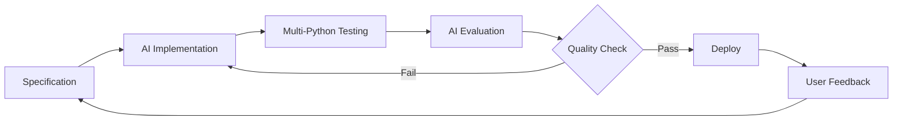
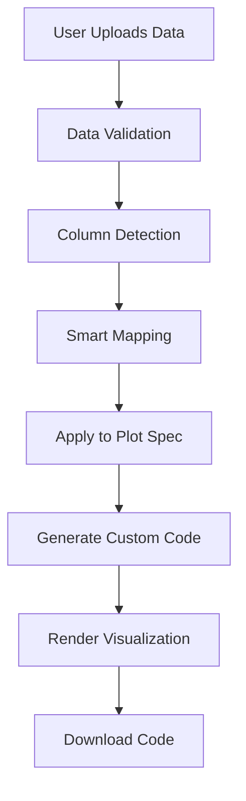

# 🏗️ pyplots Architecture

## Overview

pyplots is an AI-powered, specification-driven platform for Python data visualization examples that work directly with user data. Built as a mono-repository with automated workflows and intelligent tagging.

## 🎯 Core Principles

1. **Specification-First**: Every plot starts with a spec, not code
2. **Your Data First**: Examples work with real user data, not fake data
3. **Library Agnostic**: Compare the same plot across all libraries
4. **AI-Native**: Intelligence built-in, not bolted on
5. **Community-Driven**: Open source with automated contributions

## 📁 Mono-Repository Structure

```
pyplots/
├── plots/                      # Plot specifications and implementations
│   ├── _registry.json         # Central plot registry
│   └── {plot-id}/
│       ├── spec.yaml          # Plot specification (source of truth)
│       ├── implementations/   # Different versions
│       │   ├── current/       # Latest stable version
│       │   │   ├── plot.py
│       │   │   ├── plot_py310.py  # Python-specific if needed
│       │   │   ├── plot_py311.py
│       │   │   └── plot_py312.py
│       │   └── candidates/    # AI-generated improvements
│       ├── evaluations/       # Quality scores
│       ├── tests/            # Spec compliance tests
│       └── assets/           # Preview images
│
├── website/                   # Next.js frontend
│   ├── src/
│   │   ├── components/       # React components
│   │   ├── pages/           # Next.js pages
│   │   └── lib/             # Utilities
│   └── public/              # Static assets
│
├── api/                      # FastAPI backend
│   ├── app/
│   │   ├── routers/         # API endpoints
│   │   ├── services/        # Business logic
│   │   └── models/          # Data models
│   └── requirements.txt
│
├── automation/               # Automation workflows
│   ├── n8n/                 # n8n workflows
│   │   └── workflows/       # JSON workflow definitions
│   ├── scripts/             # Python automation scripts
│   └── claude-code/         # AI generation templates
│
├── packages/                # Shared packages
│   ├── plot-validator/      # Specification validation
│   ├── spec-parser/        # Parse and process specs
│   └── ai-evaluator/       # AI quality evaluation
│
├── infrastructure/          # Infrastructure as code
│   ├── docker/             # Docker configurations
│   └── terraform/          # Cloud infrastructure (optional)
│
└── data/                   # Sample datasets
    └── examples/           # Example data files
```

## 🔄 Core Workflows

### 1. Plot Development Pipeline



### 2. User Data Flow



## 🏷️ AI-Powered Tagging System

### Dynamic Contextual Tags

Instead of rigid categories, AI generates contextual tags:

```python
# Traditional (rigid):
categories = {
    "library": "matplotlib",
    "type": "bar",
    "domain": "finance"
}

# AI-Contextual (flexible):
tags = [
    "real-time-stock-tracker",
    "websocket-enabled",
    "mobile-responsive",
    "handles-missing-data",
    "publication-ready",
    "colorblind-safe"
]
```

### Multi-Dimensional Search

```yaml
Search Dimensions:
  - Technical: "handles-1M-points", "gpu-accelerated"
  - Visual: "minimalist", "dashboard-ready", "print-quality"
  - Domain: "clinical-trials", "stock-market", "climate-data"
  - Capability: "streaming-data", "interactive", "exportable"
  - Compatibility: "works-with-pandas", "jupyter-friendly"
```

## 🤖 AI Components

### Claude Code Integration

```yaml
Purpose: Generate and optimize plot implementations
Triggers:
  - New plot specification
  - Optimization request
  - Python version update
  
Process:
  1. Read specification
  2. Generate implementation
  3. Test across Python versions
  4. Create version-specific code if needed
  5. Submit PR
```

### Multi-AI Consensus

```yaml
Evaluation Pipeline:
  Claude:
    - Code quality
    - Specification compliance
    
  GPT-4:
    - Visual aesthetics
    - User experience
    
  Gemini:
    - Performance optimization
    - Alternative approaches
    
  Consensus:
    - Average scores
    - Flag disagreements
    - Require 85%+ for approval
```

## 🔄 n8n Automation Workflows

### Workflow 1: Idea Collection
```yaml
Schedule: Every 6 hours
Sources:
  - Reddit r/dataisbeautiful
  - Stack Overflow questions
  - GitHub trending
Actions:
  - Extract visualization ideas
  - Check for duplicates
  - Create GitHub issues
  - Trigger AI implementation
```

### Workflow 2: Quality Monitoring
```yaml
Schedule: Daily
Actions:
  - Test all plots
  - Check performance
  - Find similar plots
  - Identify optimization opportunities
  - Update quality scores
```

### Workflow 3: Social Media
```yaml
Triggers:
  - New plot added
  - Milestone reached
Actions:
  - Post to X/Twitter
  - Update Discord
  - Rate limit: Max 3/day
```

## 💾 Data Architecture

### PostgreSQL Database
```sql
-- Plot metadata
CREATE TABLE plots (
    id VARCHAR PRIMARY KEY,
    spec_version VARCHAR,
    created_at TIMESTAMP,
    quality_score FLOAT,
    view_count INTEGER
);

-- User interactions
CREATE TABLE plot_usage (
    plot_id VARCHAR,
    user_session VARCHAR,
    data_shape JSON,
    success BOOLEAN,
    timestamp TIMESTAMP
);

-- AI evaluations
CREATE TABLE evaluations (
    plot_id VARCHAR,
    ai_model VARCHAR,
    scores JSON,
    timestamp TIMESTAMP
);
```

### Redis Cache
```yaml
Purpose: Performance optimization
Cache:
  - Plot metadata (TTL: 1 hour)
  - Preview images (TTL: 24 hours)
  - Search results (TTL: 10 minutes)
  - User sessions (TTL: 30 minutes)
```

## 🚀 Deployment Architecture

### Development
```yaml
Local:
  - Docker Compose for all services
  - Hot reload for website
  - Local n8n instance
  - SQLite for quick testing
```

### Production
```yaml
Hosting:
  Website: Vercel/Netlify (static)
  API: Google Cloud Run (serverless)
  Database: Google Cloud SQL
  Storage: Google Cloud Storage
  n8n: Google Compute Engine (e2-micro)
  
CDN:
  - Cloudflare for static assets
  - Image optimization
  - Global edge caching
```

## 🔐 Security Considerations

### Code Execution Sandbox
```yaml
User Code Execution:
  - Docker containers with limits
  - No network access
  - Time limit: 5 seconds
  - Memory limit: 100MB
  - Allowed imports whitelist
```

### Data Privacy
```yaml
User Data:
  - Never stored permanently
  - Processed in memory only
  - Deleted after session
  - No analytics on user data
  - GDPR compliant
```

## 📊 Performance Targets

### Response Times
- Plot search: < 100ms
- Data upload: < 2s for 10MB
- Plot generation: < 5s
- Library comparison: < 10s

### Scale Targets
- 100,000 monthly active users
- 1,000 plots in collection
- 10GB data processing daily
- 99.9% uptime

## 🔄 Version Strategy

### Python Version Support
```python
# Single universal implementation (when possible)
plot.py

# Version-specific (when needed)
plot_py310.py  # Python 3.10 specific
plot_py311.py  # Python 3.11 specific
plot_py312.py  # Python 3.12 specific

# Decision matrix
if syntax_identical_across_versions:
    use("plot.py")
elif minor_differences:
    create_version_specific_files()
elif major_api_changes:
    create_separate_implementations()
```

### Plot Versioning
```yaml
Semantic Versioning:
  MAJOR: Breaking changes to spec
  MINOR: New features, Python version
  PATCH: Bug fixes, optimizations
  
Example:
  1.0.0: Initial implementation
  1.1.0: Added animation support
  1.1.1: Fixed edge case with NaN
  2.0.0: Changed API, new spec format
```

## 🎯 Success Metrics

### Technical Metrics
- Test coverage: > 90%
- Plot success rate: > 95%
- API response time: p95 < 200ms
- Zero security incidents

### User Metrics
- User satisfaction: > 4.5/5
- Data upload success: > 99%
- Code generation accuracy: > 95%
- Monthly active users growth: 20%

### Community Metrics
- Contributors: > 100
- GitHub stars: > 10,000
- Plot submissions/month: > 50
- Issue resolution time: < 48h

## 🔮 Future Enhancements

### Phase 1 (Current)
- Core plot collection
- Basic data upload
- Library comparison
- AI tagging

### Phase 2 (Q1 2025)
- Natural language to plot
- Real-time collaboration
- Custom themes
- API access

### Phase 3 (Q2 2025)
- pip package
- IDE plugins
- WebAssembly runtime
- Enterprise features

### Phase 4 (Q3 2025)
- Auto-adaptive plots
- ML-powered suggestions
- Custom plot designer
- White-label solution

## 🛠️ Technology Stack

### Core
- **Language**: Python 3.10+
- **Package Manager**: UV (10-100x faster than pip)
- **Web Framework**: FastAPI
- **Frontend**: Next.js 14 + TypeScript
- **Database**: PostgreSQL + Redis
- **Testing**: Pytest + Playwright

### Libraries
- **Visualization**: matplotlib, seaborn, plotly, bokeh, altair
- **Data**: pandas, polars, numpy
- **AI**: Anthropic, OpenAI, Google AI

### Infrastructure
- **Containers**: Docker
- **Orchestration**: n8n (self-hosted)
- **CI/CD**: GitHub Actions
- **Monitoring**: Prometheus + Grafana (optional)

## 📝 Development Guidelines

### Specification Format
```yaml
plot_id: "unique-identifier"
title: "Human readable title"
description: "What this plot visualizes"
requirements:
  data:
    - input format
    - required columns
  visual:
    - what it should show
    - key features
  technical:
    - performance constraints
    - compatibility needs
```

### Code Standards
- Type hints required
- Docstrings mandatory
- Black formatting
- 90%+ test coverage
- Performance benchmarks

### Contribution Flow
1. Create plot specification
2. AI generates implementation
3. Human review
4. Automated testing
5. Community feedback
6. Continuous improvement

---

## 🚀 Getting Started

```bash
# Clone repository
git clone https://github.com/username/pyplots.git

# Setup with UV
curl -LsSf https://astral.sh/uv/install.sh | sh
cd pyplots && uv sync

# Start development
make serve

# Create new plot
make plot PLOT="my-awesome-visualization"
```

---

*This architecture is designed to scale from a simple plot collection to a comprehensive visualization platform while maintaining simplicity and performance.*