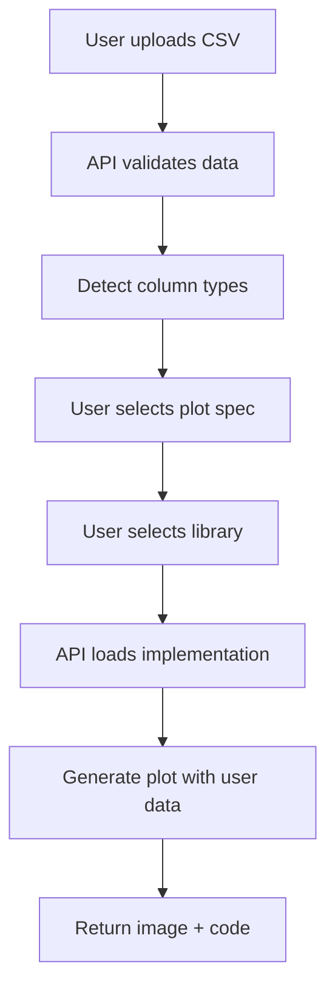

# 🏗️ pyplots Architecture

## Overview

pyplots is an AI-powered, specification-driven platform for Python data visualization examples that work directly with
user data. Built as a mono-repository following the proven patterns from statistix.

## 🎯 Core Principles

1. **Specification-First**: Every plot starts with a library-agnostic spec, not code
2. **Your Data First**: Examples work with real user data, not fake data
3. **Library Agnostic**: Support ALL Python plotting libraries, not just the big names
4. **All Plot Types**: Support all types of plots that Python libraries can create
5. **Fully Tested**: Every implementation is tested (90%+ coverage target)
6. **AI-Generated**: Code is generated and updated by AI
7. **Community-Driven**: Open source with automated contributions

## 📁 Repository Structure

```
pyplots/
├── specs/                             # Generische Plot-Spezifikationen (Markdown!)
│   ├── scatter-basic-001.md           # GitHub Issue → Markdown Spec
│   ├── heatmap-corr-002.md
│   └── timeseries-line-003.md
│
├── plots/                             # Library-spezifische Implementierungen
│   ├── matplotlib/
│   │   ├── scatter/
│   │   │   ├── scatter-basic-001/     # Implementiert specs/scatter-basic-001.md
│   │   │   │   ├── default.py         # Standard-Implementierung
│   │   │   │   ├── ggplot_style.py    # Style-Variante
│   │   │   │   ├── py310.py           # Python 3.10 spezifisch (nur wenn nötig)
│   │   │   │   ├── preview.png        # AI-generiertes Preview
│   │   │   │   └── quality_report.json # Vision-based Quality Check
│   │   │   └── scatter-advanced-005/
│   │   │       └── default.py
│   │   └── bar/
│   │       └── bar-basic-004/
│   │           └── default.py
│   │
│   ├── seaborn/
│   │   ├── scatterplot/
│   │   │   └── scatter-basic-001/      # Gleiche Spec-ID!
│   │   │       ├── default.py
│   │   │       ├── darkgrid_style.py
│   │   │       ├── preview.png
│   │   │       └── quality_report.json
│   │   └── heatmap/
│   │       └── heatmap-corr-002/
│   │           └── default.py
│   │
│   └── plotly/
│       └── scatter/
│           └── scatter-basic-001/      # Gleiche Spec-ID!
│               ├── default.py
│               ├── preview.png
│               └── quality_report.json
│
├── core/                           # Shared business logic
│   ├── database.py                 # Database connection management
│   ├── config.py                   # Configuration (simple, .env-based)
│   ├── cache.py                    # Caching utilities
│   ├── models/                     # SQLAlchemy ORM models
│   │   ├── spec.py
│   │   ├── implementation.py
│   │   └── library.py
│   └── repositories/               # Repository pattern
│       ├── base.py
│       ├── spec_repo.py
│       └── implementation_repo.py
│
├── api/                            # FastAPI backend
│   ├── main.py                     # Application entry point
│   ├── dependencies.py             # Dependency injection
│   ├── schemas.py                  # Pydantic models
│   └── routers/
│       ├── plots.py                # Plot endpoints
│       ├── specs.py                # Spec endpoints
│       └── data.py                 # Data upload
│
├── app/                            # React frontend
│   ├── src/
│   │   ├── components/
│   │   ├── pages/
│   │   └── lib/
│   └── package.json
│
├── automation/                     # n8n workflows + AI tools
│   ├── generators/
│   │   ├── claude_generator.py     # Code generation
│   │   └── quality_checker.py      # Vision-based quality check
│   └── n8n/
│       └── workflows/
│
├── tests/                          # Test suite
│   ├── unit/
│   │   ├── core/
│   │   ├── api/
│   │   └── plots/
│   └── integration/
│
├── scripts/                        # Utility scripts
│   └── init_database.py
│
├── docs/
└── pyproject.toml
```

## 🔄 How Specs and Implementations Work

### 1. Generische Spec (library-agnostisch, Markdown!)

Specs kommen von GitHub Issues und werden als Markdown gespeichert:

```markdown
# specs/scatter-basic-001.md

# scatter-basic-001: Basic 2D Scatter Plot

## Description

Create a simple scatter plot showing the relationship between two numeric variables.
Perfect for correlation analysis, outlier detection, and exploring bivariate relationships.

## Data Requirements

- **x**: Numeric values for x-axis
- **y**: Numeric values for y-axis

## Optional Parameters

- `color`: Point color (string) or column name for color mapping
- `size`: Point size (numeric) or column name for size mapping
- `alpha`: Transparency (0.0-1.0, default: 0.8)
- `title`: Plot title (string, optional)

## Quality Criteria

- [ ] X and Y axes are labeled with column names
- [ ] Grid is visible but subtle
- [ ] Points are clearly distinguishable
- [ ] No overlapping axis labels
- [ ] Legend is shown if color/size mapping is used
- [ ] Colorblind-safe colors when color mapping is used
- [ ] Appropriate figure size (default: 10x6 inches)

## Expected Output

A 2D scatter plot with clearly visible points showing the correlation or distribution
between x and y variables. The plot should be immediately understandable without
additional explanation.

## Tags

correlation, bivariate, basic, 2d, statistical, exploratory

## Use Cases

- Correlation analysis between two variables
- Outlier detection
- Pattern recognition in data
- Relationship visualization
- Quality control charts
```

**Warum Markdown?**
- ✅ GitHub Issues sind Markdown
- ✅ Menschen können es leicht schreiben
- ✅ AI kann es parsen
- ✅ Checklists für Quality Criteria
- ✅ Direkt auf Website renderbar

### 2. Library-spezifische Implementierungen

Für **matplotlib**:

```python
# plots/matplotlib/scatter/scatter-basic-001/default.py
import matplotlib.pyplot as plt
import pandas as pd


def create_plot(data: pd.DataFrame, x: str, y: str, **kwargs):
    """Implementation for scatter-basic-001 using matplotlib"""
    fig, ax = plt.subplots()
    ax.scatter(data[x], data[y], **kwargs)
    ax.set_xlabel(x)
    ax.set_ylabel(y)
    return fig
```

Für **seaborn** (gleiche Spec-ID!):

```python
# plots/seaborn/scatterplot/scatter-basic-001/default.py
import seaborn as sns
import pandas as pd


def create_plot(data: pd.DataFrame, x: str, y: str, **kwargs):
    """Implementation for scatter-basic-001 using seaborn"""
    return sns.scatterplot(data=data, x=x, y=y, **kwargs)
```

### 3. Style-Varianten

```python
# plots/matplotlib/scatter/scatter-basic-001/ggplot_style.py
import matplotlib.pyplot as plt
import pandas as pd


def create_plot(data: pd.DataFrame, x: str, y: str, **kwargs):
    """ggplot style variant for scatter-basic-001"""
    plt.style.use('ggplot')
    fig, ax = plt.subplots()
    ax.scatter(data[x], data[y], **kwargs)
    ax.set_xlabel(x)
    ax.set_ylabel(y)
    return fig
```

### 4. Python-Versions-spezifisch (nur wenn nötig)

```python
# plots/matplotlib/scatter/scatter-basic-001/py310.py
# Nur erstellen wenn Breaking Changes zwischen Python-Versionen
import matplotlib.pyplot as plt
import pandas as pd


def create_plot(data: pd.DataFrame, x: str, y: str, **kwargs):
    """Python 3.10 specific implementation"""
    # Python 3.10 spezifische Syntax/Features
    ...
```

## 💾 Database Schema (PostgreSQL)

```sql
-- Generische Plot-Spezifikationen
CREATE TABLE specs
(
    id                VARCHAR PRIMARY KEY, -- "scatter-basic-001"
    title             VARCHAR NOT NULL,
    description       TEXT,
    data_requirements JSONB   NOT NULL,
    optional_params   JSONB,
    tags              VARCHAR[] DEFAULT '{}',
    created_at        TIMESTAMP DEFAULT NOW(),
    updated_at        TIMESTAMP DEFAULT NOW()
);

-- Unterstützte Plotting Libraries
CREATE TABLE libraries
(
    id                VARCHAR PRIMARY KEY, -- "matplotlib"
    name              VARCHAR NOT NULL,
    version           VARCHAR,
    documentation_url VARCHAR,
    active            BOOLEAN DEFAULT true
);

-- Library-spezifische Implementierungen
CREATE TABLE implementations
(
    id             UUID PRIMARY KEY DEFAULT gen_random_uuid(),
    spec_id        VARCHAR NOT NULL REFERENCES specs (id),
    library_id     VARCHAR NOT NULL REFERENCES libraries (id),
    plot_function  VARCHAR NOT NULL,                 -- "scatter", "bar", etc.
    variant        VARCHAR NOT NULL,                 -- "default", "ggplot_style", "py310"
    file_path      VARCHAR NOT NULL,                 -- "plots/matplotlib/scatter/scatter-basic-001/default.py"
    preview_url    VARCHAR,                          -- GCS URL
    python_version VARCHAR          DEFAULT '3.10+', -- "3.10+", "3.11+", "3.10", etc.
    tested         BOOLEAN          DEFAULT false,
    quality_score  FLOAT,
    created_at     TIMESTAMP        DEFAULT NOW(),
    updated_at     TIMESTAMP        DEFAULT NOW(),
    UNIQUE (spec_id, library_id, variant)
);

-- AI-generierte Tags
CREATE TABLE tags
(
    id         UUID PRIMARY KEY DEFAULT gen_random_uuid(),
    spec_id    VARCHAR NOT NULL REFERENCES specs (id),
    tag        VARCHAR NOT NULL,
    confidence FLOAT            DEFAULT 1.0,  -- AI confidence (0-1)
    created_by VARCHAR          DEFAULT 'ai', -- "ai" or "human"
    created_at TIMESTAMP        DEFAULT NOW(),
    UNIQUE (spec_id, tag)
);

-- User-generierte Plots (optional, für Analytics)
CREATE TABLE plot_usage
(
    id           UUID PRIMARY KEY DEFAULT gen_random_uuid(),
    spec_id      VARCHAR REFERENCES specs (id),
    library_id   VARCHAR REFERENCES libraries (id),
    variant      VARCHAR,
    user_session VARCHAR,
    data_shape   JSONB, -- {"rows": 100, "columns": 3}
    success      BOOLEAN,
    created_at   TIMESTAMP        DEFAULT NOW()
);

-- Indizes für Performance
CREATE INDEX idx_implementations_spec ON implementations (spec_id);
CREATE INDEX idx_implementations_library ON implementations (library_id);
CREATE INDEX idx_tags_spec ON tags (spec_id);
CREATE INDEX idx_plot_usage_spec ON plot_usage (spec_id);
```

## ☁️ Google Cloud Infrastructure

```yaml
# Deployment Architecture (wie statistix)

Storage:
  Service: Google Cloud Storage
  Bucket: gs://pyplots-images
  Structure:
    - previews/{library}/{spec-id}/{variant}.png
    - generated/{session_id}/{plot_id}.png
  Access: Public read
  Cache-Control: "public, max-age=31536000, immutable"

Database:
  Service: Cloud SQL
  Engine: PostgreSQL 15
  Instance: db-f1-micro (start)
  Region: europe-west4
  Private IP: True (production)

Backend:
  Service: Cloud Run
  Runtime: Python 3.10+
  Concurrency: 80
  Min Instances: 0
  Max Instances: 10
  Memory: 512Mi

Frontend:
  Service: Cloud Run
  Runtime: Node.js 20
  Static: Next.js build
  Memory: 256Mi

Automation:
  Service: Cloud Run Jobs
  Trigger: Cloud Scheduler
  n8n: Self-hosted (Cloud Run)
```

## 🔄 Core Workflows

### 1. Plot Development Pipeline (mit Vision-based Quality Check)


**Detailed Steps:**

1. **Spec Creation**: GitHub Issue (Markdown) → `specs/scatter-basic-001.md`
2. **AI Generation**: Claude reads spec, generates `plots/matplotlib/scatter/scatter-basic-001/default.py`
3. **Testing**: Pytest runs tests for each implementation
4. **Preview Generation**: Code creates `preview.png` with sample data
5. **Vision Quality Check**: Claude Vision analyzes image against spec + quality criteria
6. **Quality Gate**: Score must be >= 85 to proceed
7. **Upload**: Preview → Google Cloud Storage
8. **Metadata**: Store in Cloud SQL (spec_id, library, quality_score)
9. **Deploy**: Website displays plot + code

### 2. Vision-based Quality Check

```python
# automation/generators/quality_checker.py
from anthropic import Anthropic
import base64
from pathlib import Path


def check_plot_quality(spec_path: str, plot_image_path: str) -> dict:
    """
    Claude Vision schaut sich das Bild an und vergleicht gegen Spec
    """
    client = Anthropic()

    # Spec laden
    spec_md = Path(spec_path).read_text()

    # Bild laden
    with open(plot_image_path, 'rb') as f:
        image_data = base64.standard_b64encode(f.read()).decode('utf-8')

    # Prompt für Vision
    prompt = f"""
Hier ist die Plot-Spezifikation:

{spec_md}

Ich zeige dir jetzt das generierte Plot-Bild.

Bitte überprüfe:

1. **Data Requirements**: Sind die erforderlichen Daten korrekt dargestellt?
2. **Quality Criteria**: Sind alle Checkboxen erfüllt?
3. **Expected Output**: Entspricht das Bild der Beschreibung?
4. **Visual Quality**: Gibt es Probleme (überlappende Labels, unleserlich, etc.)?

Gib deine Antwort als JSON:
{{
  "score": 0-100,
  "passed": true/false,
  "criteria_met": ["criterion1", "criterion2"],
  "criteria_failed": ["criterion3"],
  "feedback": "Detailliertes Feedback"
}}
"""

    response = client.messages.create(
        model="claude-sonnet-4",
        max_tokens=1024,
        messages=[{
            "role": "user",
            "content": [
                {
                    "type": "image",
                    "source": {
                        "type": "base64",
                        "media_type": "image/png",
                        "data": image_data
                    }
                },
                {
                    "type": "text",
                    "text": prompt
                }
            ]
        }]
    )

    # Parse JSON response
    import json
    result = json.loads(response.content[0].text)

    return {
        "score": result["score"],
        "passed": result["score"] >= 85,
        "criteria_met": result["criteria_met"],
        "criteria_failed": result["criteria_failed"],
        "feedback": result["feedback"]
    }


# Beispiel: Quality Report
quality_report = {
    "spec_id": "scatter-basic-001",
    "library": "matplotlib",
    "variant": "default",
    "score": 92,
    "passed": True,
    "criteria_met": [
        "X and Y axes are labeled",
        "Grid is visible but subtle",
        "Points are clearly distinguishable",
        "No overlapping axis labels",
        "Appropriate figure size"
    ],
    "criteria_failed": [],
    "feedback": "Excellent plot! All quality criteria met. Axes are properly labeled, grid is subtle, points are clearly visible.",
    "checked_at": "2025-01-18T20:30:00Z"
}
```

### 3. User Data Flow



## 🧪 Testing Strategy

### Test Structure

```
tests/
├── unit/
│   ├── core/
│   │   └── test_repositories.py
│   ├── api/
│   │   └── test_routers.py
│   └── plots/
│       ├── matplotlib/
│       │   └── test_scatter_basic_001.py
│       └── seaborn/
│           └── test_scatter_basic_001.py
└── integration/
    └── test_plot_pipeline.py
```

### Testing Requirements

- **Unit Tests**: Every implementation has a test
- **Integration Tests**: Full workflow from spec to plot
- **Data Tests**: Test with various data shapes
- **Version Tests**: Test across Python 3.10, 3.11, 3.12
- **Coverage Target**: 90%+

### Example Test

```python
# tests/unit/plots/matplotlib/test_scatter_basic_001.py
import pandas as pd
import pytest


def test_scatter_basic_001_default():
    """Test matplotlib scatter-basic-001 default implementation"""
    # Import implementation
    from plots.matplotlib.scatter.scatter_basic_001.default import create_plot

    # Test data
    data = pd.DataFrame({
        'x': [1, 2, 3, 4, 5],
        'y': [2, 4, 6, 8, 10]
    })

    # Create plot
    fig = create_plot(data, x='x', y='y')

    # Assertions
    assert fig is not None
    assert len(fig.axes) == 1
    assert fig.axes[0].get_xlabel() == 'x'
    assert fig.axes[0].get_ylabel() == 'y'
```

## 🛠️ Technology Stack

### Backend

- **Language**: Python 3.10+
- **Package Manager**: UV
- **Framework**: FastAPI
- **Database**: PostgreSQL (Cloud SQL)
- **ORM**: SQLAlchemy (async)
- **Testing**: Pytest
- **Linting/Formatting**: Ruff

### Frontend

- **Framework**: Next.js 14
- **Language**: TypeScript
- **Styling**: Tailwind CSS
- **Deployment**: Cloud Run

### Libraries (Start)

- **matplotlib** >= 3.8.0
- **seaborn** (später)
- **plotly** (später)
- More added over time

### Infrastructure

- **Cloud**: Google Cloud Platform
- **Storage**: Google Cloud Storage
- **Database**: Cloud SQL (PostgreSQL)
- **Compute**: Cloud Run
- **Automation**: n8n (self-hosted)

## 🔐 Security

### API Security

- Input validation (Pydantic)
- Rate limiting
- CORS configuration
- Environment variables for secrets

### Data Privacy

- User data never stored permanently
- Processed in memory only
- Generated plots deleted after 24h
- No tracking of user data content

### Code Execution

- Sandboxed execution
- Import whitelist
- Time limits
- Memory limits

## 📊 Performance Targets

### Response Times

- Plot search: < 100ms
- Data upload (10MB): < 2s
- Plot generation: < 5s
- Library comparison: < 10s

### Database

- Connection pooling
- Query optimization
- Proper indexing
- Async operations

## 🚀 Development Workflow

```bash
# Setup
uv sync --all-extras

# Run tests
uv run pytest

# Start backend (local)
uv run uvicorn api.main:app --reload

# Start frontend
cd app && npm run dev

# Lint
uv run ruff check .

# Format
uv run ruff format .
```

## 📝 Code Standards

### Python

- Type hints required
- Docstrings required
- Ruff formatting (line-length: 120)
- 90%+ test coverage

### Naming Conventions

- **Spec IDs**: `{type}-{variant}-{number}` (e.g., `scatter-basic-001`)
- **Files**: `default.py`, `{style}_style.py`, `py{version}.py`
- **Functions**: `create_plot(data, x, y, **kwargs)`

### Spec Format (Markdown)

Specs werden als Markdown geschrieben (GitHub Issues → .md Dateien):

```markdown
# {spec-id}: {Title}

## Description
{Detaillierte Beschreibung}

## Data Requirements
- **param1**: Description
- **param2**: Description

## Optional Parameters
- `param3`: Description
- `param4`: Description

## Quality Criteria
- [ ] Criterion 1
- [ ] Criterion 2
- [ ] Criterion 3

## Expected Output
{Was der Plot zeigen soll}

## Tags
tag1, tag2, tag3

## Use Cases
- Use case 1
- Use case 2
```

**Required Sections:**
- Title (H1 with spec-id)
- Description
- Data Requirements
- Quality Criteria (Checklist!)

**Optional Sections:**
- Optional Parameters
- Expected Output
- Tags
- Use Cases

---

*This architecture follows the proven patterns from statistix while being tailored for multi-library plot management.*
