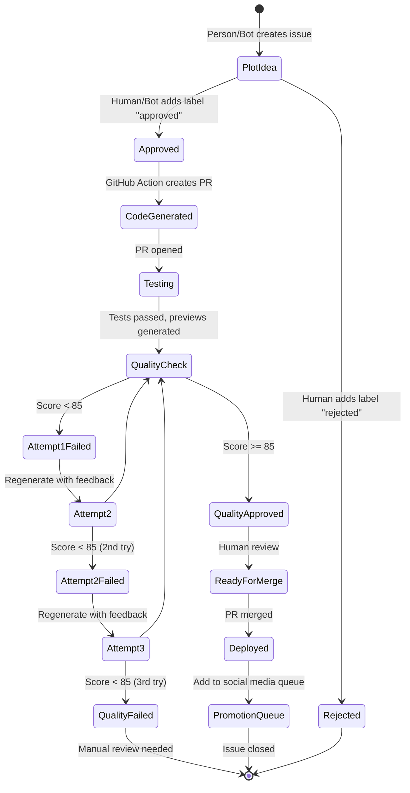
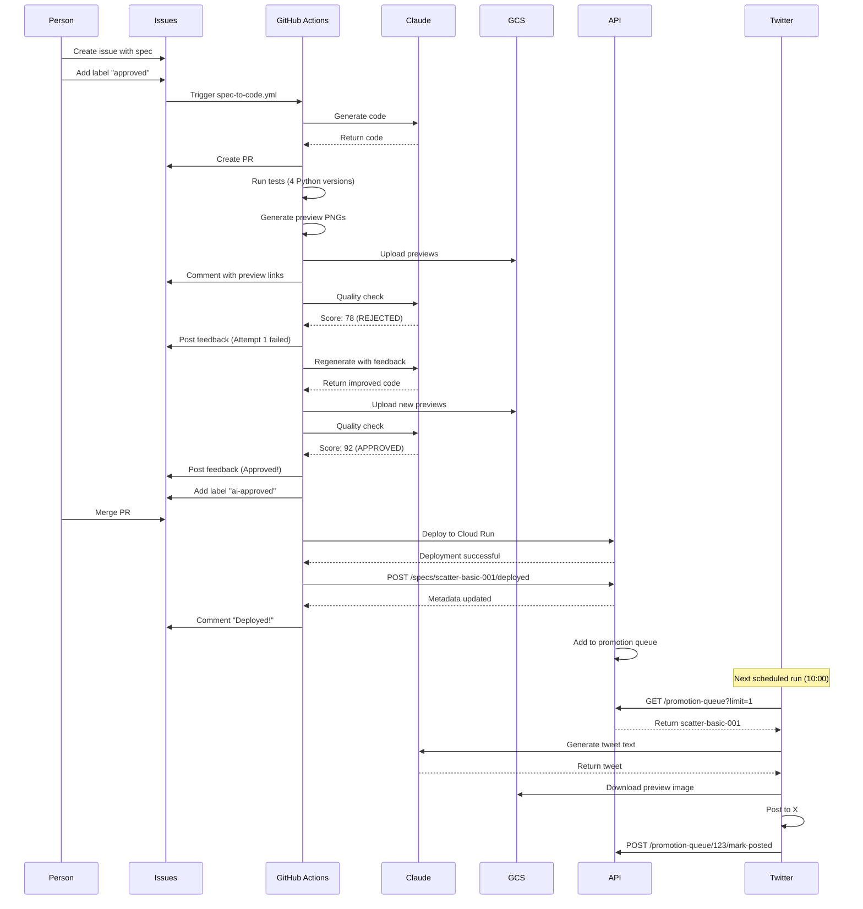

# 🔄 Automation Workflows

## Overview

pyplots uses a **hybrid automation strategy** combining GitHub Actions (for code-related workflows) and n8n (for external service integration). GitHub Issues serve as the **single source of truth** for workflow state and quality feedback.

---

## GitHub Actions vs. n8n: Division of Responsibilities

**This is the authoritative table for automation responsibilities.** All other docs reference this table.

| Workflow | Platform | Trigger | Frequency | Why This Platform? |
|----------|----------|---------|-----------|-------------------|
| **Code Generation** | GitHub Actions | Issue labeled `approved` | On-demand | Native GitHub integration, version-controlled |
| **Multi-Version Testing** | GitHub Actions | PR opened/updated | On-demand | Included in GitHub Pro, transparent |
| **Preview Generation** | GitHub Actions | Tests passed | On-demand | Needs code checkout, GCS upload |
| **AI Review** | GitHub Actions | Tests passed, previews generated | On-demand | Claude evaluates Spec ↔ Code ↔ Preview |
| **Auto-Merge** | GitHub Actions | PR labeled `ai-approved` | On-demand | Automatic squash merge |
| **Deployment** | GitHub Actions | PR merged to main | On-demand | Native CI/CD, Cloud Run deployment |
| **Social Media Monitoring** | n8n | Scheduled (daily) | 1x/day | Twitter/Reddit API integration |
| **Social Media Posting** | n8n | Scheduled (twice daily) | 2x/day at 10 AM & 3 PM CET | X API, promotion queue management |
| **Issue Triage** | n8n | New issue created | On-demand | Multi-step labeling logic |
| **Maintenance Scheduler** | n8n | Scheduled (weekly) | 1x/week | Detect LLM/library updates, trigger GitHub workflows |

### Why GitHub Actions for Code Workflows?

✅ **Already paid** - Included in GitHub Pro subscription
✅ **Transparent** - Community can see and contribute to workflows
✅ **Version-controlled** - Workflows are in git
✅ **Native integration** - Issues, PRs, commits trigger natively
✅ **Easy maintenance** - Solo developer can edit YAML files

### Why n8n for External Services?

✅ **Better for external APIs** - Twitter, Reddit, etc.
✅ **Visual orchestration** - Complex multi-step flows
✅ **Scheduled jobs** - Cron-based automation
✅ **Multi-service coordination** - Easier to connect 5+ external services
✅ **Already paid** - n8n Cloud Pro subscription

---

## GitHub Actions Workflows

All workflows are in `.github/workflows/`

### 1. `spec-to-code.yml` + `claude.yml` - Code Generation

**Trigger**: GitHub Issue labeled `approved`

**Purpose**: Convert approved spec into implementation code using Claude Code

**How it works**:

1. **spec-to-code.yml** (trigger workflow):
   - Extracts spec ID from issue title (format: `scatter-basic-001`)
   - Posts `@claude` comment with detailed generation instructions
   - Links to spec file, generation rules, and quality criteria

2. **claude.yml** (execution workflow):
   - Triggers on `@claude` comments (via `anthropics/claude-code-action@v1`)
   - Claude Code reads spec and generation rules
   - Generates implementations for matplotlib and seaborn
   - Self-reviews code against quality criteria (max 3 attempts)
   - Creates pull request with implementations
   - **Visible live** at https://claude.ai/code (if OAuth token configured)

**Steps**:
```yaml
# spec-to-code.yml
on:
  issues:
    types: [labeled]

jobs:
  trigger-claude-code:
    if: github.event.label.name == 'approved'
    steps:
      - name: Extract spec ID from issue
        run: |
          # Parse spec ID from title (e.g., "scatter-basic-001")
          SPEC_ID=$(echo "$ISSUE_TITLE" | grep -oiP '^[a-z]+-[a-z]+-\d{3,4}')

      - name: Trigger Claude Code with @claude comment
        run: |
          # Post @claude comment with:
          # - Spec file path: specs/{spec-id}.md
          # - Generation rules: rules/generation/v1.0.0-draft/
          # - Target paths for matplotlib and seaborn
          # - Self-review requirements
```

```yaml
# claude.yml
on:
  issue_comment:
    types: [created]

jobs:
  claude:
    if: contains(github.event.comment.body, '@claude')
    steps:
      - uses: anthropics/claude-code-action@v1
        with:
          claude_code_oauth_token: ${{ secrets.CLAUDE_CODE_OAUTH_TOKEN }}
          # Claude Code reads instructions from @claude comment
          # Generates code, commits, creates PR autonomously
```

**Outputs**:
- Implementation files: `plots/{library}/{type}/{spec-id}/default.py`
- Pull request with title: `feat: implement {spec-id}`
- PR linked to original issue
- Live progress visible in Claude Code Web

**Required Secrets**:
- `CLAUDE_CODE_OAUTH_TOKEN`: OAuth token from https://claude.ai/code/settings

---

### 2. `test-and-preview.yml` - Testing & Preview Generation

**Trigger**: Pull request opened or updated

**Purpose**: Run multi-version tests and generate preview images

**Steps**:
```yaml
on:
  pull_request:
    types: [opened, synchronize]

jobs:
  test:
    runs-on: ubuntu-latest
    strategy:
      matrix:
        python-version: ['3.13', '3.12', '3.11', '3.10']
    steps:
      - name: Checkout code
        uses: actions/checkout@v4

      - name: Set up Python ${{ matrix.python-version }}
        uses: actions/setup-python@v5
        with:
          python-version: ${{ matrix.python-version }}

      - name: Install dependencies
        run: |
          pip install uv
          uv sync --all-extras

      - name: Run tests
        run: uv run pytest tests/ --cov=plots --cov-report=xml

      - name: Upload coverage
        uses: codecov/codecov-action@v3

  preview:
    needs: test
    runs-on: ubuntu-latest
    steps:
      - name: Generate preview images
        run: |
          # Execute each implementation with sample data
          # Create PNG files

      - name: Upload to GCS
        env:
          GCS_CREDENTIALS: ${{ secrets.GCS_CREDENTIALS }}
        run: |
          # Upload to gs://pyplots-images/previews/{library}/{spec-id}/{variant}/v{timestamp}.png

      - name: Comment PR with previews
        uses: peter-evans/create-or-update-comment@v3
        with:
          issue-number: ${{ github.event.pull_request.number }}
          body: |
            ## Preview Images Generated

            - matplotlib: [View](https://storage.googleapis.com/...)
            - seaborn: [View](https://storage.googleapis.com/...)
```

**Outputs**:
- Test results for Python 3.10-3.13
- Coverage report
- Preview PNGs uploaded to GCS
- PR comment with preview links

---

### 3. `ai-review.yml` + `claude.yml` - Quality Evaluation

**Trigger**: `workflow_run` when `test-and-preview.yml` completes successfully

**Purpose**: Evaluate generated plots using Claude Code with vision capabilities

**How it works**:

1. **test-and-preview.yml** runs tests and uploads preview images to GCS
2. **ai-review.yml** downloads images and posts `@claude` comment
3. **claude.yml** triggers on `@claude` comment
4. Claude Code evaluates images against spec criteria using vision
5. Claude Code posts quality report and updates labels

**Steps**:
```yaml
# ai-review.yml
on:
  workflow_run:
    workflows: ["Test and Generate Previews"]
    types: [completed]

jobs:
  trigger-quality-check:
    steps:
      - name: Download preview images from GCS
        run: |
          # Download preview PNGs to preview_images/ directory
          gsutil -m cp -r "gs://$BUCKET/$PATH/*" preview_images/

      - name: Trigger Claude Code with @claude comment
        run: |
          # Post @claude comment on PR with:
          # - Preview image locations
          # - Spec file reference
          # - Quality criteria from spec
          # - Scoring guidelines (0-100, ≥85 to pass)
```

```yaml
# claude.yml
on:
  issue_comment:
    types: [created]

jobs:
  claude:
    if: contains(github.event.comment.body, '@claude')
    steps:
      - uses: anthropics/claude-code-action@v1
        with:
          claude_code_oauth_token: ${{ secrets.CLAUDE_CODE_OAUTH_TOKEN }}
          # Claude Code:
          # 1. Reads spec file
          # 2. Views preview images with vision
          # 3. Evaluates against quality criteria
          # 4. Posts quality report as comment
          # 5. Adds label: ai-approved or ai-failed
```

**Evaluation Process**:
1. For each preview image:
   - Parse filename to extract spec_id, library, variant
   - Read corresponding spec file
   - View image using Claude's vision capabilities
   - Check against all quality criteria in spec
   - Score 0-100 (≥85 to pass)

2. Generate quality report with:
   - Overall verdict (PASS/FAIL)
   - Score for each implementation
   - Specific feedback per quality criterion
   - Strengths and improvements needed

**Quality Gate**:
- Claude vision-based evaluation
- Pass threshold: Score ≥ 85 for all implementations
- Objective, measurable criteria from spec

**Outputs**:
- Quality report as PR comment
- Label: `ai-approved` or `ai-failed`
- Live evaluation visible in Claude Code Web

---

### 4. `deploy.yml` - Deployment to Production

**Trigger**: Pull request merged to `main`

**Purpose**: Deploy to Cloud Run and update metadata

**Steps**:
```yaml
on:
  push:
    branches: [main]

jobs:
  deploy-backend:
    runs-on: ubuntu-latest
    steps:
      - name: Checkout code
        uses: actions/checkout@v4

      - name: Authenticate to Google Cloud
        uses: google-github-actions/auth@v2
        with:
          credentials_json: ${{ secrets.GCP_CREDENTIALS }}

      - name: Build and push Docker image
        run: |
          gcloud builds submit --tag gcr.io/${{ secrets.GCP_PROJECT }}/pyplots-api

      - name: Deploy to Cloud Run
        run: |
          gcloud run deploy pyplots-api \
            --image gcr.io/${{ secrets.GCP_PROJECT }}/pyplots-api \
            --region europe-west4 \
            --platform managed

      - name: Update database metadata
        run: |
          # Call API endpoint to update spec/implementation metadata
          curl -X POST https://api.pyplots.ai/internal/sync-from-repo \
            -H "Authorization: Bearer ${{ secrets.API_TOKEN }}"

  deploy-frontend:
    runs-on: ubuntu-latest
    steps:
      # Similar steps for Next.js frontend

  notify-completion:
    needs: [deploy-backend, deploy-frontend]
    runs-on: ubuntu-latest
    steps:
      - name: Post deployment success
        run: |
          # Comment on all related issues that were deployed
          gh issue comment ${{ env.ISSUE_NUMBER }} \
            --body "✅ Deployed to production: https://pyplots.ai/plots/${{ env.SPEC_ID }}"
```

**Post-Deployment**:
- Comment on original issue with live URL
- Add to promotion queue (for social media)
- Close issue automatically

---

## n8n Cloud Workflows

**Platform**: n8n Cloud Pro (already subscribed)

**Access**: https://app.n8n.cloud

### 1. Social Media Monitoring

**Schedule**: Daily at 9:00 AM CET

**Purpose**: Discover plot ideas from data science community

**Flow**:
```
Trigger: Schedule (daily)
│
├─→ Twitter API: Search #dataviz #python #matplotlib
│   └─→ Filter: Contains plot ideas?
│       └─→ Claude: Extract plot idea
│           └─→ GitHub API: Create issue with template
│               └─→ Label: plot-idea
│
├─→ Reddit API: r/dataisbeautiful, r/Python top posts
│   └─→ (same as above)
│
└─→ GitHub API: Trending repos with visualization
    └─→ (same as above)
```

**Output**: GitHub Issues labeled `plot-idea`

**Phased Rollout**:
- Phase 1 (MVP): Twitter only
- Phase 2: + Reddit
- Phase 3: + GitHub Discussions, ArXiv papers

---

### 2. Twitter Promotion

**Schedule**: 2x daily at 10:00 and 15:00 CET

**Purpose**: Automatically promote new plots on X (Twitter)

**Flow**:
```
Trigger: Schedule (2x daily)
│
├─→ API Call: GET /promotion-queue?limit=1
│   └─→ Check: Posted today < 2?
│       ├─→ YES: Continue
│       └─→ NO: Skip (rate limit reached)
│
├─→ Claude: Generate tweet text
│   - Eye-catching description
│   - Use cases
│   - Hashtags: #dataviz #python #matplotlib
│   - Link: https://pyplots.ai/plots/{spec-id}
│   - Max 280 characters
│
├─→ GCS: Download preview image
│
├─→ Twitter API: Post tweet with image
│
└─→ API Call: POST /promotion-queue/{id}/mark-posted
```

**Rate Limiting**:
- Hard limit: 2 posts per day
- Reset: Daily at midnight CET
- Queue priority: quality_score DESC

**Fallback**:
- If tweet fails: Retry max 3 times
- If 3 failures: Mark as failed, alert human

---

### 3. Issue Triage

**Trigger**: New GitHub issue created

**Purpose**: Automatically label and assign new issues

**Flow**:
```
Trigger: New issue created
│
├─→ Claude: Analyze issue content
│   └─→ Determine:
│       - Is it a plot idea?
│       - Is it a bug report?
│       - Is it a feature request?
│       - Suggested difficulty level
│
├─→ GitHub API: Add labels
│   - plot-idea / bug / feature
│   - difficulty:simple / difficulty:medium / difficulty:complex
│
└─→ GitHub API: Add comment
    - Thank you message
    - Next steps
    - Link to contributing guide
```

---

### 4. Maintenance Scheduler

**Trigger**: Event-based (not scheduled)

**Purpose**: Detect library/LLM updates and trigger plot updates

**Flow**:
```
Trigger: Manual or event detection
│
├─→ PyPI API: Check for new matplotlib/seaborn/plotly versions
│
├─→ If new version detected:
│   └─→ For each affected plot:
│       └─→ GitHub API: Create issue
│           - Title: "Update {spec-id} for {library} {version}"
│           - Body: Auto-generated update request
│           - Label: update, library:{library}
│           - References: Original issue
│
└─→ GitHub Actions: spec-to-code.yml triggered automatically
```

**Update Strategy**:
- New issues for updates (not reopening original)
- Can run in parallel for multiple libraries
- Each update has own quality check cycle

---

## GitHub Issues as State Machine

### Issue Lifecycle



### Issue Labels

**Lifecycle Labels**:
- `plot-idea` - New proposal
- `approved` - Ready for code generation
- `code-generated` - PR created
- `testing` - Tests running
- `ai-attempt-1/2/3` - AI Review attempt count
- `ai-approved` - AI Review passed, ready for auto-merge
- `ai-failed` - AI Review failed after 3 attempts
- `deployed` - Live on pyplots.ai
- `rejected` - Not viable

**Category Labels**:
- `library:matplotlib`, `library:seaborn`, `library:plotly`
- `type:scatter`, `type:bar`, `type:heatmap`
- `difficulty:simple`, `difficulty:medium`, `difficulty:complex`
- `update` - Updating existing plot
- `bug` - Bug fix
- `feature` - New feature request

---

## Issue-Based Quality Feedback

### Why Issues Instead of Files?

✅ **Transparency** - Community sees all feedback
✅ **No repo clutter** - No `quality_report.json` files
✅ **Discussion** - Humans can comment on feedback
✅ **History** - All attempts documented
✅ **Linkable** - Easy to reference in PRs

### Example Issue Flow

```markdown
Issue #123: "scatter-basic-001: Basic Scatter Plot"

[Person] Initial post with spec proposal

[Bot Comment]
✓ Spec quality looks good
✓ Creating implementation for: matplotlib, seaborn, plotly

[Bot Comment]
PR #124 created with implementations
Running tests...

[Bot Comment]
✅ Tests passed on Python 3.10, 3.11, 3.12, 3.13
✅ Previews generated
🔍 Running quality checks...

[Bot Comment - Quality Check Results]
## 🤖 Quality Check Results - Attempt 1

**Claude:** 78/100
- ❌ X-axis labels overlapping
- ❌ Legend not colorblind-safe
- ✅ Grid is subtle
- ✅ Points clearly visible

**Consensus:** REJECTED (median: 78)

Regenerating with feedback...

[Bot Comment - Quality Check Results]
## 🤖 Quality Check Results - Attempt 2

**Claude:** 92/100
- ✅ All quality criteria met
- ✅ Colorblind-safe colors
- ✅ Labels properly spaced

**Consensus:** APPROVED (median: 92)

PR #124 ready for merge!

[Human] Merges PR #124

[Bot Comment]
✅ Deployed to production!
- Live: https://pyplots.ai/plots/scatter-basic-001
- Added to promotion queue

Issue automatically closed via PR merge.
```

---

## Update Strategy: New Issues with References

### Why New Issues for Updates?

✅ **Specific scope** - Only update what's needed
✅ **Parallel updates** - Multiple libraries at once
✅ **Clean history** - Original issue stays focused
✅ **Linkable** - Clear relationship via references

### Example Update Issues

**Original Spec**:
```
Issue #123: "scatter-basic-001: Basic Scatter Plot"
[Closed after deployment]
```

**Library Update**:
```
Issue #456: "Update scatter-basic-001: Matplotlib 4.0 compatibility"
References: #123
Scope: matplotlib implementation only
[Bot regenerates, tests, deploys]
```

**Spec Refinement**:
```
Issue #489: "Refine scatter-basic-001: Add colorblind mode"
References: #123
Scope: Spec + all implementations
[Human approves spec change, bot updates all libraries]
```

**New Style Variant**:
```
Issue #502: "Add ggplot style to scatter-basic-001"
References: #123
Scope: matplotlib/scatter-basic-001/ggplot_style.py
[Bot creates new variant file]
```

**Bug Fix**:
```
Issue #534: "Fix scatter-basic-001 seaborn legend overlap"
References: #123
Scope: seaborn implementation only
[Bot fixes issue, quality check, deploy]
```

---

## Workflow Integration Example

Complete flow from idea to deployment:



---

## Cost Optimization

### GitHub Actions
- ✅ Free with GitHub Pro (2,000 minutes/month)
- ✅ Matrix strategy for parallel testing
- ✅ Cache dependencies between runs

### n8n Cloud Pro
- Already paid subscription
- Unlimited workflow executions
- No hosting costs
- $0 additional cost

### API Calls
- Claude: Code Max subscription (already paid)
- Vertex AI: Only for critical multi-LLM decisions
- Twitter API: Free tier (sufficient for 2 posts/day)

---

## Rule Versioning Integration

**Status**: Documentation phase (automation not yet implemented)

When automation workflows are built, they will integrate with the rule versioning system:

### GitHub Actions Integration
```yaml
# .github/workflows/generate-plot.yml
- name: Generate with versioned rules
  run: |
    python automation/generate.py \
      --spec scatter-basic-001 \
      --library matplotlib \
      --rule-version v1.0.0  # Explicit rule version
```

### Rule Version Tracking
- All generated plots will record which rule version was used
- Database stores `generation_ruleset_version` for each implementation
- Enables A/B testing and rule performance analysis

### A/B Testing Workflow
```yaml
# .github/workflows/test-new-rules.yml
- name: Compare rule versions
  run: |
    python automation/testing/ab_test_runner.py \
      --baseline v1.0.0 \
      --candidate v2.0.0 \
      --specs standard_test_set.txt
```

**See Also**:
- [Rule Versioning Architecture](./rule-versioning.md)
- [A/B Testing Strategies](../concepts/ab-testing-rules.md)

---

## Auto-Tagging Workflow

**Status**: Documentation phase (automation not yet implemented)

**Trigger**: After preview generation and upload to GCS (Flow 4.5 in `docs/workflow.md`)

### GitHub Actions Workflow

```yaml
# .github/workflows/auto-tag-plot.yml
name: Auto-Tag Plot Implementation

on:
  workflow_run:
    workflows: ["Generate Preview"]
    types: [completed]

jobs:
  auto-tag:
    runs-on: ubuntu-latest
    if: ${{ github.event.workflow_run.conclusion == 'success' }}

    steps:
      - name: Checkout code
        uses: actions/checkout@v4

      - name: Download workflow artifacts
        uses: actions/download-artifact@v4
        with:
          name: preview-metadata
          run-id: ${{ github.event.workflow_run.id }}

      - name: Extract metadata
        id: metadata
        run: |
          SPEC_ID=$(jq -r '.spec_id' preview-metadata.json)
          LIBRARY=$(jq -r '.library' preview-metadata.json)
          PREVIEW_URL=$(jq -r '.preview_url' preview-metadata.json)
          CODE_PATH=$(jq -r '.code_path' preview-metadata.json)

          echo "spec_id=$SPEC_ID" >> $GITHUB_OUTPUT
          echo "library=$LIBRARY" >> $GITHUB_OUTPUT
          echo "preview_url=$PREVIEW_URL" >> $GITHUB_OUTPUT
          echo "code_path=$CODE_PATH" >> $GITHUB_OUTPUT

      - name: Generate tags with AI
        id: tagging
        uses: ./.github/actions/ai-tagger
        with:
          code_path: ${{ steps.metadata.outputs.code_path }}
          spec_id: ${{ steps.metadata.outputs.spec_id }}
          preview_url: ${{ steps.metadata.outputs.preview_url }}
          tagging_rules_version: 'v1.0.0-draft'
          anthropic_api_key: ${{ secrets.ANTHROPIC_API_KEY }}

      - name: Validate tags
        run: |
          python automation/tagging/validate_tags.py \
            --tags-json "${{ steps.tagging.outputs.tags }}" \
            --taxonomy docs/concepts/tagging-system.md

      - name: Store tags in database
        run: |
          python automation/tagging/store_tags.py \
            --tags-json "${{ steps.tagging.outputs.tags }}" \
            --confidence "${{ steps.tagging.outputs.confidence }}"
          # Currently stores in PostgreSQL
          # Future: Optional Firestore sync for multi-dimensional queries

      - name: Update search index
        run: |
          python automation/search/update_index.py \
            --plot-id "${{ steps.metadata.outputs.spec_id }}-${{ steps.metadata.outputs.library }}"

      - name: Report results
        run: |
          echo "## Auto-Tagging Results" >> $GITHUB_STEP_SUMMARY
          echo "" >> $GITHUB_STEP_SUMMARY
          echo "**Plot**: ${{ steps.metadata.outputs.spec_id }}" >> $GITHUB_STEP_SUMMARY
          echo "**Library**: ${{ steps.metadata.outputs.library }}" >> $GITHUB_STEP_SUMMARY
          echo "**Confidence**: ${{ steps.tagging.outputs.confidence }}" >> $GITHUB_STEP_SUMMARY
          echo "" >> $GITHUB_STEP_SUMMARY
          echo "### Generated Tags" >> $GITHUB_STEP_SUMMARY
          echo '```json' >> $GITHUB_STEP_SUMMARY
          echo "${{ steps.tagging.outputs.tags }}" | jq '.' >> $GITHUB_STEP_SUMMARY
          echo '```' >> $GITHUB_STEP_SUMMARY
```

### n8n Workflow Integration

```json
{
  "name": "Auto-Tag Plot After Preview",
  "nodes": [
    {
      "name": "Webhook: Preview Generated",
      "type": "n8n-nodes-base.webhook",
      "parameters": {
        "path": "plot-preview-generated",
        "responseMode": "onReceived"
      }
    },
    {
      "name": "Fetch Code from GitHub",
      "type": "n8n-nodes-base.github",
      "parameters": {
        "operation": "getFile",
        "repository": "pyplots",
        "filePath": "{{ $json.code_path }}"
      }
    },
    {
      "name": "Fetch Spec from GitHub",
      "type": "n8n-nodes-base.github",
      "parameters": {
        "operation": "getFile",
        "repository": "pyplots",
        "filePath": "specs/{{ $json.spec_id }}.md"
      }
    },
    {
      "name": "Download Preview from GCS",
      "type": "n8n-nodes-base.googleCloudStorage",
      "parameters": {
        "operation": "download",
        "bucket": "pyplots-images",
        "fileName": "{{ $json.preview_path }}"
      }
    },
    {
      "name": "AI Tagging - Level 1: Library",
      "type": "n8n-nodes-base.code",
      "parameters": {
        "code": "// Extract library from imports\nconst code = $input.item.json.code_content;\nconst imports = code.match(/import .* from ['\"](.+?)['\"]/g);\n\nconst library = detectPrimaryLibrary(imports);\nreturn { library };"
      }
    },
    {
      "name": "AI Tagging - Level 2: Plot Type",
      "type": "n8n-nodes-base.httpRequest",
      "parameters": {
        "url": "{{ $env.CLAUDE_API }}/v1/messages",
        "method": "POST",
        "body": {
          "model": "claude-3-haiku-20240307",
          "max_tokens": 1024,
          "messages": [
            {
              "role": "user",
              "content": [
                {
                  "type": "image",
                  "source": {
                    "type": "base64",
                    "media_type": "image/png",
                    "data": "{{ $json.preview_base64 }}"
                  }
                },
                {
                  "type": "text",
                  "text": "Classify this plot type: scatter, line, bar, heatmap, 3d, etc."
                }
              ]
            }
          ]
        }
      }
    },
    {
      "name": "AI Tagging - Level 3: Data Type",
      "type": "n8n-nodes-base.httpRequest",
      "parameters": {
        "url": "{{ $env.CLAUDE_API }}/v1/messages",
        "method": "POST",
        "body": {
          "model": "claude-3-haiku-20240307",
          "messages": [
            {
              "role": "user",
              "content": "Analyze this spec and determine data type (tabular, timeseries, categorical, etc.):\n\n{{ $json.spec_content }}"
            }
          ]
        }
      }
    },
    {
      "name": "AI Tagging - Level 4: Domain",
      "type": "n8n-nodes-base.httpRequest",
      "parameters": {
        "url": "{{ $env.CLAUDE_API }}/v1/messages",
        "method": "POST",
        "body": {
          "model": "claude-3-haiku-20240307",
          "messages": [
            {
              "role": "user",
              "content": "Classify the domain for this plot (finance, research, data-science, business, engineering, healthcare, general):\n\nSpec: {{ $json.spec_content }}\n\nProvide primary domain, secondary domains (if any), and confidence score."
            }
          ]
        }
      }
    },
    {
      "name": "AI Tagging - Level 5: Features",
      "type": "n8n-nodes-base.code",
      "parameters": {
        "code": "// Analyze code for features\nconst code = $input.item.json.code_content;\nconst library = $input.item.json.library;\n\nconst features = {\n  interactivity: detectInteractivity(code, library),\n  complexity: calculateComplexity(code),\n  performance: detectPerformanceFeatures(code)\n};\n\nreturn { features };"
      }
    },
    {
      "name": "Merge Tags",
      "type": "n8n-nodes-base.merge",
      "parameters": {
        "mode": "combine",
        "combinationMode": "mergeByPosition"
      }
    },
    {
      "name": "Validate Tags",
      "type": "n8n-nodes-base.code",
      "parameters": {
        "code": "// Validate against taxonomy\nconst tags = $input.item.json;\nconst validation = validateTagsAgainstTaxonomy(tags);\n\nif (!validation.valid) {\n  throw new Error(`Tag validation failed: ${validation.errors}`);\n}\n\nreturn { tags, validation };"
      }
    },
    {
      "name": "Calculate Confidence Score",
      "type": "n8n-nodes-base.code",
      "parameters": {
        "code": "// Weighted average of dimension confidences\nconst scores = $input.item.json.confidence_scores;\n\nconst weights = {\n  library: 0.3,\n  plot_type: 0.25,\n  data_type: 0.2,\n  domain: 0.15,\n  features: 0.1\n};\n\nconst overall = Object.keys(weights).reduce(\n  (sum, dim) => sum + scores[dim] * weights[dim],\n  0\n);\n\nreturn { overall_confidence: overall.toFixed(2) };"
      }
    },
    {
      "name": "Store tags in PostgreSQL",
      "type": "n8n-nodes-base.postgres",
      "parameters": {
        "operation": "executeQuery",
        "query": "INSERT INTO tags (spec_id, tag, confidence, created_by) SELECT '{{ $json.spec_id }}', unnest(ARRAY{{ $json.tags }}), {{ $json.overall_confidence }}, 'ai' ON CONFLICT (spec_id, tag) DO UPDATE SET confidence = EXCLUDED.confidence"
      }
    },
    {
      "name": "Update implementation metadata",
      "type": "n8n-nodes-base.postgres",
      "parameters": {
        "operation": "executeQuery",
        "query": "UPDATE implementations SET tested = true WHERE spec_id = '{{ $json.spec_id }}' AND library_id = '{{ $json.library }}'"
      }
    },
    {
      "name": "Send Notification",
      "type": "n8n-nodes-base.slack",
      "parameters": {
        "message": "✅ Auto-tagged plot: {{ $json.spec_id }} ({{ $json.library }})\nConfidence: {{ $json.overall_confidence }}\nTags: {{ $json.tags | json }}"
      }
    }
  ]
}
```

### Tag Confidence Handling

**High Confidence (≥0.85)**:
- Auto-approve and store in PostgreSQL
- No human review needed
- Proceed to deployment

**Medium Confidence (0.70-0.84)**:
- Store in PostgreSQL with lower confidence score
- Create GitHub issue for human review
- Assign to `tag-review` label

**Low Confidence (<0.70)**:
- Do not auto-store tags
- Create GitHub issue requesting manual tagging
- Provide AI-suggested tags as starting point

### Validation Checks

```python
# automation/tagging/validate_tags.py
def validate_tags(tags: dict, taxonomy_path: str) -> ValidationResult:
    """
    Validate generated tags against official taxonomy

    Checks:
    1. All required dimensions present
    2. Values match allowed taxonomy
    3. No conflicting tags
    4. Confidence scores in valid range
    """
    errors = []

    # Load taxonomy
    taxonomy = load_taxonomy(taxonomy_path)

    # Check each dimension
    for dimension in ['library', 'plot_type', 'data_type', 'domain', 'features']:
        if dimension not in tags:
            errors.append(f"Missing dimension: {dimension}")

        if tags[dimension]['primary'] not in taxonomy[dimension]:
            errors.append(f"Invalid {dimension}: {tags[dimension]['primary']}")

    return ValidationResult(valid=len(errors) == 0, errors=errors)
```

### Retry Logic

```yaml
- name: Tag with retry
  uses: nick-fields/retry@v2
  with:
    timeout_minutes: 5
    max_attempts: 3
    command: |
      python automation/tagging/auto_tag.py \
        --spec-id ${{ env.SPEC_ID }} \
        --library ${{ env.LIBRARY }}
```

### Monitoring & Alerts

**Key Metrics**:
- Tagging success rate (should be >90%)
- Average confidence score
- Time to tag (should be <2 minutes)
- Tag validation failure rate

**Alerts**:
- Success rate drops below 85% → investigate AI model
- Confidence consistently <0.7 → review tagging rules
- Validation failures spike → taxonomy/rules mismatch

### Cost Estimation

**Per Plot Tagging**:
- Claude Haiku API calls: 5 (one per dimension) × $0.00025 = **$0.00125**
- Vision API (preview analysis): 1 × $0.001 = **$0.001**
- PostgreSQL writes: Included in Cloud SQL costs (~$0)
- **Total per plot: ~$0.0022**

**Monthly** (100 new plots):
- 100 × $0.0022 = **$0.22/month**

---

*For high-level automation flows, see [workflow.md](../workflow.md)*
*For code examples, see [development.md](../development.md)*
*For rule versioning details, see [rule-versioning.md](./rule-versioning.md)*
