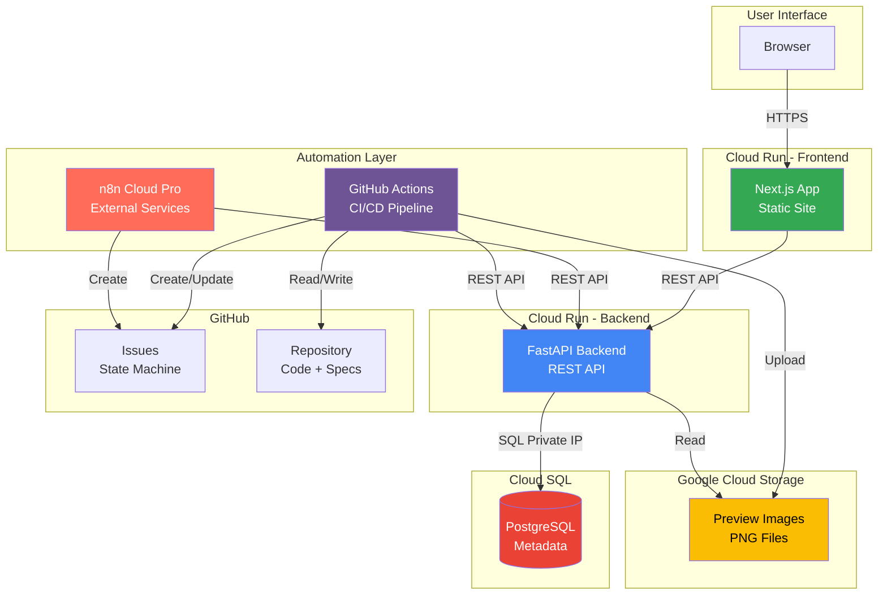
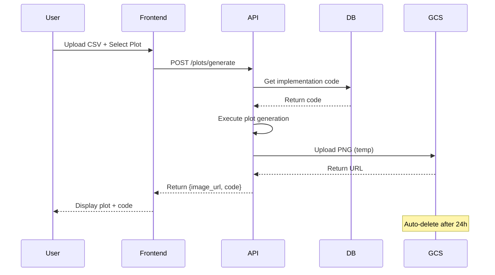
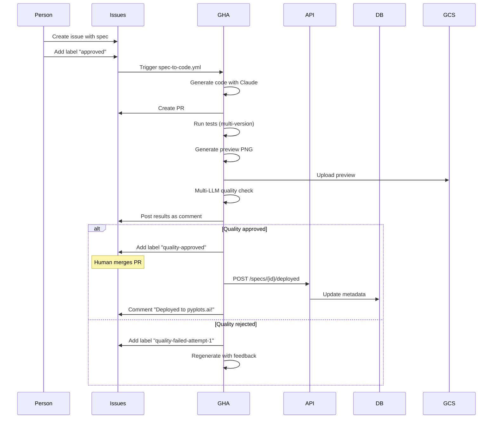

# 🏗️ System Overview

## Architecture at a Glance

pyplots is a **specification-driven, AI-powered platform** for Python data visualization that automatically discovers, generates, tests, and maintains plotting examples. Built as a mono-repository with clear separation between specifications and implementations.

## Core Principles

1. **Specification-First**: Every plot starts with a library-agnostic spec, not code
2. **Your Data First**: Examples work with real user data, not fake data
3. **Library Agnostic**: Support ALL Python plotting libraries
4. **Fully Tested**: Every implementation is tested (90%+ coverage target)
5. **AI-Generated & Maintained**: Code is generated and continuously updated by AI
6. **Issue-Based State Management**: GitHub Issues as single source of truth for workflow state

## System Components



## Component Details

### Frontend (Next.js on Cloud Run)

**Purpose**: User interface for browsing plots and generating visualizations

**Technology**:
- Framework: Next.js 14 (App Router)
- Language: TypeScript
- Styling: Tailwind CSS
- Deployment: Cloud Run (containerized)

**Key Features**:
- Browse plot catalog with previews
- Search and filter plots
- Upload user data (CSV/Excel/JSON)
- Generate plots with user data
- Compare libraries side-by-side
- Copy production-ready code

**API Communication**:
- All data access via REST API
- No direct database connection
- Stateless (no server-side sessions)

---

### Backend (FastAPI on Cloud Run)

**Purpose**: Central API for all data operations and plot generation

**Technology**:
- Framework: FastAPI (async)
- Language: Python 3.10+
- ORM: SQLAlchemy (async)
- Package Manager: uv

**Key Responsibilities**:
- Serve plot metadata and code
- Handle user data uploads
- Execute plot generation
- Manage database operations
- Provide endpoints for automation

**Security**:
- Input validation (Pydantic)
- Rate limiting
- Sandboxed code execution
- No permanent storage of user data

---

### Database (Cloud SQL - PostgreSQL)

**Purpose**: Store metadata, not code or images

**What's Stored**:
- ✅ Spec metadata (title, description, tags)
- ✅ Implementation metadata (library, variant, quality score)
- ✅ GCS URLs (preview images)
- ✅ Promotion queue (social media posts)
- ❌ NO plot code (stored in repository)
- ❌ NO images (stored in GCS)
- ❌ NO quality report files (quality reports ARE stored as GitHub Issue comments)

**Access**:
- Only API has direct access (Private IP)
- Frontend and n8n access via REST API

---

### Storage (Google Cloud Storage)

**Purpose**: Host preview images and user-generated plots

**Buckets**:
```
gs://pyplots-images/
├── previews/{library}/{spec-id}/{variant}/v{timestamp}.png
└── generated/{session_id}/{plot_id}.png  (auto-deleted after 24h)
```

**Lifecycle Policy**:
- Current preview version: permanent
- Old preview versions: auto-deleted 30 days after new version uploaded
- User-generated plots: auto-deleted after 24 hours

**Access**:
- Public read for previews
- Cache-Control: `public, max-age=31536000, immutable`

---

### Automation Layer (GitHub Actions + n8n)

**Strategy**: Hybrid automation - GitHub Actions for code workflows, n8n for external services

**Key Workflows**:

**GitHub Actions** (Code-related):
- Code generation from approved specs
- Multi-version testing (Python 3.10+)
- Preview image generation
- Multi-LLM quality checks
- Cloud Run deployment

**n8n Cloud** (External services):
- Social media monitoring (Twitter, Reddit)
- Automated posting (2x daily to X)
- Issue triage and labeling
- Maintenance scheduling

**For detailed responsibility breakdown**, see [Automation Workflows](./automation-workflows.md#github-actions-vs-n8n-division-of-responsibilities)

---

### GitHub Issues (State Machine)

**Purpose**: Single source of truth for plot lifecycle and quality feedback

**What's Stored in Issues**:
- ✅ Initial spec proposal (Markdown in issue body)
- ✅ Multi-LLM quality feedback (as bot comments)
- ✅ Feedback loops (attempt 1, 2, 3 results)
- ✅ Deployment confirmation
- ✅ Links to PRs and deployed plots

**Benefits**:
- No `quality_report.json` files cluttering the repository
- Full transparency for community
- Easy discussion and iteration
- Automatic linking with PRs
- Clean repository (only production code)

**Update Strategy**:
- Initial spec → Issue #123
- Update for matplotlib 4.0 → Issue #456 (references #123)
- Add new style variant → Issue #502 (references #123)
- Fix seaborn bug → Issue #534 (references #123)

---

## Data Flow Examples

### User Generates Plot with Own Data



### Automated Plot Creation from Issue



---

## Communication Protocols

### Frontend ↔ API
- Protocol: REST over HTTPS
- Format: JSON
- Authentication: API keys (for premium features)
- Endpoints: See [api.md](./api.md)

### n8n ↔ API
- Protocol: REST over HTTPS (internal)
- Format: JSON
- Authentication: Service account token
- Use cases: Queue management, metadata updates

### GitHub Actions ↔ API
- Protocol: REST over HTTPS
- Format: JSON
- Authentication: GitHub Actions service account
- Use cases: Deployment notifications, metadata updates

### API ↔ Database
- Protocol: PostgreSQL wire protocol (Private IP)
- ORM: SQLAlchemy async
- Connection pooling: Yes
- Migrations: Alembic

---

## Technology Stack Summary

| Component | Technology | Hosting | Access |
|-----------|-----------|---------|--------|
| **Frontend** | Next.js 14, TypeScript, Tailwind | Cloud Run | Public HTTPS |
| **Backend** | FastAPI, Python 3.10+, SQLAlchemy | Cloud Run | Public HTTPS |
| **Database** | PostgreSQL 15 | Cloud SQL | Private IP (API only) |
| **Storage** | Google Cloud Storage | GCS | Public read |
| **CI/CD** | GitHub Actions | GitHub-hosted runners | - |
| **Automation** | n8n Cloud Pro | n8n Cloud | External (webhooks to API) |
| **Code** | Python, uv package manager | GitHub | Public |
| **State** | GitHub Issues, Labels | GitHub | Public |

---

## Deployment Environments

### Development (Local)
- Frontend: `localhost:3000`
- Backend: `localhost:8000`
- Database: Local PostgreSQL or Cloud SQL proxy
- Storage: Local filesystem or GCS test bucket

### Production
- Frontend: `https://pyplots.ai` (Cloud Run)
- Backend: `https://api.pyplots.ai` (Cloud Run)
- Database: Cloud SQL (Private IP)
- Storage: `gs://pyplots-images` (GCS)

---

## Scalability Considerations

**Current Design** (Solo Developer, Cost-Conscious):
- Cloud Run: Auto-scaling from 0 to 10 instances
- Database: db-f1-micro (start small, upgrade as needed)
- Storage: Pay-per-use (cheap for images)
- GitHub Actions: Included in Pro subscription

**Future Scaling** (If Needed):
- Increase Cloud Run max instances
- Add Cloud CDN for GCS images
- Upgrade database instance
- Add Redis cache for API responses
- Separate API into microservices (specs, plots, data)

---

*For detailed information on specific components, see:*
- [Repository Structure](./repository-structure.md)
- [Automation Workflows](./automation-workflows.md)
- [Database Schema](./database.md)
- [API Specification](./api.md)
