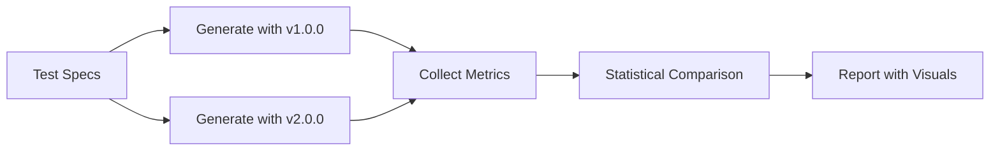
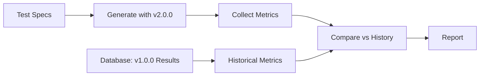
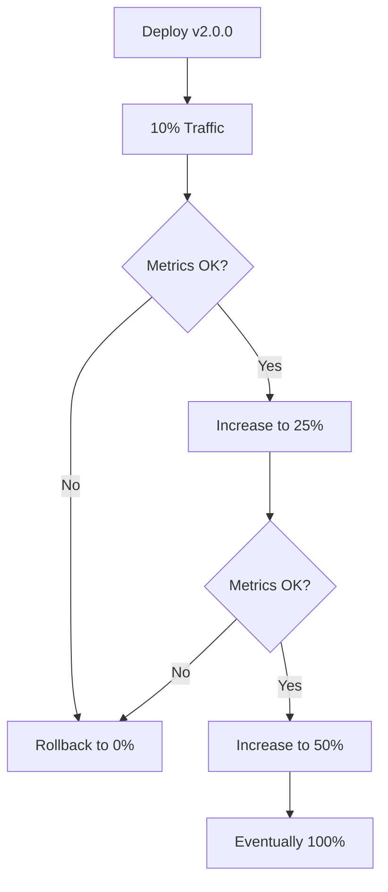
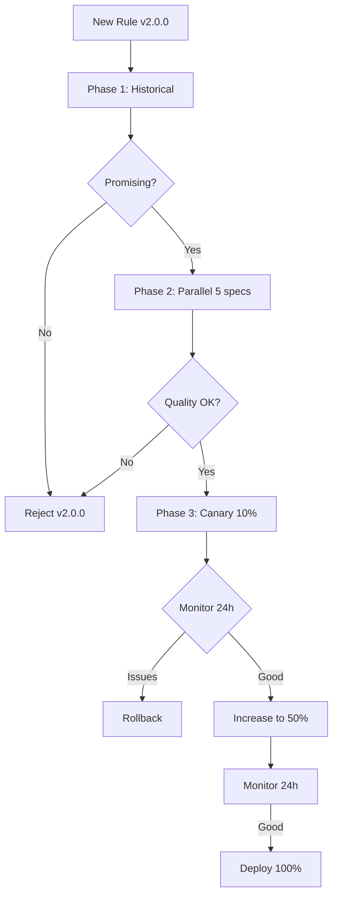

# 🧪 A/B Testing Rules: Comparison Strategies

## Overview

When you create a new version of generation or evaluation rules, you need to **scientifically prove** it's better than the current version before deploying it. This document explores different strategies for A/B testing rule versions.

## The Core Challenge

**Problem**: You have two rule versions and need to answer:
- Is the new version objectively better?
- For which metrics? (quality score, generation time, pass rate)
- By how much? (statistical significance)
- For all plot types or just some?

**Requirements**:
- Compare same specs with both rule versions
- Objective metrics (not subjective)
- Statistical validity (enough samples)
- Visual comparison (side-by-side images)
- Cost-conscious (minimize AI API calls)

---

## Approach 1: Parallel Generation

### Concept

Generate plots **simultaneously** with both rule versions and compare results.

```
Spec: scatter-basic-001
    │
    ├─→ Generate with v1.0.0 → plot_v1.png + metrics_v1
    │
    └─→ Generate with v2.0.0 → plot_v2.png + metrics_v2

Compare: metrics_v1 vs metrics_v2
```

### Workflow



### Implementation

```bash
# Command-line tool
python automation/testing/ab_parallel.py \
  --baseline v1.0.0 \
  --candidate v2.0.0 \
  --specs scatter-basic-001,heatmap-corr-002,bar-grouped-004 \
  --runs 10 \
  --output comparison-report.html
```

### Pros

✅ **Fair comparison**: Both versions tested under identical conditions
✅ **No bias**: Same timestamp, same LLM state, same randomness
✅ **Fast results**: Get answers quickly
✅ **Easy to automate**: Can run in CI/CD

### Cons

❌ **Expensive**: Doubles AI API costs (generate everything twice)
❌ **Requires both implementations**: Need v1 and v2 automation code
❌ **Resource intensive**: Doubles compute and storage

### Best For

- Final validation before deploying new rules
- Small test sets (5-10 specs)
- Critical decisions (major version bumps)
- When budget allows doubling AI costs

---

## Approach 2: Historical Comparison

### Concept

Generate plots with **new** version only, compare metrics against **historical** results from the old version.

```
Spec: scatter-basic-001
    │
    └─→ Generate with v2.0.0 → plot_v2.png + metrics_v2

Database: metrics_v1 (from past generations with v1.0.0)

Compare: metrics_v2 vs historical metrics_v1
```

### Workflow



### Implementation

```bash
# Generate with new version
python automation/testing/ab_historical.py \
  --candidate v2.0.0 \
  --baseline-from-db v1.0.0 \
  --specs scatter-basic-001,heatmap-corr-002 \
  --output comparison-report.html
```

### Database Query

```sql
-- Get historical metrics for v1.0.0
SELECT
  spec_id,
  AVG(quality_score) as avg_score,
  AVG(generation_time_seconds) as avg_time,
  COUNT(*) as sample_size
FROM implementations
WHERE generation_ruleset_version = 'v1.0.0'
  AND spec_id IN ('scatter-basic-001', 'heatmap-corr-002')
GROUP BY spec_id;
```

### Pros

✅ **Cost-effective**: Only generate with new version
✅ **Fast**: No need to regenerate with old version
✅ **Scalable**: Can compare against large historical dataset
✅ **Continuous**: Always comparing against production baseline

### Cons

❌ **Timing bias**: Old results from different time (different LLM version?)
❌ **Context drift**: Libraries may have updated between v1 and v2
❌ **Sample variance**: Historical data may be noisy
❌ **No visual comparison**: Can't show side-by-side images (old images may not exist)

### Best For

- Quick preliminary checks
- Large-scale comparisons (100+ specs)
- Continuous monitoring
- When budget is tight
- Minor version updates (low risk)

---

## Approach 3: Staged Rollout

### Concept

Deploy new version to a **small percentage** of plots first, monitor performance, gradually increase.

```
Day 1: 10% of new plots use v2.0.0, 90% use v1.0.0
       Monitor metrics for 24 hours

Day 2: If good → 25% use v2.0.0
       If bad → Rollback to 0%

Day 3: 50% → 75% → 100%
```

### Workflow



### Implementation

```python
# automation/rollout/canary.py
class CanaryRollout:
    def select_rule_version(self, spec_id: str) -> str:
        """
        Returns which rule version to use for this generation

        Uses consistent hashing to ensure:
        - Same spec always gets same version (during rollout)
        - Percentage split is accurate
        """
        rollout_percentage = get_current_rollout_percentage()

        # Hash spec_id to get consistent assignment
        hash_value = int(hashlib.md5(spec_id.encode()).hexdigest(), 16)
        bucket = hash_value % 100

        if bucket < rollout_percentage:
            return "v2.0.0"  # New version
        else:
            return "v1.0.0"  # Current stable version
```

### Monitoring

```bash
# Real-time monitoring dashboard
python automation/rollout/monitor.py \
  --new-version v2.0.0 \
  --baseline v1.0.0 \
  --metrics quality_score,generation_time,pass_rate \
  --window 24h \
  --auto-rollback-threshold -5%
```

### Pros

✅ **Safe**: Limits blast radius if new version has issues
✅ **Real production data**: Testing with actual usage patterns
✅ **Gradual**: Can abort anytime
✅ **Continuous feedback**: Real-time metrics
✅ **Cost-effective**: Not duplicating work

### Cons

❌ **Slow**: Takes days to fully roll out
❌ **Requires monitoring**: Someone needs to watch metrics
❌ **Mixed state**: System has two versions running simultaneously
❌ **Rollback complexity**: Need to invalidate cached results

### Best For

- Major version changes (high risk)
- Production deployments
- When you have time (not urgent)
- When you have monitoring infrastructure
- Large-scale systems with many users

---

## Approach 4: Hybrid (Recommended)

### Concept

Combine multiple approaches for **balance of speed, cost, and confidence**.

```
Phase 1: Historical Comparison (Quick & Cheap)
         ↓ If promising
Phase 2: Parallel Generation on Small Set (5 specs)
         ↓ If good
Phase 3: Staged Rollout (10% → 50% → 100%)
```

### Workflow



### Decision Tree

```
┌─────────────────────────────────────────────────┐
│ Phase 1: Historical Comparison                  │
│ Cost: Low | Speed: Fast | Confidence: Medium    │
│                                                  │
│ Question: Is new version likely better?         │
│ Criteria: avg(score_v2) > avg(score_v1) + 2%   │
└─────────────────────────────────────────────────┘
              │
              ├─ NO: STOP (reject v2.0.0)
              │
              └─ YES: Continue
                     ↓
┌─────────────────────────────────────────────────┐
│ Phase 2: Parallel on Small Set                  │
│ Cost: Medium | Speed: Medium | Confidence: High │
│                                                  │
│ Question: Is quality consistently better?       │
│ Criteria: - No regressions on critical metrics  │
│           - Visual quality equal or better      │
│           - Statistical significance (p < 0.05) │
└─────────────────────────────────────────────────┘
              │
              ├─ NO: STOP (need more refinement)
              │
              └─ YES: Deploy with canary
                     ↓
┌─────────────────────────────────────────────────┐
│ Phase 3: Staged Rollout                         │
│ Cost: Low | Speed: Slow | Confidence: Very High │
│                                                  │
│ 10% → 24h monitor → 50% → 24h → 100%           │
│                                                  │
│ Auto-rollback if: - Quality drops > 5%          │
│                   - Failure rate > 10%          │
│                   - Generation time > 2x        │
└─────────────────────────────────────────────────┘
```

### Implementation

```bash
# Automated multi-phase testing
python automation/testing/ab_hybrid.py \
  --baseline v1.0.0 \
  --candidate v2.0.0 \
  --test-specs standard_test_set.txt \
  --auto-progress \
  --output hybrid-test-report.html

# Output:
# ✓ Phase 1 (Historical): +3.2% quality improvement → PASS
# ✓ Phase 2 (Parallel):   4/5 specs improved → PASS
# → Triggering Phase 3 (Canary 10%)
# → Will auto-increase after 24h if metrics stable
```

### Pros

✅ **Balanced cost**: Expensive tests only if cheap tests pass
✅ **Fast feedback**: Know quickly if worth pursuing
✅ **High confidence**: Multiple validation layers
✅ **Safe**: Gradual rollout limits risk
✅ **Efficient**: Don't waste resources on bad versions

### Cons

❌ **Complex**: More moving parts
❌ **Longer total time**: Three phases take longer than one
❌ **Requires automation**: Manual process would be tedious

### Best For

- **Most scenarios** (recommended default)
- Production systems
- When you want confidence without excessive cost
- Continuous improvement workflow

---

## Metrics to Compare

### 1. Quality Score
```python
{
  "metric": "quality_score",
  "v1_mean": 87.3,
  "v2_mean": 91.2,
  "improvement": "+3.9%",
  "p_value": 0.003,  # Statistically significant
  "verdict": "BETTER"
}
```

### 2. Pass Rate
```python
{
  "metric": "pass_rate",
  "v1": 0.87,  # 87% passed
  "v2": 0.94,  # 94% passed
  "improvement": "+7%",
  "verdict": "BETTER"
}
```

### 3. Generation Time
```python
{
  "metric": "generation_time_seconds",
  "v1_p50": 12.3,
  "v2_p50": 15.1,
  "change": "+22.8%",
  "verdict": "WORSE (slower)"
}
```

### 4. Attempt Distribution
```python
{
  "metric": "attempts_to_pass",
  "v1": {"1": 0.60, "2": 0.27, "3": 0.13},  # 60% pass on first try
  "v2": {"1": 0.75, "2": 0.20, "3": 0.05},  # 75% pass on first try
  "verdict": "BETTER (fewer retries)"
}
```

### 5. LLM Agreement (Multi-LLM only)
```python
{
  "metric": "llm_agreement",
  "v1": 0.78,  # 78% agreement between Claude/Gemini/GPT
  "v2": 0.89,  # 89% agreement
  "verdict": "BETTER (more consistent criteria)"
}
```

---

## Comparison Report Format

### HTML Report Structure

```html
<!DOCTYPE html>
<html>
<head>
    <title>Rule A/B Test: v1.0.0 vs v2.0.0</title>
</head>
<body>
    <h1>A/B Test Results</h1>

    <!-- Executive Summary -->
    <section>
        <h2>Summary</h2>
        <table>
            <tr>
                <th>Metric</th>
                <th>v1.0.0</th>
                <th>v2.0.0</th>
                <th>Change</th>
                <th>Verdict</th>
            </tr>
            <tr>
                <td>Quality Score</td>
                <td>87.3</td>
                <td>91.2</td>
                <td class="positive">+3.9%</td>
                <td class="winner">✓ BETTER</td>
            </tr>
            <!-- More metrics... -->
        </table>
    </section>

    <!-- Per-Spec Comparison -->
    <section>
        <h2>Per-Spec Results</h2>
        <div class="spec">
            <h3>scatter-basic-001</h3>
            <div class="side-by-side">
                <div>
                    <h4>v1.0.0 (score: 88)</h4>
                    
                </div>
                <div>
                    <h4>v2.0.0 (score: 93)</h4>
                    
                </div>
            </div>
            <p class="analysis">
                Improvement: Font size increased, grid more subtle,
                colorblind-safe palette applied.
            </p>
        </div>
        <!-- More specs... -->
    </section>

    <!-- Statistical Analysis -->
    <section>
        <h2>Statistical Significance</h2>
        <p>T-test: p-value = 0.003 (p < 0.05, significant)</p>
        <p>Effect size: Cohen's d = 0.72 (medium effect)</p>
        <p>Sample size: 10 specs × 5 runs = 50 samples per version</p>
    </section>

    <!-- Recommendation -->
    <section>
        <h2>Recommendation</h2>
        <div class="recommendation pass">
            ✓ DEPLOY v2.0.0

            Rationale:
            - Significant quality improvement (+3.9%, p=0.003)
            - Better pass rate (+7%)
            - No critical regressions
            - Visual quality consistently better

            Suggested rollout: Canary 10% → 50% → 100%
        </div>
    </section>
</body>
</html>
```

---

## Sample Sizes & Statistical Power

### How Many Specs to Test?

**Rule of Thumb**:
- **Quick check**: 3-5 specs (low confidence, good enough for draft)
- **Standard test**: 10-15 specs (medium confidence, good for minor versions)
- **Rigorous test**: 20-30 specs (high confidence, required for major versions)

### How Many Runs per Spec?

```python
# Statistical power calculation
def required_sample_size(
    expected_improvement: float = 0.05,  # 5% improvement
    significance_level: float = 0.05,    # p < 0.05
    power: float = 0.80                   # 80% power
) -> int:
    """
    Returns: Number of runs needed per spec per version

    Example:
    - To detect 5% improvement
    - With 95% confidence (p < 0.05)
    - And 80% chance of detecting if it exists
    → Need ~64 samples per version
    → For 10 specs: 6-7 runs per spec per version
    """
    pass
```

**Practical Guide**:
- **Budget unlimited**: 10 runs per spec per version
- **Budget medium**: 5 runs per spec per version
- **Budget tight**: 3 runs per spec per version
- **Quick check**: 1 run per spec per version (not statistically valid, just a sanity check)

---

## Cost Estimation

### Parallel Generation (Approach 1)

```python
# Assumptions
specs = 10
runs = 5
cost_per_generation = $0.10  # Claude API

# Cost calculation
total_generations = specs × runs × 2  # ×2 for both versions
total_cost = total_generations × cost_per_generation

# = 10 × 5 × 2 × $0.10 = $10.00
```

### Historical Comparison (Approach 2)

```python
# Only generate with new version
total_generations = specs × runs
total_cost = total_generations × cost_per_generation

# = 10 × 5 × $0.10 = $5.00  (50% cheaper)
```

### Hybrid Approach (Approach 4)

```python
# Phase 1: Historical (free, uses existing data)
phase1_cost = $0

# Phase 2: Parallel on 5 specs, 5 runs each
phase2_cost = 5 × 5 × 2 × $0.10 = $5.00

# Phase 3: Canary (spreads over time, no extra cost)
phase3_cost = $0

# Total: $5.00  (same as Approach 2, but higher confidence)
```

---

## Automation Scripts (Conceptual)

### Quick Start

```bash
# Install dependencies
pip install pyplots-testing

# Run standard A/B test (hybrid approach)
pyplots-ab-test \
  --baseline v1.0.0 \
  --candidate v2.0.0 \
  --output report.html

# Output:
# ✓ Phase 1: Historical check PASSED
# ✓ Phase 2: Parallel test PASSED
# → Starting Phase 3: Canary rollout
```

### Custom Test

```python
# automation/testing/custom_ab_test.py
from pyplots.testing import ABTest

# Configure test
test = ABTest(
    baseline_version="v1.0.0",
    candidate_version="v2.0.0",
    approach="hybrid"
)

# Add test specs
test.add_specs([
    "scatter-basic-001",
    "heatmap-corr-002",
    "bar-grouped-004"
])

# Configure metrics
test.track_metrics([
    "quality_score",
    "pass_rate",
    "generation_time",
    "attempts_to_pass"
])

# Run test
results = test.run()

# Generate report
test.generate_report(
    output="comparison-report.html",
    include_visuals=True
)

# Decision
if results.recommend_deployment():
    print("✓ Deploy v2.0.0")
    test.trigger_canary_rollout()
else:
    print("✗ Keep v1.0.0")
    print(f"Reason: {results.rejection_reason}")
```

---

## Decision Framework

### Should I Deploy the New Version?

```
Deploy v2.0.0 if ALL of:
├─ Quality score improved OR stayed same
├─ Pass rate improved OR stayed within -2%
├─ No critical regressions (must-have features still work)
├─ Statistical significance (p < 0.05) OR large effect size
└─ Visual inspection looks good (side-by-side comparison)

DON'T deploy if ANY of:
├─ Quality score dropped > 3%
├─ Pass rate dropped > 5%
├─ Critical features broken
├─ Generation time increased > 50% (unless quality gain is huge)
└─ Visual quality clearly worse
```

### Borderline Cases

```
If results are mixed (some metrics better, some worse):
1. Weight metrics by importance:
   - Quality score: 40%
   - Pass rate: 30%
   - Visual quality: 20%
   - Generation time: 10%

2. Calculate weighted score

3. If weighted score > current + 5%:
   → Deploy
   Otherwise:
   → Refine and test again
```

---

## Future Enhancements

### Automatic A/B Testing in CI/CD

```yaml
# .github/workflows/test-new-rules.yml
on:
  pull_request:
    paths:
      - 'rules/**'

jobs:
  ab-test:
    runs-on: ubuntu-latest
    steps:
      - name: Detect rule changes
        id: detect
        run: |
          # Extract version numbers
          OLD_VERSION=$(...)
          NEW_VERSION=$(...)

      - name: Run A/B test
        run: |
          pyplots-ab-test \
            --baseline $OLD_VERSION \
            --candidate $NEW_VERSION \
            --auto

      - name: Post report to PR
        uses: actions/github-script@v6
        with:
          script: |
            // Comment with HTML report
```

### Machine Learning for Rule Optimization

```python
# Future: Learn which rules produce best results
from pyplots.ml import RuleOptimizer

optimizer = RuleOptimizer()

# Learn from historical data
optimizer.train(
    generations=all_generations_from_database,
    target_metric="quality_score"
)

# Suggest rule improvements
suggestions = optimizer.suggest_improvements(
    current_version="v2.0.0"
)

# Output:
# Suggestion 1: Increase grid alpha to 0.35 (predicted +2% quality)
# Suggestion 2: Add minimum 11pt font size (predicted +1.5% quality)
```

---

## Summary

### Quick Reference Table

| Approach | Cost | Speed | Confidence | Best For |
|----------|------|-------|------------|----------|
| **Parallel** | High | Fast | High | Critical decisions, final validation |
| **Historical** | Low | Very Fast | Medium | Quick checks, large scale |
| **Staged** | Low | Slow | Very High | Major changes, production |
| **Hybrid** | Medium | Medium | Very High | **Most scenarios (recommended)** |

### Recommendation

**For most use cases, use the Hybrid approach**:
1. Quick historical check (5 min, $0)
2. If promising → Parallel test on 5 specs (1 hour, $5)
3. If good → Canary rollout 10% → 50% → 100% (2-3 days, $0 extra)

This balances cost, speed, and confidence while minimizing risk.

---

## Related Documentation

- [Rule Versioning System](../architecture/rule-versioning.md)
- [Claude Skill for Plot Generation](./claude-skill-plot-generation.md)
- [Automation Workflows](../architecture/automation-workflows.md)

---

*"Test scientifically. Deploy confidently."*
