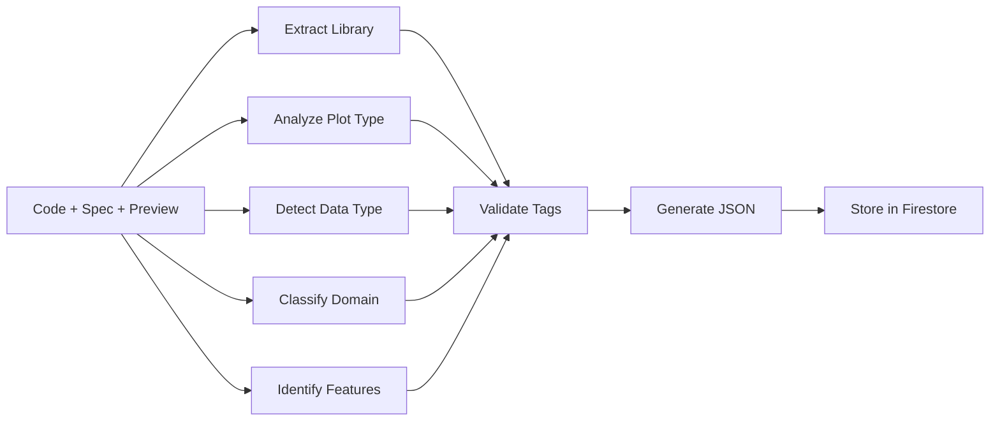

# Multi-Level Tagging & Clustering System

## Overview

A multi-dimensional categorization system that organizes plots by various aspects, makes them searchable, and is automatically generated by AI.

**Status**: v1.0.0-draft (concept phase)

**Key Features**:
- 🏷️ 5-level hierarchical tag system
- 🤖 Automatic tag generation by AI (following rules)
- 🔍 Multi-dimensional search and filters
- 🎨 Visual clustering algorithms
- 💡 Intelligent plot recommendations
- 📊 Analytics and gap analysis

---

## Motivation

### Problem
Without a structured tagging system:
- Plots are hard to find (only text search by spec-id)
- No discovery of similar plots
- No domain-specific navigation
- No data-driven recommendations

### Solution
Multi-dimensional tag system with:
- **Automation**: AI generates tags following rules (no manual tagging)
- **Consistency**: Versioned tagging rules guarantee uniform tags
- **Flexibility**: 5 independent dimensions enable precise search
- **Scalability**: System grows with the plot collection

---

## Tag Hierarchy (5 Levels)

### Overview

```yaml
tag_hierarchy:
  level_1_library:           # Welche Python-Bibliothek
    - matplotlib
    - seaborn
    - plotly
    - bokeh
    - altair

  level_2_plot_type:         # Art der Visualisierung
    - line
    - bar
    - scatter
    - heatmap
    - 3d

  level_3_data_type:         # Input-Daten-Struktur
    - timeseries
    - categorical
    - numerical
    - geospatial
    - network

  level_4_domain:            # Anwendungsdomäne
    - finance
    - research
    - data-science
    - business
    - engineering

  level_5_features:          # Spezielle Features
    - interactive
    - animated
    - real-time
    - static
    - export-ready
```

---

## Detaillierte Tag-Taxonomie

### Level 1: Library Tags

```yaml
libraries:
  matplotlib:
    description: "Classic Python plotting library"
    subcategories:
      - pyplot
      - object-oriented
      - axes3d
      - animation
    typical_use: "Publication-ready static plots"

  seaborn:
    description: "Statistical data visualization"
    subcategories:
      - statistical
      - categorical
      - distribution
      - regression
    typical_use: "Statistical analysis visualizations"

  plotly:
    description: "Interactive web-based plots"
    subcategories:
      - express
      - graph-objects
      - dash-integration
      - 3d-plots
    typical_use: "Interactive dashboards and reports"

  bokeh:
    description: "Interactive visualization for browsers"
    subcategories:
      - server-apps
      - widgets
      - streaming
    typical_use: "Real-time data visualization"

  altair:
    description: "Declarative visualization"
    subcategories:
      - vega-lite
      - grammar-of-graphics
    typical_use: "Quick exploratory visualizations"

  holoviews:
    description: "Data analysis and visualization"
    subcategories:
      - declarative
      - composable
    typical_use: "Complex multi-dimensional data"
```

---

### Level 2: Plot Type Tags

```yaml
plot_types:
  basic:
    line:
      variants: [simple, multi-line, stepped, curved]
      complexity: low

    bar:
      variants: [vertical, horizontal, grouped, stacked]
      complexity: low

    scatter:
      variants: [2d, bubble, colored, sized]
      complexity: low

    pie:
      variants: [simple, donut, exploded, nested]
      complexity: low

  statistical:
    histogram:
      variants: [simple, stacked, normalized, 2d]
      complexity: medium

    boxplot:
      variants: [simple, grouped, notched, violin]
      complexity: medium

    heatmap:
      variants: [simple, annotated, clustered, correlation]
      complexity: medium

    distribution:
      variants: [kde, rug, ecdf, qq]
      complexity: high

  advanced:
    3d:
      variants: [surface, wireframe, scatter3d, volume]
      complexity: high

    network:
      variants: [force-directed, hierarchical, circular, geo]
      complexity: high

    parallel:
      variants: [coordinates, categories, sets]
      complexity: high

    sankey:
      variants: [flow, alluvial, chord]
      complexity: high

  specialized:
    financial:
      variants: [candlestick, ohlc, renko, kagi]
      complexity: high

    scientific:
      variants: [contour, vector-field, streamplot, quiver]
      complexity: high

    geospatial:
      variants: [choropleth, bubble-map, flow-map, hexbin]
      complexity: high
```

---

### Level 3: Data Type Tags

```yaml
data_types:
  structured:
    tabular:
      formats: [dataframe, csv, excel, sql]
      characteristics:
        - rows and columns
        - mixed types
        - indexed
      example_plots: [bar, scatter, heatmap]

    timeseries:
      formats: [datetime-indexed, timestamp, period]
      characteristics:
        - temporal ordering
        - regular/irregular intervals
        - seasonality
      example_plots: [line, area, candlestick]

    hierarchical:
      formats: [json, xml, nested-dict, tree]
      characteristics:
        - parent-child relationships
        - multiple levels
        - recursive structure
      example_plots: [treemap, sunburst, dendrogram]

  unstructured:
    text:
      formats: [string, corpus, documents]
      characteristics:
        - word frequency
        - sentiment
        - topics
      example_plots: [wordcloud, network, bar]

    image:
      formats: [matrix, tensor, pixels]
      characteristics:
        - 2d/3d arrays
        - channels
        - spatial data
      example_plots: [heatmap, contour, image-plot]

  specialized:
    geospatial:
      formats: [geojson, shapefile, coordinates]
      characteristics:
        - latitude/longitude
        - polygons
        - spatial relationships
      example_plots: [map, choropleth, hexbin]

    network:
      formats: [edgelist, adjacency, graphml]
      characteristics:
        - nodes and edges
        - directed/undirected
        - weighted
      example_plots: [network, chord, sankey]

    multidimensional:
      formats: [tensor, ndarray, xarray]
      characteristics:
        - 3+ dimensions
        - large scale
        - sparse/dense
      example_plots: [parallel-coords, facets, small-multiples]
```

---

### Level 4: Domain Tags

```yaml
domains:
  finance:
    description: "Financial markets and analysis"
    subtopics:
      - stock-market
      - portfolio
      - risk-analysis
      - trading
      - crypto
    common_plots:
      - candlestick
      - portfolio-composition
      - correlation-matrix
      - risk-heatmap
    data_characteristics:
      - high-frequency
      - time-sensitive
      - volatility

  research:
    description: "Academic and scientific research"
    subtopics:
      - biology
      - physics
      - chemistry
      - social-science
      - medicine
    common_plots:
      - publication-quality
      - error-bars
      - statistical-significance
      - experimental-results
    requirements:
      - latex-fonts
      - precise-axes
      - reproducible

  data_science:
    description: "ML and data analysis"
    subtopics:
      - eda
      - feature-engineering
      - model-evaluation
      - clustering
      - classification
    common_plots:
      - confusion-matrix
      - roc-curve
      - feature-importance
      - learning-curves
    tools_integration:
      - sklearn
      - tensorflow
      - pytorch

  business:
    description: "Business intelligence and reporting"
    subtopics:
      - kpi-dashboard
      - sales-analysis
      - customer-analytics
      - operations
      - marketing
    common_plots:
      - executive-dashboard
      - funnel-chart
      - gauge-chart
      - waterfall
    requirements:
      - branded-colors
      - export-to-ppt
      - interactive

  engineering:
    description: "Engineering and technical analysis"
    subtopics:
      - signal-processing
      - control-systems
      - structural
      - electrical
      - mechanical
    common_plots:
      - bode-plot
      - smith-chart
      - polar-plot
      - phase-diagram
    characteristics:
      - precise-measurements
      - technical-standards
      - simulation-data

  healthcare:
    description: "Medical and health data"
    subtopics:
      - clinical-trials
      - epidemiology
      - patient-data
      - genomics
      - imaging
    common_plots:
      - survival-curves
      - forest-plot
      - manhattan-plot
      - roc-analysis
    requirements:
      - hipaa-compliant
      - anonymized
      - statistical-rigor
```

---

### Level 5: Feature Tags

```yaml
features:
  interactivity:
    static:
      description: "Non-interactive images"
      formats: [png, svg, pdf]
      use_case: "Reports, publications"

    interactive:
      description: "User can interact"
      features: [zoom, pan, hover, click]
      use_case: "Dashboards, exploration"

    animated:
      description: "Time-based animation"
      formats: [gif, mp4, html]
      use_case: "Presentations, social media"

  complexity:
    beginner:
      description: "Simple, minimal code"
      lines_of_code: "< 20"
      concepts: "Basic plotting"

    intermediate:
      description: "Moderate complexity"
      lines_of_code: "20-100"
      concepts: "Customization, styling"

    advanced:
      description: "Complex implementations"
      lines_of_code: "> 100"
      concepts: "Custom classes, algorithms"

  performance:
    real_time:
      description: "Streaming data"
      update_rate: "> 10 fps"
      use_case: "Monitoring, live data"

    large_scale:
      description: "Big data capable"
      data_points: "> 1M"
      techniques: "Datashader, decimation"

    lightweight:
      description: "Minimal resources"
      memory: "< 100MB"
      use_case: "Embedded, web"
```

---

## Auto-Tagging by AI

### Process Overview



### KI-Tagging-Strategie

**Input**:
- `code`: Generated Python implementation
- `spec`: Markdown specification
- `preview_image`: Plot preview (PNG)

**Output**:
```json
{
  "plot_id": "scatter-basic-001",
  "tags": {
    "library": {
      "primary": "matplotlib",
      "secondary": []
    },
    "plot_type": {
      "primary": "scatter",
      "family": "basic",
      "variants": ["2d", "colored"]
    },
    "data_type": {
      "primary": "tabular",
      "secondary": ["numerical"],
      "format": "dataframe"
    },
    "domain": {
      "primary": "data-science",
      "secondary": ["research"],
      "industry": null
    },
    "features": {
      "interactivity": "static",
      "complexity": "beginner",
      "performance": "lightweight",
      "special": ["export-ready"]
    }
  },
  "search_keywords": [
    "scatter", "2d", "matplotlib", "basic",
    "data-science", "dataframe", "simple"
  ],
  "confidence_scores": {
    "library": 1.0,
    "plot_type": 0.95,
    "data_type": 0.9,
    "domain": 0.75,
    "features": 0.85
  }
}
```

**Tagging-Rules**: Siehe `rules/generation/v1.0.0-draft/tagging-rules.md`

---

## Multi-Dimensionale Suche

### Search Query Examples

```python
# Find all matplotlib timeseries plots for finance
search_query = {
    "library": "matplotlib",
    "data_type": "timeseries",
    "domain": "finance"
}
# Results: candlestick, portfolio-timeseries, price-charts

# Find all interactive 3D plots for research
search_query = {
    "plot_type": "3d",
    "features": ["interactive"],
    "domain": "research"
}
# Results: interactive-surface, 3d-scatter-plotly, volume-visualization

# Find beginner-friendly categorical plots
search_query = {
    "data_type": "categorical",
    "complexity": "beginner",
    "library": ["matplotlib", "seaborn"]
}
# Results: bar-chart, count-plot, pie-chart
```

### Firestore Document Structure

```javascript
{
  "plot_id": "fin-ts-candlestick-001",
  "spec_id": "candlestick-basic-001",
  "library": "plotly",
  "implementation_path": "plots/plotly/candlestick/candlestick-basic-001/default.py",

  "tags": {
    "library": {
      "primary": "plotly",
      "secondary": ["matplotlib"]
    },
    "plot_type": {
      "primary": "candlestick",
      "family": "financial",
      "variants": ["ohlc", "volume-overlay"]
    },
    "data_type": {
      "primary": "timeseries",
      "secondary": ["tabular"],
      "format": "dataframe"
    },
    "domain": {
      "primary": "finance",
      "secondary": ["trading", "crypto"],
      "industry": "fintech"
    },
    "features": {
      "interactivity": "interactive",
      "complexity": "intermediate",
      "performance": "real-time",
      "special": ["responsive", "mobile-friendly"]
    }
  },

  "search_keywords": [
    "stock", "trading", "ohlc", "candlestick",
    "financial", "market", "bitcoin", "forex"
  ],

  "similarity_clusters": {
    "visual_cluster": "financial-charts",
    "technical_cluster": "timeseries-analysis",
    "domain_cluster": "trading-tools"
  },

  "metadata": {
    "created": "2025-01-23T10:30:00Z",
    "tagged_by": "claude-auto-tagger-v1.0.0",
    "confidence_score": 0.88,
    "human_verified": false
  }
}
```

### Firestore Indices (für schnelle Suche)

```javascript
// Composite indices
db.collection('plot_tags').createIndex({
  'tags.library.primary': 1,
  'tags.plot_type.family': 1,
  'tags.domain.primary': 1
});

db.collection('plot_tags').createIndex({
  'tags.data_type.primary': 1,
  'tags.features.complexity': 1,
  'search_keywords': 1
});

// Text search index
db.collection('plot_tags').createIndex({
  'search_keywords': 'text'
});
```

---

## Clustering-Algorithmen

### 1. Visual Similarity Clustering

Gruppiert Plots nach visueller Ähnlichkeit:

```python
visual_clusters = {
    "line-based": [
        "line", "multi-line", "timeseries",
        "sparkline", "area", "stepped"
    ],

    "distribution": [
        "histogram", "kde", "violin",
        "ridgeline", "density", "ecdf"
    ],

    "correlation": [
        "heatmap", "correlogram", "bubble-matrix",
        "scatter-matrix", "clustermap"
    ],

    "hierarchical": [
        "treemap", "sunburst", "dendrogram",
        "icicle", "circle-packing"
    ],

    "flow": [
        "sankey", "alluvial", "chord",
        "network", "arc-diagram"
    ],

    "geographic": [
        "choropleth", "bubble-map", "flow-map",
        "hexbin-map", "cartogram"
    ],

    "3d-family": [
        "surface", "wireframe", "scatter3d",
        "volume", "mesh"
    ]
}
```

**Use Case**: "Zeige mir ähnliche Plots" - Recommendation System

---

### 2. Domain-Specific Clustering

Gruppiert nach typischen Anwendungsfällen in Domänen:

```python
domain_clusters = {
    "finance": {
        "market-analysis": [
            "candlestick", "volume", "macd",
            "bollinger", "price-chart"
        ],
        "portfolio": [
            "pie", "treemap", "returns-heatmap",
            "efficient-frontier", "composition"
        ],
        "risk": [
            "var-chart", "correlation-matrix",
            "monte-carlo", "drawdown"
        ]
    },

    "research": {
        "experiments": [
            "bar-with-errors", "grouped-box",
            "paired-plot", "before-after"
        ],
        "publications": [
            "scatter-with-fit", "multi-panel",
            "latex-styled", "high-dpi"
        ],
        "statistics": [
            "qq-plot", "residual-plot",
            "forest-plot", "funnel-plot"
        ]
    },

    "data-science": {
        "eda": [
            "pairplot", "correlation",
            "distribution-grid", "missing-data"
        ],
        "modeling": [
            "roc", "confusion-matrix",
            "learning-curves", "pr-curve"
        ],
        "clustering": [
            "dendrogram", "silhouette",
            "elbow", "tsne", "umap"
        ]
    }
}
```

**Use Case**: "Zeige mir typische Finance-Plots" - Domain Navigation

---

### 3. Complexity-Based Clustering

Gruppiert nach Implementierungskomplexität:

```python
complexity_clusters = {
    "beginner": {
        "description": "Simple one-liners, < 20 lines",
        "examples": [
            "line-basic", "bar-simple",
            "scatter-basic", "pie-simple"
        ],
        "learning_path": "Start here"
    },

    "intermediate": {
        "description": "Customization, 20-100 lines",
        "examples": [
            "multi-line-styled", "grouped-bar",
            "scatter-with-color", "heatmap-annotated"
        ],
        "learning_path": "After mastering basics"
    },

    "advanced": {
        "description": "Complex logic, > 100 lines",
        "examples": [
            "3d-surface", "interactive-dashboard",
            "animated-scatter", "custom-projection"
        ],
        "learning_path": "For experienced users"
    }
}
```

**Use Case**: "Zeige mir einfache Plots für Einsteiger" - Learning Path

---

## Intelligent Recommendations

### Recommendation Engine

```python
class PlotRecommendationEngine:
    """Intelligent plot recommendations based on viewing history"""

    def recommend_next_plot(
        self,
        viewed_plots: list[str],
        user_domain: str
    ) -> dict:
        """
        Args:
            viewed_plots: List of plot_ids the user has viewed
            user_domain: Primary domain of the user (e.g., "finance")

        Returns:
            Dict with different recommendation categories
        """
        # Analyze tag patterns
        common_tags = self.extract_common_tags(viewed_plots)

        recommendations = {
            "similar": self.find_similar_plots(
                common_tags,
                exclude=viewed_plots
            ),

            "next_complexity": self.suggest_next_level(
                common_tags
            ),

            "same_domain": self.find_domain_matches(
                user_domain
            ),

            "trending": self.get_trending_in_domain(
                user_domain
            ),

            "complementary": self.find_complementary_plots(
                common_tags
            )
        }

        return self.rank_recommendations(recommendations)

    def find_similar_plots(self, tags, exclude):
        """Finde Plots mit ähnlichen Tags"""
        # Gewichtete Tag-Similarity
        weights = {
            "library": 0.3,
            "plot_type": 0.4,
            "domain": 0.2,
            "data_type": 0.1
        }
        # ... Implementation

    def suggest_next_level(self, tags):
        """Schlage nächsten Schwierigkeitsgrad vor"""
        current_complexity = tags.get("complexity", "beginner")

        progression = {
            "beginner": "intermediate",
            "intermediate": "advanced",
            "advanced": "advanced"  # Bleibe auf advanced
        }

        next_level = progression[current_complexity]
        # ... find plots at next level

    def find_complementary_plots(self, tags):
        """Finde ergänzende Plot-Typen"""
        # Wenn User scatter-plots anschaut,
        # empfehle correlation heatmap

        complementary_map = {
            "scatter": ["heatmap", "pair-plot"],
            "line": ["area", "multi-line"],
            "bar": ["grouped-bar", "stacked-bar"],
            # ...
        }
        # ... Implementation
```

### Example Recommendation

```python
# User has viewed:
viewed = [
    "scatter-basic-001",  # matplotlib, beginner
    "scatter-colored-002", # matplotlib, beginner
    "line-basic-003"       # matplotlib, beginner
]

recommendations = engine.recommend_next_plot(viewed, domain="data-science")

# Output:
{
  "similar": [
    {
      "plot_id": "scatter-bubble-004",
      "reason": "Ähnlich zu scatter-colored-002, fügt Bubble-Size hinzu",
      "similarity_score": 0.92
    }
  ],

  "next_complexity": [
    {
      "plot_id": "scatter-regression-005",
      "reason": "Nächster Schritt: Scatter mit Regression Line",
      "complexity": "intermediate"
    }
  ],

  "complementary": [
    {
      "plot_id": "heatmap-correlation-010",
      "reason": "Visualisiere Korrelationen zwischen scatter-Variablen",
      "use_case": "Ergänzt scatter-Analyse"
    }
  ],

  "trending": [
    {
      "plot_id": "pair-plot-015",
      "reason": "Beliebt in data-science für multi-variate Exploration",
      "views_last_week": 342
    }
  ]
}
```

---

## UI/UX Filter Design

### Hierarchical Filter Interface

```typescript
interface PlotFilter {
  // Level 1: Library Selection (Multiple)
  libraries: {
    matplotlib: boolean;
    seaborn: boolean;
    plotly: boolean;
    bokeh: boolean;
    altair: boolean;
  };

  // Level 2: Plot Type (Hierarchical)
  plotTypes: {
    basic: string[];      // ["line", "bar"]
    statistical: string[];
    advanced: string[];
    specialized: string[];
  };

  // Level 3: Data Type (Multiple)
  dataTypes: string[];

  // Level 4: Domain (Primary + Secondary)
  domains: {
    primary: string;
    secondary: string[];
  };

  // Level 5: Features (Checkbox)
  features: {
    interactivity: "any" | "static" | "interactive" | "animated";
    complexity: "any" | "beginner" | "intermediate" | "advanced";
    performance: string[];
  };
}
```

### Smart Tag Suggestions

```typescript
class TagRecommender {
  /**
   * Empfehle verwandte Tags basierend auf Auswahl
   */
  suggestTags(selectedTags: string[]): TagSuggestions {
    return {
      related: this.findRelatedTags(selectedTags),
      popularCombinations: this.getPopularCombos(selectedTags),
      missingDimensions: this.findMissingDimensions(selectedTags)
    };
  }

  private findRelatedTags(tags: string[]): string[] {
    // Wenn User "finance" wählt, schlage vor:
    // "timeseries", "candlestick", "portfolio"

    const relatedMap: Record<string, string[]> = {
      "finance": ["timeseries", "candlestick", "portfolio"],
      "research": ["publication-quality", "error-bars", "latex"],
      "real-time": ["streaming", "bokeh", "animated"],
      "3d": ["plotly", "surface", "interactive"],
      // ...
    };

    return relatedMap[tags[0]] || [];
  }
}
```

---

## Analytics Dashboard für Tags

### SQL Views für Analyse

```sql
-- Most popular tag combinations
CREATE VIEW popular_tag_combos AS
SELECT
    library,
    plot_type,
    domain,
    COUNT(*) as usage_count,
    AVG(quality_score) as avg_quality
FROM plot_tags
GROUP BY library, plot_type, domain
ORDER BY usage_count DESC;

-- Tag coverage analysis
CREATE VIEW tag_coverage AS
SELECT
    'library' as dimension,
    COUNT(DISTINCT library) as unique_values,
    COUNT(*) as total_plots
FROM plot_tags
UNION ALL
SELECT 'domain', COUNT(DISTINCT domain), COUNT(*)
FROM plot_tags
UNION ALL
SELECT 'plot_type', COUNT(DISTINCT plot_type), COUNT(*)
FROM plot_tags;

-- Missing combinations (gaps to fill)
CREATE VIEW missing_combinations AS
SELECT DISTINCT
    l.name as library,
    pt.name as plot_type,
    d.name as domain
FROM libraries l
CROSS JOIN plot_types pt
CROSS JOIN domains d
WHERE NOT EXISTS (
    SELECT 1 FROM plots p
    WHERE p.library = l.name
    AND p.plot_type = pt.name
    AND p.domain = d.name
)
LIMIT 100;  -- Top 100 missing combos
```

### Dashboard Metriken

**Key Metrics**:
- **Tag Coverage**: Wie viele der möglichen Tag-Kombinationen sind abgedeckt?
- **Popular Combos**: Welche Tag-Kombinationen werden am meisten gesucht?
- **Quality by Tags**: Welche Tag-Kombinationen haben höchste Quality-Scores?
- **Gaps**: Welche wichtigen Kombinationen fehlen noch?

**Example Dashboard Query**:
```python
# Find most requested but missing combinations
missing_combos = db.query("""
    SELECT
        search_library,
        search_plot_type,
        search_domain,
        COUNT(*) as search_count
    FROM user_searches
    WHERE result_count = 0
    GROUP BY search_library, search_plot_type, search_domain
    ORDER BY search_count DESC
    LIMIT 20
""")

# Ergebnis: "plotly + sankey + finance" wurde 45x gesucht, aber 0 Ergebnisse
# → Priorität für neue Spec-Erstellung
```

---

## Integration in n8n Workflow

### Auto-Tagging Workflow

```json
{
  "name": "Auto-Tag New Plot",
  "trigger": "plot_generated",

  "nodes": [
    {
      "name": "1. Extract Library from Code",
      "type": "n8n-nodes-base.code",
      "parameters": {
        "code": "// Detect primary library from imports\nconst imports = $input.item.json.code.match(/import .* from ['\"](.*?)['\"]/g);\nconst library = detectPrimaryLibrary(imports);\nreturn { library };"
      }
    },

    {
      "name": "2. Analyze Plot Type (Vision API)",
      "type": "n8n-nodes-base.httpRequest",
      "parameters": {
        "url": "{{ $env.CLAUDE_VISION_API }}/analyze",
        "method": "POST",
        "body": {
          "image_url": "{{ $json.preview_url }}",
          "task": "classify_plot_type",
          "options": ["line", "bar", "scatter", "heatmap", "3d"]
        }
      }
    },

    {
      "name": "3. Detect Data Type from Spec",
      "type": "n8n-nodes-base.code",
      "parameters": {
        "code": "// Parse spec requirements\nconst spec = $input.item.json.specification;\nconst dataType = extractDataTypeFromSpec(spec);\nreturn { dataType };"
      }
    },

    {
      "name": "4. Classify Domain (NLP)",
      "type": "n8n-nodes-base.httpRequest",
      "parameters": {
        "url": "{{ $env.CLAUDE_API }}/classify",
        "method": "POST",
        "body": {
          "text": "{{ $json.spec_description }}",
          "categories": ["finance", "research", "data-science", "business", "engineering", "healthcare"],
          "model": "claude-3-haiku"
        }
      }
    },

    {
      "name": "5. Identify Features",
      "type": "n8n-nodes-base.code",
      "parameters": {
        "code": "// Analyze code for features\nconst code = $input.item.json.code;\nconst features = {\n  interactivity: detectInteractivity(code),\n  complexity: calculateComplexity(code),\n  performance: detectPerformanceFeatures(code)\n};\nreturn { features };"
      }
    },

    {
      "name": "6. Validate Tags",
      "type": "n8n-nodes-base.code",
      "parameters": {
        "code": "// Validate against tagging-rules.md\nconst tags = {\n  library: $json.library,\n  plot_type: $json.plot_type,\n  data_type: $json.dataType,\n  domain: $json.domain_classification,\n  features: $json.features\n};\n\nconst validation = validateTagsAgainstRules(tags);\nif (!validation.valid) {\n  throw new Error(`Invalid tags: ${validation.errors}`);\n}\n\nreturn { tags, confidence: validation.confidence };"
      }
    },

    {
      "name": "7. Store in Firestore",
      "type": "n8n-nodes-base.firestore",
      "parameters": {
        "operation": "create",
        "collection": "plot_tags",
        "document": {
          "plot_id": "{{ $json.plot_id }}",
          "tags": "{{ $json.tags }}",
          "metadata": {
            "tagged_by": "n8n-auto-tagger-v1.0.0",
            "confidence_score": "{{ $json.confidence }}",
            "created": "{{ $now }}"
          }
        }
      }
    },

    {
      "name": "8. Update Search Index",
      "type": "n8n-nodes-base.httpRequest",
      "parameters": {
        "url": "{{ $env.SEARCH_API }}/index/update",
        "method": "POST",
        "body": {
          "plot_id": "{{ $json.plot_id }}",
          "tags": "{{ $json.tags }}",
          "keywords": "{{ $json.search_keywords }}"
        }
      }
    }
  ]
}
```

---

## Migration & Rollout

### Phase 1: Foundation (Current)
- ✅ Dokumentation des Tag-Systems
- ✅ Tagging-Rules erstellt (v1.0.0-draft)
- ⏳ Templates für Tag-Erstellung

### Phase 2: Implementation
- ⏳ Firestore Collection Setup
- ⏳ Auto-Tagging in GitHub Actions
- ⏳ n8n Workflow Implementation
- ⏳ API Endpoints für Tag-Suche

### Phase 3: Testing
- ⏳ Tag 100 existing plots
- ⏳ Validate accuracy (>90% confidence)
- ⏳ A/B Test Tagging-Rules v1.0.0 vs v1.1.0

### Phase 4: Production
- ⏳ Auto-Tag all new plots
- ⏳ Backfill all existing plots
- ⏳ Enable Search & Filter UI
- ⏳ Launch Recommendation Engine

---

## Best Practices

### For Tag Generation

**DO**:
- ✅ Use versioned tagging-rules.md for consistency
- ✅ Validate tags against taxonomy before storing
- ✅ Include confidence scores for AI-generated tags
- ✅ Store tag provenance (which rules version, which AI model)
- ✅ Allow manual override for low-confidence tags

**DON'T**:
- ❌ Manually tag plots (use KI nach Rules)
- ❌ Create new tag categories without updating taxonomy
- ❌ Store tags without validation
- ❌ Ignore low confidence scores (<0.7)

### For Tag Search

**DO**:
- ✅ Support multi-dimensional filtering
- ✅ Show related tag suggestions
- ✅ Provide "search zero results" → create spec request
- ✅ Track popular search combinations

**DON'T**:
- ❌ Force single-dimension search only
- ❌ Show overwhelming number of filter options at once
- ❌ Ignore search analytics

---

## Future Enhancements

### V2.0 (Future)
- 🔮 Visual similarity search (upload image → find similar plots)
- 🔮 Natural language search ("Show me finance plots for big data")
- 🔮 Auto-cluster discovery (ML finds new plot families)
- 🔮 Cross-library equivalence tagging ("matplotlib's scatter = seaborn's scatterplot")
- 🔮 User-generated custom tags
- 🔮 Collaborative filtering recommendations

---

## See Also

- **Tagging Rules**: `rules/generation/v1.0.0-draft/tagging-rules.md`
- **Database Schema**: `docs/architecture/database.md` (Firestore tags collection)
- **Automation**: `docs/architecture/automation-workflows.md` (Auto-Tagging workflow)
- **API Endpoints**: `docs/architecture/api.md` (Tag search endpoints)
- **Workflow Integration**: `docs/workflow.md` (Where tagging happens)

---

*Version: v1.0.0-draft*
*Status: Konzeptphase - Noch nicht implementiert*
*Last Updated: 2025-01-23*
