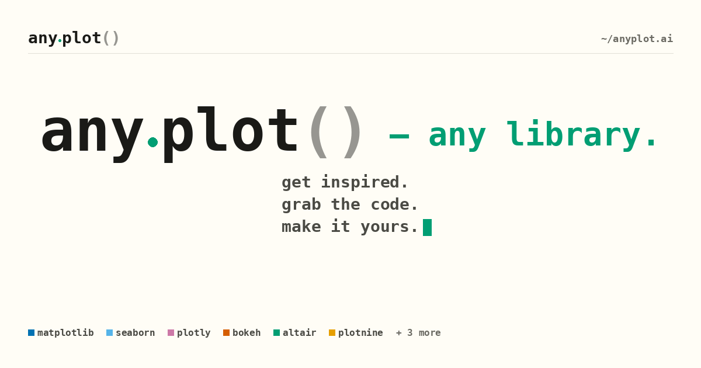
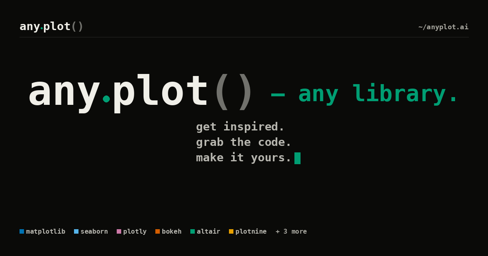
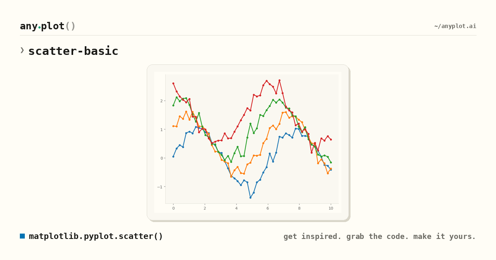
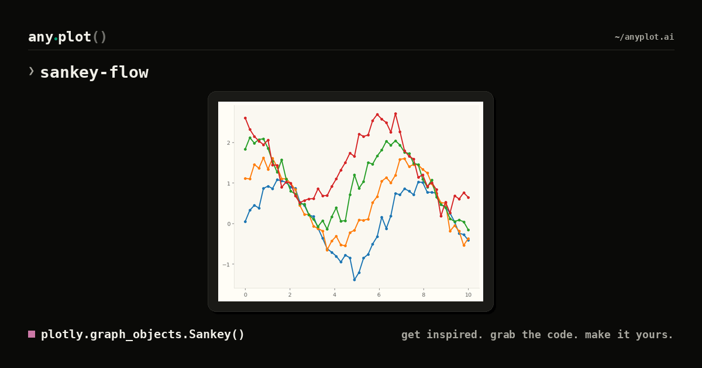
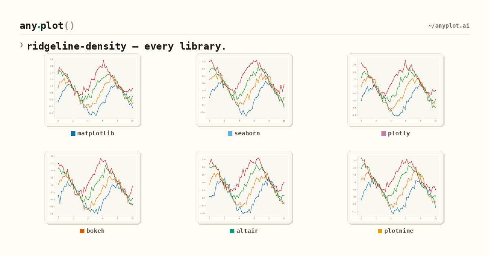
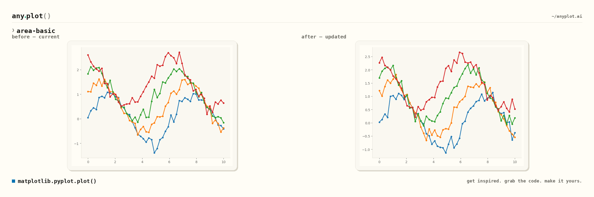
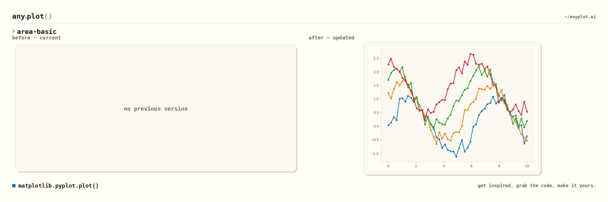

# OG image samples

Reference renders of every `/og/*.png` endpoint in the new **any.plot()** visual
identity (issue [#5652](https://github.com/MarkusNeusinger/anyplot/issues/5652)).
Regenerate with:

```bash
uv run python scripts/generate_og_samples.py --out docs/reference/og-samples
```

The script does not depend on the API or live database — it renders against
inline matplotlib placeholders. Output is **structurally** stable across
machines, but exact pixels depend on the MonoLisa fonts being available
(downloaded from the `anyplot-static` GCS bucket, then cached under
`/tmp/anyplot-fonts/`). Without GCS access the script falls back to
DejaVu Sans Mono, which shifts glyph metrics slightly. For a 1:1
match with production, run the script in an environment with GCS auth.

## What's in here

| File pattern                                | Endpoint                                | Purpose                              |
|---------------------------------------------|-----------------------------------------|--------------------------------------|
| `home__{theme}.png`                         | `/og/home.png`, `/og/plots.png`         | Hero card — fallback for site root   |
| `branded__{spec}__{library}__{theme}.png`   | `/og/{spec}/{lang}/{library}.png`       | Single-implementation branded card   |
| `collage__{spec}__{theme}.png`              | `/og/{spec}.png`                        | 2×3 grid across libraries            |
| `compare__{spec}__{library}__{theme}.png`   | impl-review comparison images           | Before/after for spec updates        |
| `compare__{spec}__{library}__new.png`       | impl-review for first-time impls        | "no previous version" placeholder    |

Each variant is rendered in both `light` (cream `#FFFDF6`) and `dark`
(`#0A0A08`) themes so we can pick the right surface per share context.

## Visual reference for review

### `/og/home.png` + `/og/plots.png`





### `/og/{spec_id}/{language}/{library}.png`





### `/og/{spec_id}.png`



### Implementation comparison




