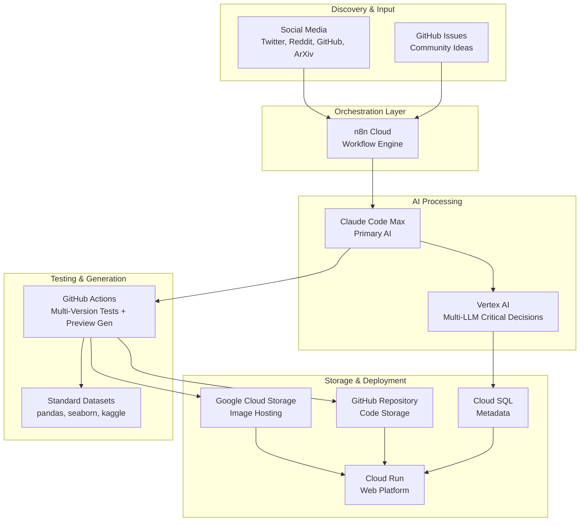
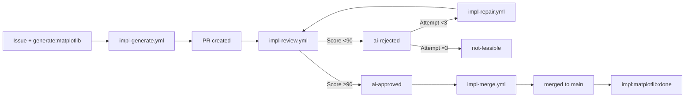
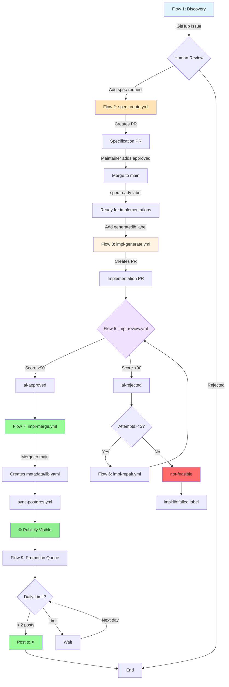

# 🔄 pyplots Automation Workflow

## Overview

pyplots is a **community-driven, AI-powered platform** that automatically discovers, generates, tests, and maintains Python plotting examples. This document describes the high-level automation architecture that makes this possible.

### Philosophy

- **Start Simple, Scale Intelligently**: Begin with basics (Twitter, matplotlib), expand based on learnings
- **Cost-Conscious Design**: Leverage existing subscriptions and smart resource allocation
- **Quality Over Quantity**: Multi-LLM validation ensures only excellent examples go live
- **Community-Driven**: Ideas from the data science community, curated by AI, approved by humans
- **Always Current**: Event-based maintenance keeps examples updated with latest libraries and LLMs

### Key Principles

1. **Images in GCS, Code in GitHub**: Plot PNGs stored in Google Cloud Storage with version history, source code version-controlled
2. **Multi-Version Support**: All plots tested across Python 3.11+ (3.11, 3.12, 3.13, 3.13 primary)
3. **Hybrid Automation**: AI handles routine tasks, humans approve critical decisions
4. **Standard Datasets**: Use well-known datasets (pandas iris, seaborn tips, kaggle) for realistic previews
5. **Event-Based Optimization**: Update plots when LLM/library versions change, not on fixed schedules

---

## System Architecture



### Component Responsibilities

| Component | Purpose | Usage Notes |
|-----------|---------|-------------|
| **GitHub Actions** | Code generation, testing, preview gen, quality checks, deployment | See `.github/workflows/` for implementation |
| **n8n Cloud Pro** | Social media monitoring, posting, issue triage, maintenance scheduling | External service integration |
| **Claude Code Max** | Code generation, routine evaluation, post content | Primary AI workload |
| **Vertex AI (Multi-LLM)** | Critical quality decisions | Multi-LLM consensus for complex plots |
| **Google Cloud Storage** | PNG hosting with lifecycle management | Preview images + generated plots |
| **Cloud SQL (PostgreSQL)** | Metadata, tags, quality scores, promotion queue | All structured data |
| **X (Twitter) API** | Social media posting | Max 2 posts/day |

**Workflow files**: See `.github/workflows/` for all automation implementations (ci-*, bot-*, gen-*, util-*).

---

## Core Automation Flows

### Flow 1: Discovery & Ideation
n8n monitors social media daily → AI extracts plot ideas → Creates GitHub issues with draft specs → Human reviews and approves

### Flow 2: Specification Creation (with Approval Gate)

User adds `spec-request` label to issue → **`spec-create.yml`** runs:

1. Creates branch: `specification/{specification-id}`
2. Claude generates: `plots/{specification-id}/specification.md` + `specification.yaml`
3. Creates PR: `specification/{specification-id}` → `main`
4. Posts analysis comment, waits for approval

```
Issue + [spec-request] label
       ↓
spec-create.yml
  ├─ Creates branch: specification/scatter-basic
  ├─ Creates: plots/scatter-basic/specification.md
  ├─ Creates: plots/scatter-basic/specification.yaml
  └─ Creates PR → main (waits for approval)
       ↓
Maintainer adds [approved] label
       ↓
spec-create.yml (merge job)
  ├─ Merges PR to main
  ├─ Adds [spec-ready] label
  └─ sync-postgres.yml triggers
```

**Specification is now in main, ready for implementations.**

### Flow 3: Implementation Generation

Implementations run **independently** - each library gets its own workflow:

**Triggers:**
- `generate:{library}` label on issue (e.g., `generate:matplotlib`)
- `workflow_dispatch` for manual triggering
- `bulk-generate.yml` for batch operations

**Process per library:**
1. **`impl-generate.yml`** creates branch: `implementation/{specification-id}/{library}`
2. Claude generates code, tests, uploads preview to GCS staging
3. Creates PR: `implementation/{specification-id}/{library}` → `main`
4. Triggers `impl-review.yml`

```
Issue + [generate:matplotlib] label  OR  workflow_dispatch
       ↓
impl-generate.yml
  ├─ Creates branch: implementation/scatter-basic/matplotlib
  ├─ Generates: plots/scatter-basic/implementations/matplotlib.py
  ├─ Uploads to GCS staging
  └─ Creates PR → main, triggers impl-review.yml
```

**Key benefit**: Each library runs independently - no single point of failure!

### Flow 4: Multi-Version Testing
PR created → `ci-plottest.yml` runs tests across Python 3.11+ → Reports results

### Flow 5: AI Review
PR created → **`impl-review.yml`** runs:

1. Downloads plot images from GCS staging
2. Claude evaluates: Spec ↔ Code ↔ Preview
3. Posts review comment with score
4. Adds labels: `quality:XX`, `ai-approved` OR `ai-rejected`

```
impl-review.yml
  ├─ Score ≥90 → [ai-approved] → triggers impl-merge.yml
  └─ Score <90 → [ai-rejected] → triggers impl-repair.yml
```

### Flow 6: Repair Loop (max 3 attempts)
PR labeled `ai-rejected` → **`impl-repair.yml`** triggers:

1. Reads AI feedback from PR comments
2. Claude fixes the implementation
3. Re-uploads to GCS staging
4. Re-triggers `impl-review.yml`
5. After 3 failures: `not-feasible` label

**Note**: Each library repairs independently - matplotlib can be on attempt 3 while seaborn already merged!

### Flow 7: Auto-Merge

PR labeled `ai-approved` → **`impl-merge.yml`** triggers:

1. Squash-merges PR to main
2. Creates `metadata/{library}.yaml` with quality score and generation info
3. Promotes GCS images: staging → production
4. Updates issue labels: `impl:{library}:done`
5. `sync-postgres.yml` triggers automatically

```
impl-merge.yml
  ├─ Squash merge PR → main
  ├─ Creates: plots/scatter-basic/metadata/matplotlib.yaml
  ├─ Promotes GCS: staging → production
  └─ sync-postgres.yml triggers (database updated)
```

### Flow 8: Deployment & Maintenance
Merged to main → Deploy to Cloud Run → Publicly visible on website → Event-based maintenance (LLM/library updates) → A/B test improvements

### Flow 9: Social Media Promotion
Deployed plot → Added to promotion queue (prioritized by quality score) → n8n posts 2x/day at 10 AM & 3 PM CET → Claude generates content → Posts to X with preview image

---

## Decoupled Architecture

The new architecture separates specification and implementation processes:

**Benefits:**
- **No single point of failure** - Each library runs independently
- **Specifications can land in main without implementations**
- **Partial implementations OK** - 6/9 done = fine
- **No merge conflicts** - Per-library metadata files
- **Flexible triggers** - Labels for single, dispatch for bulk
- **PostgreSQL synced on every merge to main**

### Implementation Lifecycle



### Label System

**Specification Labels:**
| Label | Meaning |
|-------|---------|
| `spec-request` | New specification request |
| `spec-update` | Update existing specification |
| `spec-ready` | Specification merged to main |

**Implementation Labels:**
| Label | Meaning |
|-------|---------|
| `generate:{library}` | Trigger generation (e.g., `generate:matplotlib`) |
| `impl:{library}:pending` | Generation in progress |
| `impl:{library}:done` | Implementation merged to main |
| `impl:{library}:failed` | Max retries exhausted |

**PR Labels:**
| Label | Meaning |
|-------|---------|
| `ai-approved` | Passed review (score ≥90) |
| `ai-rejected` | Failed review, will retry |
| `ai-attempt-1/2/3` | Retry counter |
| `not-feasible` | 3x failed, library cannot implement |
| `quality:XX` | Quality score (e.g., `quality:92`) |

### Bulk Operations

Use `bulk-generate.yml` for batch operations:

```bash
# All libraries for one spec:
workflow_dispatch: specification_id=scatter-basic, library=all

# One library across all specs:
workflow_dispatch: specification_id=all, library=matplotlib
```

**Concurrency**: Max 3 parallel implementation workflows globally.

---

## Flow Integration



---

## Decision Framework

### AI Decides Automatically

✅ **Similar plots** (high semantic similarity to existing specs)
✅ **Routine quality checks** (standard visualizations)
✅ **Tag generation** (categorization and clustering)
✅ **Version compatibility** detection (which Python versions supported)
✅ **Standard optimizations** (code formatting, best practices)

### Human Approval Required

⚠️ **New plot types** (low similarity to existing specs)
⚠️ **Complex visualizations** (3D, animations, interactive)
⚠️ **Multi-LLM disagreement** (no majority consensus)
⚠️ **Breaking changes** (major spec modifications)

### Approval Mechanism

Via **GitHub Issue Labels**:
- `approved` → Proceed to code generation
- `rejected` → Close issue
- `needs-revision` → Request changes from proposer

---

## Resource Management

### Leveraging Existing Subscriptions

| Resource | Subscription | Usage | Monthly Cost |
|----------|-------------|-------|--------------|
| **GitHub Pro** | ✅ Active | Actions (testing + preview gen) | Included |
| **n8n Cloud Pro** | ✅ Active | Workflow orchestration | Included (subscribed) |
| **Claude Code Max** | ✅ Active | Primary AI workload | Included |
| **Google Cloud** | Pay-as-you-go | GCS, Cloud SQL, Cloud Run | Variable |
| **Vertex AI** | Pay-per-use | Multi-LLM critical decisions only | Minimal |

### Cost Optimization Strategies

1. **Smart AI Usage**:
   - Claude Code Max for routine work (already subscribed)
   - Vertex AI multi-LLM only for critical decisions
   - Avoid redundant evaluations

2. **Efficient Storage**:
   - GCS versioning: all versions kept permanently for history tracking
   - Path structure: `plots/{spec-id}/{library}/{variant}/v{ISO-timestamp}.png`
   - Thumbnails: `v{timestamp}_thumb.png` (400px width) for gallery views
   - Images never in git repository
   - Before/after comparison in Issues for updates

3. **Smart Scheduling**:
   - Event-based maintenance (not daily scheduled)
   - Batch processing when possible
   - GitHub Actions matrix for parallel testing

4. **Data Efficiency**:
   - Standard datasets (no AI generation needed)
   - Small CSVs in repo acceptable
   - Reuse datasets across similar plots

---

## Data & Testing Strategy

### Sample Data for Previews

**Critical Principle**: All plot code must be **100% standalone and deterministic**

**Data Embedding Strategy**:

1. **Small datasets** - Hardcoded dict/list directly in code (recommended)
2. **Standard datasets** - Use `sns.load_dataset('iris')` or similar (always produces same data)
3. **AI-generated data** - AI generates once with fixed seed, then hardcoded
4. **Seeded random** - Use `np.random.seed(42)` for reproducibility

**Why This Matters**:
- Same code must produce same image every single time
- Quality reviewers must see the exact image that will be deployed
- Users must see the exact image shown in previews
- No surprises, no randomness, complete reproducibility

**Code Requirements**:
- ✅ Self-contained (no external file loading)
- ✅ Deterministic (same output every run)
- ✅ Includes explanation text as docstring
- ✅ Sample data embedded directly in code
- ❌ No CSV file loading
- ❌ No random data without fixed seed
- ❌ No external API calls

### Multi-Version Testing

**Python Versions Supported**: 3.11+ (tested on 3.11, 3.12, 3.13, 3.13)

**Primary Version**: Python 3.13 (required to pass, generates plot images)

**Testing Infrastructure**: GitHub Actions matrix tests all Python versions in parallel. See `ci-plottest.yml`.

**Test Triggers**:
- On Pull Request creation
- Before Quality Assurance flow
- Not on every commit (saves resources)

**Version Compatibility Documentation**:
- Code optimized for Python 3.13 (newest)
- Older versions (3.11-3.13) run as compatibility tests
- Failures in older versions don't block the PR

**Test Requirements**:
- Python 3.13 tests must pass (primary)
- Plot images only generated with Python 3.13
- Older version failures logged but don't block merge

---

## Phased Rollout

### Phase 1: MVP (Current Focus)

**Scope**:
- 🎯 **Monitoring**: Twitter only
- 📊 **Libraries**: All 8 supported (matplotlib, seaborn, plotly, bokeh, altair, plotnine, pygal, highcharts)
- 🐍 **Python**: 3.13+ (primary), tested on 3.11-3.13
- ✋ **Approval**: Manual for all new plots
- ✅ **Quality**: Basic Claude evaluation
- 📱 **Promotion**: X (Twitter) posting with 2/day limit

**Supported Libraries**:
| Library | Strength |
|---------|----------|
| matplotlib | The classic standard, maximum flexibility |
| seaborn | Statistical visualizations, beautiful defaults |
| plotly | Interactive web plots, dashboards, 3D |
| bokeh | Interactive, streaming data, large datasets |
| altair | Declarative/Vega-Lite, elegant exploration |
| plotnine | ggplot2 syntax for R users |
| pygal | Minimalistic SVG charts |
| highcharts | Interactive web charts, stock charts |
| lets-plot | ggplot2 grammar of graphics by JetBrains |

**Goal**: Prove automation pipeline works end-to-end with all libraries

---

### Phase 2: Expansion

**Add**:
- 🎯 **Monitoring**: + Reddit (r/dataisbeautiful, r/Python)
- 🎯 **Monitoring**: + GitHub Trending/Discussions
- 🤖 **Approval**: Hybrid (auto for similar, manual for new)
- ✅ **Quality**: Multi-LLM for critical decisions
- 📱 **Promotion**: + LinkedIn posts for professional audience

**Goal**: Scale content production and improve automation

---

### Phase 3: Full Automation

**Add**:
- 🎯 **Monitoring**: + ArXiv papers (academic visualizations)
- 📊 **Libraries**: + specialized libraries as needed
- 🤖 **Approval**: Intelligent auto-approval (high confidence)
- 🔄 **Maintenance**: Proactive optimization suggestions
- 🌐 **Community**: Public spec submissions via issues
- 📱 **Promotion**: + Reddit posts (r/dataisbeautiful, r/Python), cross-platform coordination

**Goal**: Comprehensive, self-maintaining plot library

---

## Rule Versioning & Testing

**NEW**: The system now includes versioned rules for code generation and quality evaluation.

**Location**: `rules/` directory

**Key Features**:
- 📋 **Versioned Rules**: Generation rules and quality criteria stored as Markdown (vX.Y.Z)
- 🧪 **A/B Testing**: Compare rule versions before deploying
- 📊 **Audit Trail**: Know which rule version generated each plot
- 🔄 **Rollback**: Instant rollback to previous rules if issues arise
- 📈 **Scientific Improvement**: Prove new rules are better with data

**Current Status** (Documentation Phase):
- ✅ Rule templates created (rules/templates/)
- ✅ Initial draft rules (rules/generation/v1.0.0-draft/)
- ⏳ Automation not yet implemented
- ⏳ A/B testing framework planned

**Integration with Workflow**:
- When automation is implemented, all code generation will use specific rule versions
- Quality evaluation will reference versioned criteria
- Rule improvements will be A/B tested before deployment

**See Also**:
- [A/B Testing Strategies](docs/concepts/ab-testing-rules.md)
- [Claude Skill Concept](docs/concepts/claude-skill-plot-generation.md)

---

## Summary

This workflow ensures:

✅ **Decoupled Architecture**:
   - Specification and implementation processes run independently
   - No single point of failure
   - Specifications can land in main without implementations
   - Partial implementations OK (6/9 done = fine)
   - Per-library metadata files (no merge conflicts!)

✅ **Flexible Triggers**:
   - Labels (`generate:matplotlib`) for single implementations
   - `workflow_dispatch` for manual control
   - `bulk-generate.yml` for batch operations
   - Max 3 parallel implementations globally

✅ **Multi-Layer Quality Control**:
   - AI review with vision (code + image evaluation)
   - Self-repair loop (max 3 attempts per library)
   - Quality scores tracked in metadata
   - Feedback-driven optimization on rejection

✅ **PostgreSQL Synced on Every Merge**:
   - `sync-postgres.yml` triggers on push to main
   - Database always reflects repository state

✅ **Only High-Quality Plots on Website**: Failed attempts never publicly visible
✅ **Automated Marketing**: Queue-based social media promotion with smart rate limiting (max 2 posts/day)
✅ **Cost-Conscious** design leveraging existing subscriptions
✅ **Smart Storage** with GCS staging/production flow
✅ **Deterministic & Reproducible**: Same code = same image every time
✅ **Community-Driven** with AI curation and human oversight

The system is designed to **scale from MVP to full automation** while maintaining the highest quality standards, controlling costs, and automatically promoting the best content to the community.
