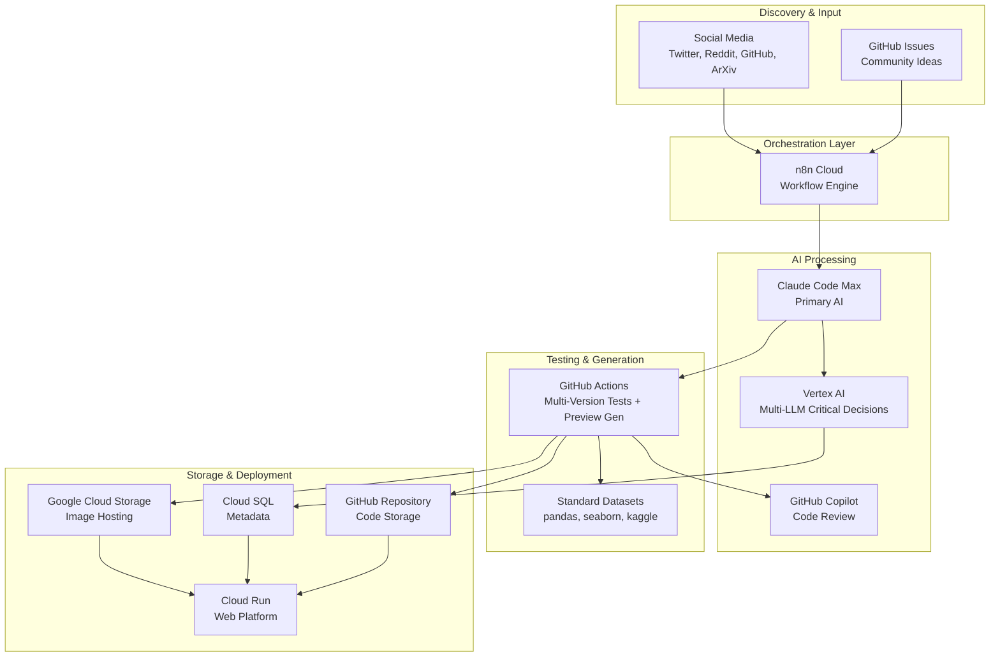
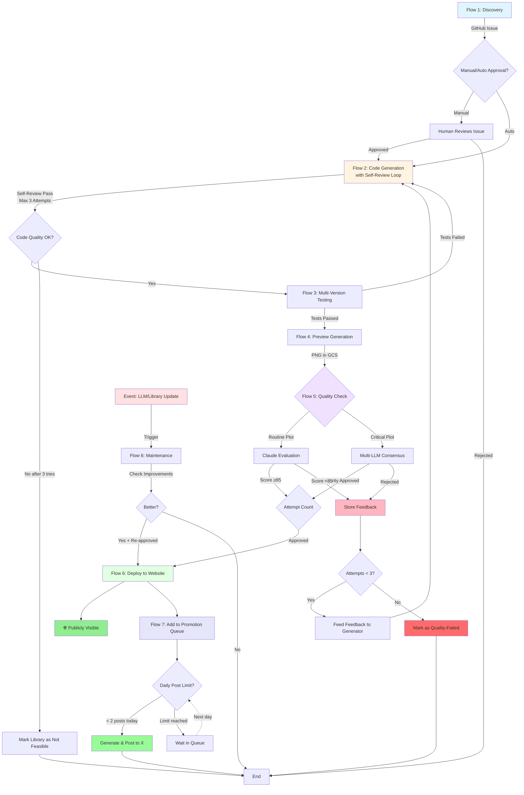

# 🔄 pyplots Automation Workflow

## Overview

pyplots is a **community-driven, AI-powered platform** that automatically discovers, generates, tests, and maintains Python plotting examples. This document describes the high-level automation architecture that makes this possible.

### Philosophy

- **Start Simple, Scale Intelligently**: Begin with basics (Twitter, matplotlib), expand based on learnings
- **Cost-Conscious Design**: Leverage existing subscriptions and smart resource allocation
- **Quality Over Quantity**: Multi-LLM validation ensures only excellent examples go live
- **Community-Driven**: Ideas from the data science community, curated by AI, approved by humans
- **Always Current**: Event-based maintenance keeps examples updated with latest libraries and LLMs

### Key Principles

1. **Images in GCS, Code in GitHub**: Preview PNGs stored in Google Cloud Storage with lifecycle management, source code version-controlled
2. **Multi-Version Support**: All plots tested across Python 3.13, 3.12, 3.11, 3.10
3. **Hybrid Automation**: AI handles routine tasks, humans approve critical decisions
4. **Standard Datasets**: Use well-known datasets (pandas iris, seaborn tips, kaggle) for realistic previews
5. **Event-Based Optimization**: Update plots when LLM/library versions change, not on fixed schedules

---

## System Architecture



### Component Responsibilities

| Component | Purpose | When Used |
|-----------|---------|-----------|
| **n8n Cloud** | Workflow orchestration, daily monitoring, social media scheduling | All automation flows + social media posting |
| **Claude Code Max** | Code generation, routine evaluation, post content generation | Primary AI workload + marketing |
| **Vertex AI (Multi-LLM)** | Critical decisions requiring consensus | Final approval, complex plots |
| **GitHub Actions** | Testing (4 Python versions), preview generation | On PR + before QA |
| **GitHub Copilot** | Automated code review | On every PR |
| **Google Cloud Storage** | PNG hosting with versioning (old versions auto-deleted after 30 days) | All preview images + social media images |
| **Cloud SQL** | Metadata, tags, quality scores, promotion queue | Plot catalog + marketing queue |
| **X (Twitter) API** | Automated social media posting | Up to 2 posts/day for plot promotion |

---

## Core Automation Flows

### Flow 1: Discovery & Ideation

**Purpose**: Find plot ideas from the data science community

**Trigger**: Daily n8n schedule (start with one source, expand gradually)

**Process**:
1. n8n monitors social media platforms (phased rollout: Twitter → Reddit → GitHub → ArXiv)
2. AI extracts interesting plot ideas and visualization techniques
3. Checks for duplicates against existing specs
4. Creates GitHub issue with draft spec in Markdown format
5. Labels issue as `plot-idea`

**Output**: GitHub issue ready for human review

**Cost**: Minimal (daily n8n workflow + lightweight AI calls)

---

### Flow 2: Validation & Code Generation

**Purpose**: Transform approved ideas into working implementations

**Trigger**:
- GitHub issue labeled `approved` (manual)
- OR auto-approved for similar plots (high similarity score)

**Process**:
1. Claude Code Max analyzes spec and checks quality
2. Determines suitable libraries (matplotlib always, others based on plot type)
3. **For each library**, enters self-optimization loop (max 3 attempts):

   **Attempt Loop**:
   - a) Generates implementation code including:
     - Standalone code with embedded sample data
     - Deterministic data (hardcoded or seeded)
     - Explanation text (docstring)
   - b) Executes code to render preview image
   - c) **Self-reviews** the generated image:
     - Does it match the spec requirements?
     - Are there visual issues (overlapping labels, unreadable text, etc.)?
     - Does it follow plotting best practices?
   - d) If issues found: Optimize code and retry (up to 3 attempts)
   - e) If successful: Mark as ready for external review
   - f) If 3 attempts failed: Mark library as "not feasible" for this plot

4. Creates Pull Request with successfully generated implementations
5. **Decision point**: Simple/similar plots auto-proceed, new/complex types wait for human approval

**Output**: Pull Request containing spec + self-reviewed implementation files

**Self-Review Quality Gate**:
- Code must execute without errors
- Image must be generated successfully
- No obvious visual defects detected
- Basic spec compliance verified
- Only then proceeds to multi-version testing

**Failure Handling**:
- If library implementation impossible after 3 attempts: Document as "not supported"
- Feedback from failed attempts stored for learning
- Other libraries continue independently

**Human-in-the-Loop**:
- New plot types require manual approval via GitHub label
- Complex visualizations reviewed before proceeding

---

### Flow 3: Multi-Version Testing

**Purpose**: Ensure compatibility across Python versions

**Trigger**:
- Pull Request created
- Before Quality Assurance flow

**Process**:
1. GitHub Actions matrix strategy launches parallel test jobs
2. Tests run with Python 3.13, 3.12, 3.11, 3.10
3. Pytest executes for each version independently
4. GitHub Copilot reviews code quality automatically
5. Version compatibility documented in metadata (e.g., `"3.12+"`, `"all"`, `"3.11-3.13"`)
6. Results aggregated and reported in PR

**Output**:
- Test results for all Python versions
- Version support metadata
- Copilot code review comments

**Infrastructure**: GitHub Actions (uses your Pro subscription minutes)

**Note**: If code only works in certain versions, this is documented in metadata rather than creating separate files.

---

### Flow 4: Preview Generation

**Purpose**: Create visual previews without bloating repository

**Trigger**: Tests passed

**Process**:
1. GitHub Action detects successful tests
2. Spins up Python environment with required plotting library
3. Executes the plot code (code is **standalone** with embedded data)
4. Code generates PNG output
5. Uploads to Google Cloud Storage: `gs://pyplots-images/previews/{library}/{spec-id}/{variant}/v{timestamp}.png`
6. Updates database with current version URL (points to latest)
7. **Stores code hash** to ensure quality reviewers see the exact same output

**Critical Requirement**:
- Code must be **100% deterministic** (same code = same image every time)
- No external data loading during preview generation
- All sample data embedded in the code itself
- This ensures quality reviewers see the exact image that will be deployed

**Storage Strategy**:
- **Current Version**: Each version has unique filename (e.g., with timestamp or version ID)
- **Latest Pointer**: Current version remains permanently in GCS
- **Lifecycle**: When new version is uploaded, previous version is automatically deleted after 30 days
- **Result**: Always keep current version, auto-cleanup old versions

**Output**: Preview PNG in GCS, URL in database, code hash for verification

---

### Flow 5: Quality Assurance

**Purpose**: Multi-LLM validation before deployment

**Trigger**: Preview uploaded to GCS

**Process**:
1. Loads the **exact PNG from GCS** (same image that will be deployed)
2. Verifies code hash matches (ensures image corresponds to code)
3. **Routine Quality Checks** (Claude via Code Max):
   - Spec compliance
   - Visual quality basics
   - Code quality
   - Fast and cost-effective for standard plots

4. **Critical Approval** (Multi-LLM via Vertex AI):
   - Activated for: new plot types, complex visualizations, or when routine check is uncertain
   - Claude + Gemini + GPT evaluate **the same PNG** independently
   - Majority vote required (≥2 of 3)
   - Each LLM provides:
     - Score (0-100)
     - Detailed feedback on issues found
     - Specific suggestions for improvement
   - Checks against spec quality criteria

**Quality Gate**:
- Score ≥ 85 (median of all reviewers) AND
- Multi-LLM majority approval (for critical decisions)

**On Rejection** (Score < 85 or majority rejects):
1. **Feedback is stored** in database with:
   - All reviewer scores and comments
   - Specific issues identified (e.g., "overlapping x-axis labels", "unclear legend")
   - Suggested improvements from each LLM
   - Attempt number (1st, 2nd, or 3rd try)

2. **Optimization Loop** (max 3 total attempts):
   - Feed all reviewer feedback back to code generator
   - Claude Code Max attempts to fix identified issues
   - Regenerates code addressing specific problems
   - Returns to Flow 2 (code generation with feedback)
   - New preview generated and re-evaluated

3. **After 3 Failed Attempts**:
   - Implementation marked as "quality-failed"
   - All feedback history preserved
   - May indicate plot is not achievable with this library
   - Human can manually review and decide next steps

**Output**:
- `quality_report.json` with scores, feedback, and decision
- On approval: Proceeds to deployment
- On rejection: Returns to Flow 2 with feedback (up to 3 times)

**Critical Rule**:
- **Only approved plots appear on website**
- Failed attempts never publicly visible
- Quality reports stored for all attempts (learning data)

**Consistency Guarantee**:
- All reviewers see the **exact same PNG** that will go live
- Code hash verification prevents mismatches
- Deterministic code ensures reproducibility

**Cost Optimization**: Vertex AI multi-LLM only for critical decisions, not every evaluation

---

### Flow 6: Deployment & Maintenance

**Purpose**: Make plots discoverable and keep them current

**Deployment Process** (Only for Multi-LLM Approved Plots):
1. **Prerequisite**: Plot must have passed Multi-LLM quality approval (Score ≥85)
2. AI generates tags from spec + code + preview analysis
3. Calculates similarity to existing plots for clustering
4. Stores metadata in Cloud SQL (tags, quality scores, version support, GCS URLs)
5. Deploys to Cloud Run web platform
6. Plot becomes **publicly visible**, searchable and browsable

**Critical Rule**:
- Only plots that passed Multi-LLM approval are deployed
- Rejected or failed attempts remain internal only
- Users only see high-quality, approved visualizations

**Maintenance Process** (Event-Based):

**Triggers** (NOT scheduled to save costs):
- New LLM version released
- Library version update (matplotlib, seaborn, etc.)
- Manual improvement request
- Community feedback

**Process**:
1. Identify plots that could benefit from update
2. Generate improved version
3. Run full test suite (multi-version)
4. Multi-LLM approval required
5. A/B comparison with current version
6. Deploy only if demonstrably better

**Output**:
- Live, searchable plots on platform
- Continuously improved over time

---

### Flow 7: Social Media Promotion

**Purpose**: Automatically promote new and updated plots on social media

**Trigger**:
- New plot deployed (passed Multi-LLM approval and went live)
- Existing plot significantly updated (new version with improved quality score)

**Process**:
1. **Queue Addition**:
   - Plot added to promotion queue in Cloud SQL
   - Queue entry includes: plot ID, quality score, preview image URL, plot description
   - Priority assigned based on quality score:
     - **High Priority**: Score ≥ 90 ("Cool plots")
     - **Medium Priority**: Score 85-89 (Standard approved plots)
     - **Low Priority**: Updates to existing plots

2. **Daily Processing** (n8n scheduled workflow):
   - Runs twice daily at optimal engagement times (e.g., 10 AM, 3 PM CET)
   - Checks daily post count (stored in database)
   - If daily limit not reached (max 2 posts/day):
     - Selects highest priority item from queue
     - Proceeds to post generation

3. **Post Generation**:
   - Claude generates engaging post content:
     - Eye-catching description (what makes this plot special)
     - Relevant use cases
     - Key features highlighted
     - Hashtags: #dataviz #python #matplotlib (or library name)
   - Loads preview image from GCS
   - Adds link to plot on website
   - Ensures X character limit compliance (280 chars)

4. **Publishing**:
   - Posts to X (Twitter) via API
   - Marks queue item as "posted" with timestamp
   - Increments daily post counter
   - Logs success/failure

5. **Queue Management**:
   - FIFO within priority tiers
   - Queue items older than 30 days may be deprioritized
   - Failed posts retry next day (max 3 attempts)

**Rate Limiting**:
- **Hard limit**: 2 posts per day maximum
- **Reset**: Daily counter resets at midnight CET
- **Prevents spam**: Even with many new plots, respects limit
- **Quality over quantity**: Only best plots get promoted

**Output**:
- Automated X posts with preview images
- Increased platform visibility
- Community engagement

**Platform Strategy**:
- **Phase 1 (MVP)**: X (Twitter) only
- **Phase 2**: Add LinkedIn for professional audience
- **Phase 3**: Relevant subreddits (r/dataisbeautiful, r/Python)
- **Coordination**: Cross-platform posts spaced to avoid redundancy

**Queue Storage** (Cloud SQL):
```
promotion_queue:
- id
- plot_id
- priority (high/medium/low)
- quality_score
- preview_url
- created_at
- posted_at (null if not yet posted)
- status (queued/posted/failed)
- attempt_count
```

**Cost Optimization**:
- n8n handles scheduling (already subscribed)
- Claude generates post text (Code Max subscription)
- X API posting (free tier sufficient for 2 posts/day)
- No additional infrastructure needed

---

## Flow Integration



---

## Decision Framework

### AI Decides Automatically

✅ **Similar plots** (high semantic similarity to existing specs)
✅ **Routine quality checks** (standard visualizations)
✅ **Tag generation** (categorization and clustering)
✅ **Version compatibility** detection (which Python versions supported)
✅ **Standard optimizations** (code formatting, best practices)

### Human Approval Required

⚠️ **New plot types** (low similarity to existing specs)
⚠️ **Complex visualizations** (3D, animations, interactive)
⚠️ **Multi-LLM disagreement** (no majority consensus)
⚠️ **Breaking changes** (major spec modifications)

### Approval Mechanism

Via **GitHub Issue Labels**:
- `approved` → Proceed to code generation
- `rejected` → Close issue
- `needs-revision` → Request changes from proposer

---

## Resource Management

### Leveraging Existing Subscriptions

| Resource | Subscription | Usage | Monthly Cost |
|----------|-------------|-------|--------------|
| **GitHub Pro** | ✅ Active | Actions (testing + preview gen) + Copilot | Included |
| **n8n Cloud** | ✅ Active | Workflow orchestration | Included |
| **Claude Code Max** | ✅ Active | Primary AI workload | Included |
| **Google Cloud** | Pay-as-you-go | GCS, Cloud SQL, Cloud Run | Variable |
| **Vertex AI** | Pay-per-use | Multi-LLM critical decisions only | Minimal |

### Cost Optimization Strategies

1. **Smart AI Usage**:
   - Claude Code Max for routine work (already subscribed)
   - Vertex AI multi-LLM only for critical decisions
   - Avoid redundant evaluations

2. **Efficient Storage**:
   - GCS lifecycle: current version stays, old versions auto-deleted 30 days after new version uploaded
   - Images never in git repository
   - Compress PNGs before upload

3. **Smart Scheduling**:
   - Event-based maintenance (not daily scheduled)
   - Batch processing when possible
   - GitHub Actions matrix for parallel testing

4. **Data Efficiency**:
   - Standard datasets (no AI generation needed)
   - Small CSVs in repo acceptable
   - Reuse datasets across similar plots

---

## Data & Testing Strategy

### Sample Data for Previews

**Critical Principle**: All plot code must be **100% standalone and deterministic**

**Data Embedding Strategy**:

1. **Small datasets** (recommended for most plots):
   ```python
   # Hardcoded dict/list directly in code
   data = pd.DataFrame({
       'category': ['A', 'B', 'C', 'D'],
       'value': [23, 45, 56, 78]
   })
   ```

2. **Standard datasets** (for known examples):
   ```python
   # Load standard dataset (always produces same data)
   data = sns.load_dataset('iris')
   ```

3. **AI-generated data** (when needed):
   - AI generates data **once** with fixed seed
   - Data is then **hardcoded** into the final code
   - Never use random generation without fixed seed

4. **Seeded random** (for demonstrations):
   ```python
   # Fixed seed ensures reproducibility
   np.random.seed(42)
   data = pd.DataFrame({
       'x': np.random.randn(100),
       'y': np.random.randn(100)
   })
   ```

**Why This Matters**:
- Same code must produce same image every single time
- Quality reviewers must see the exact image that will be deployed
- Users must see the exact image shown in previews
- No surprises, no randomness, complete reproducibility

**Code Requirements**:
- ✅ Self-contained (no external file loading)
- ✅ Deterministic (same output every run)
- ✅ Includes explanation text as docstring
- ✅ Sample data embedded directly in code
- ❌ No CSV file loading
- ❌ No random data without fixed seed
- ❌ No external API calls

### Multi-Version Testing

**Python Versions Supported**: 3.13, 3.12, 3.11, 3.10

**Testing Infrastructure**:
```yaml
# GitHub Actions Matrix Strategy
strategy:
  matrix:
    python-version: ['3.13', '3.12', '3.11', '3.10']
```

**Test Triggers**:
- On Pull Request creation
- Before Quality Assurance flow
- Not on every commit (saves resources)

**Version Compatibility Documentation**:
- Metadata field: `supported_versions`
- Examples: `"all"`, `"3.12+"`, `"3.10-3.12"`
- No separate code files per version (simplified approach)

**Test Requirements**:
- All tests must pass for at least one Python version
- Prefer universal code that works across all versions
- Document version restrictions if necessary

---

## Phased Rollout

### Phase 1: MVP (Current Focus)

**Scope**:
- 🎯 **Monitoring**: Twitter only
- 📊 **Libraries**: matplotlib only
- 🐍 **Python**: 3.12, 3.11, 3.10 (add 3.13 when stable)
- ✋ **Approval**: Manual for all new plots
- ✅ **Quality**: Basic Claude evaluation
- 📱 **Promotion**: X (Twitter) posting with 2/day limit

**Goal**: Prove automation pipeline works end-to-end

---

### Phase 2: Expansion

**Add**:
- 🎯 **Monitoring**: + Reddit (r/dataisbeautiful, r/Python)
- 🎯 **Monitoring**: + GitHub Trending/Discussions
- 📊 **Libraries**: + seaborn, + plotly
- 🤖 **Approval**: Hybrid (auto for similar, manual for new)
- ✅ **Quality**: Multi-LLM for critical decisions
- 🐍 **Python**: + 3.13 (when stable)
- 📱 **Promotion**: + LinkedIn posts for professional audience

**Goal**: Scale content production and improve automation

---

### Phase 3: Full Automation

**Add**:
- 🎯 **Monitoring**: + ArXiv papers (academic visualizations)
- 📊 **Libraries**: bokeh, altair, + specialized libraries
- 🤖 **Approval**: Intelligent auto-approval (high confidence)
- 🔄 **Maintenance**: Proactive optimization suggestions
- 🌐 **Community**: Public spec submissions via issues
- 📱 **Promotion**: + Reddit posts (r/dataisbeautiful, r/Python), cross-platform coordination

**Goal**: Comprehensive, self-maintaining plot library

---

## Summary

This workflow ensures:

✅ **Fully Automated** pipeline from discovery to deployment to promotion
✅ **Multi-Layer Quality Control**:
   - Self-review loop in code generation (max 3 attempts)
   - Multi-version testing across Python 3.10-3.13
   - Multi-LLM consensus validation (Claude + Gemini + GPT)
   - Feedback-driven optimization on rejection
✅ **Only High-Quality Plots on Website**: Failed attempts never publicly visible
✅ **Automated Marketing**: Queue-based social media promotion with smart rate limiting (max 2 posts/day)
✅ **Cost-Conscious** design leveraging existing subscriptions
✅ **Smart Storage** with GCS lifecycle management (current version stays, old deleted after 30d)
✅ **Deterministic & Reproducible**: Same code = same image every time
✅ **Community-Driven** with AI curation and human oversight
✅ **Event-Based Maintenance** for continuous improvement
✅ **Phased Rollout** starting simple, scaling intelligently
✅ **Feedback Storage**: All quality reviews saved for continuous learning

The system is designed to **scale from MVP to full automation** while maintaining the highest quality standards, controlling costs, and automatically promoting the best content to the community.
