# 🔄 pyplots Automation Workflow

## Overview

pyplots is a **community-driven, AI-powered platform** that automatically discovers, generates, tests, and maintains Python plotting examples. This document describes the high-level automation architecture that makes this possible.

### Philosophy

- **Start Simple, Scale Intelligently**: Begin with basics (Twitter, matplotlib), expand based on learnings
- **Cost-Conscious Design**: Leverage existing subscriptions and smart resource allocation
- **Quality Over Quantity**: Multi-LLM validation ensures only excellent examples go live
- **Community-Driven**: Ideas from the data science community, curated by AI, approved by humans
- **Always Current**: Event-based maintenance keeps examples updated with latest libraries and LLMs

### Key Principles

1. **Images in GCS, Code in GitHub**: Plot PNGs stored in Google Cloud Storage with version history, source code version-controlled
2. **Multi-Version Support**: All plots tested across Python 3.11+ (3.11, 3.12, 3.13, 3.14 primary)
3. **Hybrid Automation**: AI handles routine tasks, humans approve critical decisions
4. **Standard Datasets**: Use well-known datasets (pandas iris, seaborn tips, kaggle) for realistic previews
5. **Event-Based Optimization**: Update plots when LLM/library versions change, not on fixed schedules

---

## System Architecture


### Component Responsibilities

| Component | Purpose | Usage Notes |
|-----------|---------|-------------|
| **GitHub Actions** | Code generation, testing, preview gen, quality checks, deployment | See `.github/workflows/` for implementation |
| **n8n Cloud Pro** | Social media monitoring, posting, issue triage, maintenance scheduling | External service integration |
| **Claude Code Max** | Code generation, routine evaluation, post content | Primary AI workload |
| **Vertex AI (Multi-LLM)** | Critical quality decisions | Multi-LLM consensus for complex plots |
| **Google Cloud Storage** | PNG hosting with lifecycle management | Preview images + generated plots |
| **Cloud SQL (PostgreSQL)** | Metadata, tags, quality scores, promotion queue | All structured data |
| **X (Twitter) API** | Social media posting | Max 2 posts/day |

**Workflow files**: See `.github/workflows/` for all automation implementations (ci-*, bot-*, gen-*, util-*).

---

## Core Automation Flows

### Flow 1: Discovery & Ideation
n8n monitors social media daily → AI extracts plot ideas → Creates GitHub issues with draft specs → Human reviews and approves

### Flow 2: Parallel Code Generation

Approved issue triggers **parallel generation pipeline**:

1. **Orchestrator** (`gen-new-plot.yml`) creates 8 sub-issues (one per library)
2. **8 parallel jobs** run simultaneously via `gen-library-impl.yml`:
   - Each library has isolated dependencies
   - Separate Claude context (no syntax confusion)
   - Independent PR per library
3. **Per-library tracking**: Each sub-issue documents attempts and status
4. **Partial success possible**: Some libraries can merge while others retry

```
Main Issue (#53)
├── Sub-Issue: [spec-id] matplotlib implementation (#54) → PR #62
├── Sub-Issue: [spec-id] seaborn implementation (#55) → PR #63
├── Sub-Issue: [spec-id] plotly implementation (#56) → PR #64
└── ... (8 total)
```

### Flow 3: Multi-Version Testing
PR created → `ci-plottest.yml` runs tests across Python 3.11+ → Reports results

### Flow 4: Plot Image Generation
Tests passed → `gen-preview.yml` generates PNG + thumbnail → Uploads to GCS with versioned paths (`plots/{spec-id}/{library}/{variant}/v{timestamp}.png`) → Stores previous version for before/after comparison

### Flow 4.5: Auto-Tagging
PR merged with `ai-approved` → `bot-auto-tag.yml` triggers → AI analyzes code + spec + image → Generates 5-level tag hierarchy → Stores in PostgreSQL with confidence scores

### Flow 5: AI Review
Previews generated → `bot-ai-review.yml` triggers → Claude evaluates Spec ↔ Code ↔ Preview → **Posts results to Issue** (permanent knowledge base) → Score ≥7/10 on all criteria required → Labels: `ai-approved` or `ai-rejected`

### Flow 5.5: Per-Library Repair Loop
PR labeled `ai-rejected` → `gen-update-plot.yml` triggers for that **specific library**:

1. Reads all previous attempts from sub-issue (for context/learning)
2. Regenerates improved code with feedback
3. Pushes to PR → Re-triggers tests
4. Max 3 attempts per library
5. After 3 failures: `not-feasible` label (library marked as not implementable for this spec)

**Note**: Each library repairs independently - matplotlib can be on attempt 3 while plotly already merged

### Flow 5.6: Auto-Merge
PR labeled `ai-approved` → `bot-auto-merge.yml` triggers → Automatic squash merge

### Flow 6: Deployment & Maintenance
Merged to main → Deploy to Cloud Run → Publicly visible on website → Event-based maintenance (LLM/library updates) → A/B test improvements

### Flow 7: Social Media Promotion
Deployed plot → Added to promotion queue (prioritized by quality score) → n8n posts 2x/day at 10 AM & 3 PM CET → Claude generates content → Posts to X with preview image

---

## Sub-Issue Architecture

Each plot request spawns **8 parallel sub-issues** (one per library), enabling:

- **~8x faster** generation (parallel execution)
- **No context pollution** (separate Claude sessions per library)
- **Per-library dependencies** (seaborn can use older matplotlib if needed)
- **Partial success** (5/8 can merge while 3/8 retry)
- **Independent tracking** (each library has its own status)

### Sub-Issue Lifecycle

```mermaid
graph LR
    A[Main Issue<br/>plot-request + approved] --> B[Orchestrator]
    B --> C1[Sub-Issue<br/>matplotlib]
    B --> C2[Sub-Issue<br/>seaborn]
    B --> C3[Sub-Issue<br/>...]

    C1 --> D1{generating}
    D1 --> E1{testing}
    E1 --> F1{reviewing}
    F1 -->|Score ≥85| G1[ai-approved]
    F1 -->|Score <85| H1[ai-rejected]
    H1 -->|Attempt <3| D1
    H1 -->|Attempt =3| I1[not-feasible]
    G1 --> J1[merged]
```



### Sub-Issue Labels

| Label | Meaning |
|-------|---------|
| `sub-issue` | Identifies as child of main issue |
| `library:{name}` | Which library (matplotlib, seaborn, etc.) |
| `generating` | Code being generated |
| `testing` | Tests running |
| `reviewing` | AI quality review in progress |
| `ai-approved` | Passed review (score ≥85) |
| `ai-rejected` | Failed review, will retry |
| `not-feasible` | 3x failed, not implementable in this library |
| `merged` | Successfully merged to main |

### Attempt Documentation

Each attempt is documented in the sub-issue with:

```markdown
## Attempt 1/3 - 2025-11-30T12:00:00Z

### Approach
- Using: seaborn
- heatmap-correlation: Correlation Matrix Heatmap
- Create figure with figsize
- Plot data using heatmap
- Configure colorbar

### Status
- **PR:** #123
- **File:** `plots/seaborn/heatmap/heatmap-correlation/default.py`
- **Workflow:** [link]
```

This enables learning from previous attempts during repair loops.

---

## Flow Integration


---

## Decision Framework

### AI Decides Automatically

✅ **Similar plots** (high semantic similarity to existing specs)
✅ **Routine quality checks** (standard visualizations)
✅ **Tag generation** (categorization and clustering)
✅ **Version compatibility** detection (which Python versions supported)
✅ **Standard optimizations** (code formatting, best practices)

### Human Approval Required

⚠️ **New plot types** (low similarity to existing specs)
⚠️ **Complex visualizations** (3D, animations, interactive)
⚠️ **Multi-LLM disagreement** (no majority consensus)
⚠️ **Breaking changes** (major spec modifications)

### Approval Mechanism

Via **GitHub Issue Labels**:
- `approved` → Proceed to code generation
- `rejected` → Close issue
- `needs-revision` → Request changes from proposer

---

## Resource Management

### Leveraging Existing Subscriptions

| Resource | Subscription | Usage | Monthly Cost |
|----------|-------------|-------|--------------|
| **GitHub Pro** | ✅ Active | Actions (testing + preview gen) | Included |
| **n8n Cloud Pro** | ✅ Active | Workflow orchestration | Included (subscribed) |
| **Claude Code Max** | ✅ Active | Primary AI workload | Included |
| **Google Cloud** | Pay-as-you-go | GCS, Cloud SQL, Cloud Run | Variable |
| **Vertex AI** | Pay-per-use | Multi-LLM critical decisions only | Minimal |

### Cost Optimization Strategies

1. **Smart AI Usage**:
   - Claude Code Max for routine work (already subscribed)
   - Vertex AI multi-LLM only for critical decisions
   - Avoid redundant evaluations

2. **Efficient Storage**:
   - GCS versioning: all versions kept permanently for history tracking
   - Path structure: `plots/{spec-id}/{library}/{variant}/v{ISO-timestamp}.png`
   - Thumbnails: `v{timestamp}_thumb.png` (400px width) for gallery views
   - Images never in git repository
   - Before/after comparison in Issues for updates

3. **Smart Scheduling**:
   - Event-based maintenance (not daily scheduled)
   - Batch processing when possible
   - GitHub Actions matrix for parallel testing

4. **Data Efficiency**:
   - Standard datasets (no AI generation needed)
   - Small CSVs in repo acceptable
   - Reuse datasets across similar plots

---

## Data & Testing Strategy

### Sample Data for Previews

**Critical Principle**: All plot code must be **100% standalone and deterministic**

**Data Embedding Strategy**:

1. **Small datasets** - Hardcoded dict/list directly in code (recommended)
2. **Standard datasets** - Use `sns.load_dataset('iris')` or similar (always produces same data)
3. **AI-generated data** - AI generates once with fixed seed, then hardcoded
4. **Seeded random** - Use `np.random.seed(42)` for reproducibility

**Why This Matters**:
- Same code must produce same image every single time
- Quality reviewers must see the exact image that will be deployed
- Users must see the exact image shown in previews
- No surprises, no randomness, complete reproducibility

**Code Requirements**:
- ✅ Self-contained (no external file loading)
- ✅ Deterministic (same output every run)
- ✅ Includes explanation text as docstring
- ✅ Sample data embedded directly in code
- ❌ No CSV file loading
- ❌ No random data without fixed seed
- ❌ No external API calls

### Multi-Version Testing

**Python Versions Supported**: 3.11+ (tested on 3.11, 3.12, 3.13, 3.14)

**Primary Version**: Python 3.14 (required to pass, generates plot images)

**Testing Infrastructure**: GitHub Actions matrix tests all Python versions in parallel. See `ci-plottest.yml`.

**Test Triggers**:
- On Pull Request creation
- Before Quality Assurance flow
- Not on every commit (saves resources)

**Version Compatibility Documentation**:
- Code optimized for Python 3.14 (newest)
- Older versions (3.11-3.13) run as compatibility tests
- Failures in older versions don't block the PR

**Test Requirements**:
- Python 3.14 tests must pass (primary)
- Plot images only generated with Python 3.14
- Older version failures logged but don't block merge

---

## Phased Rollout

### Phase 1: MVP (Current Focus)

**Scope**:
- 🎯 **Monitoring**: Twitter only
- 📊 **Libraries**: All 8 supported (matplotlib, seaborn, plotly, bokeh, altair, plotnine, pygal, highcharts)
- 🐍 **Python**: 3.14+ (primary), tested on 3.11-3.14
- ✋ **Approval**: Manual for all new plots
- ✅ **Quality**: Basic Claude evaluation
- 📱 **Promotion**: X (Twitter) posting with 2/day limit

**Supported Libraries**:
| Library | Strength |
|---------|----------|
| matplotlib | The classic standard, maximum flexibility |
| seaborn | Statistical visualizations, beautiful defaults |
| plotly | Interactive web plots, dashboards, 3D |
| bokeh | Interactive, streaming data, large datasets |
| altair | Declarative/Vega-Lite, elegant exploration |
| plotnine | ggplot2 syntax for R users |
| pygal | Minimalistic SVG charts |
| highcharts | Interactive web charts, stock charts |

**Goal**: Prove automation pipeline works end-to-end with all libraries

---

### Phase 2: Expansion

**Add**:
- 🎯 **Monitoring**: + Reddit (r/dataisbeautiful, r/Python)
- 🎯 **Monitoring**: + GitHub Trending/Discussions
- 🤖 **Approval**: Hybrid (auto for similar, manual for new)
- ✅ **Quality**: Multi-LLM for critical decisions
- 📱 **Promotion**: + LinkedIn posts for professional audience

**Goal**: Scale content production and improve automation

---

### Phase 3: Full Automation

**Add**:
- 🎯 **Monitoring**: + ArXiv papers (academic visualizations)
- 📊 **Libraries**: + specialized libraries as needed
- 🤖 **Approval**: Intelligent auto-approval (high confidence)
- 🔄 **Maintenance**: Proactive optimization suggestions
- 🌐 **Community**: Public spec submissions via issues
- 📱 **Promotion**: + Reddit posts (r/dataisbeautiful, r/Python), cross-platform coordination

**Goal**: Comprehensive, self-maintaining plot library

---

## Rule Versioning & Testing

**NEW**: The system now includes versioned rules for code generation and quality evaluation.

**Location**: `rules/` directory

**Key Features**:
- 📋 **Versioned Rules**: Generation rules and quality criteria stored as Markdown (vX.Y.Z)
- 🧪 **A/B Testing**: Compare rule versions before deploying
- 📊 **Audit Trail**: Know which rule version generated each plot
- 🔄 **Rollback**: Instant rollback to previous rules if issues arise
- 📈 **Scientific Improvement**: Prove new rules are better with data

**Current Status** (Documentation Phase):
- ✅ Rule templates created (rules/templates/)
- ✅ Initial draft rules (rules/generation/v1.0.0-draft/)
- ⏳ Automation not yet implemented
- ⏳ A/B testing framework planned

**Integration with Workflow**:
- When automation is implemented, all code generation will use specific rule versions
- Quality evaluation will reference versioned criteria
- Rule improvements will be A/B tested before deployment

**See Also**:
- [A/B Testing Strategies](docs/concepts/ab-testing-rules.md)
- [Claude Skill Concept](docs/concepts/claude-skill-plot-generation.md)

---

## Summary

This workflow ensures:

✅ **Fully Automated** pipeline from discovery to deployment to promotion
✅ **Parallel Per-Library Generation**:
   - 8 libraries generated simultaneously (~8x faster)
   - Isolated dependencies per library
   - Independent tracking via sub-issues
   - Partial success possible (some merge while others retry)
✅ **Multi-Layer Quality Control**:
   - Self-review loop in code generation (max 3 attempts per library)
   - Multi-version testing across Python 3.11-3.14 (3.14 primary)
   - Multi-LLM consensus validation (Claude + Gemini + GPT)
   - Feedback-driven optimization on rejection
✅ **Only High-Quality Plots on Website**: Failed attempts never publicly visible
✅ **Automated Marketing**: Queue-based social media promotion with smart rate limiting (max 2 posts/day)
✅ **Cost-Conscious** design leveraging existing subscriptions
✅ **Smart Storage** with versioned GCS paths (all versions kept for history)
✅ **Deterministic & Reproducible**: Same code = same image every time
✅ **Community-Driven** with AI curation and human oversight
✅ **Event-Based Maintenance** for continuous improvement
✅ **Phased Rollout** starting simple, scaling intelligently
✅ **Feedback Storage**: All quality reviews saved for continuous learning

The system is designed to **scale from MVP to full automation** while maintaining the highest quality standards, controlling costs, and automatically promoting the best content to the community.
