# 🔄 AI-Powered Plot Generation Workflow

## Overview

This workflow describes the complete AI-driven process from identifying a new plot type to quality-assured implementation across multiple Python libraries and Python versions.

## Main Workflow

```mermaid
graph TD
    A[👤 Human/AI finds new plot type] --> B{Plot exists in specs?}
    B -->|No| C[📝 Create spec from template]
    B -->|Similar| D[🔍 Distance check against existing plots]
    D -->|Too similar| E[❌ Reject: Duplicate]
    D -->|Different enough| C
    C --> F[🤖 Claude Code analyzes spec]
    F --> G[📚 Library decision]
    G --> H[💻 Code generation for all libraries]
    H --> I[🧪 Automated testing]
    I --> J{Tests passed?}
    J -->|No| H
    J -->|Yes| K[🎨 Preview generation]
    K --> L[👁️ Multi-AI quality assessment]
    L --> M{Majority >= 85%?}
    M -->|No| N[🔧 Code optimization by AI team]
    N --> I
    M -->|Yes| O[📊 Distance calculation]
    O --> P[💾 Save to DB + GCS]
    P --> Q[🚀 Deployment]
    Q --> R[⏰ Scheduled optimization loop]
    R --> S[🔄 Continuous improvement]
    S --> I

    style A fill:#e1f5ff
    style C fill:#fff4e1
    style F fill:#f0e1ff
    style L fill:#ffe1e1
    style O fill:#e1ffe1
    style Q fill:#e1ffe1
```



## Detailed Process

### 1. Spec Creation & Validation

```mermaid
graph LR
    A[New plot type identified] --> B[Load spec template]
    B --> C[Fill out spec]
    C --> D{Complete?}
    D -->|No| C
    D -->|Yes| E[Distance check against all specs]
    E --> F{Distance >= threshold?}
    F -->|No| G[Human/AI decides]
    F -->|Yes| H[Create specs/{spec-id}.md]
    G -->|Reject| I[End]
    G -->|Accept| H
    H --> J[Git commit + push]
```

**Details:**
- **Input**: Plot type name (e.g., "ROC Curve", "Violin Plot with Significance")
- **Template**: `docs/spec-template.md`
- **Distance check**: Cosine similarity on spec embeddings
- **Threshold**: 0.3 (30% difference required)

### 2. Library Analysis & Code Generation

```mermaid
graph TD
    A[📄 New spec available] --> B[🤖 Claude Code agent starts]
    B --> C[Analyze spec]
    C --> D[Identify suitable libraries]
    D --> E{For each library}
    E --> F1[matplotlib implementation]
    E --> F2[seaborn implementation]
    E --> F3[plotly implementation]
    E --> F4[bokeh implementation]

    F1 --> G1[Generate default.py]
    F2 --> G2[Generate default.py]
    F3 --> G3[Generate default.py]
    F4 --> G4[Generate default.py]

    G1 --> H[Code review by 2nd AI]
    G2 --> H
    G3 --> H
    G4 --> H

    H --> I{Code quality OK?}
    I -->|No| J[Feedback → Regeneration]
    J --> E
    I -->|Yes| K[Generate tests]
    K --> L[Run pytest]
```



**Library Decision:**
- matplotlib: Always (baseline)
- seaborn: When statistical/categorical
- plotly: When interactivity makes sense
- bokeh: When streaming/dashboard
- altair: When declarative is better
- others: As needed

### 3. Multi-AI Quality Assessment

```mermaid
graph TD
    A[🎨 Preview generated] --> B[AI Reviewer #1]
    A --> C[AI Reviewer #2]
    A --> D[AI Reviewer #3]

    B --> E1[Score: 0-100]
    C --> E2[Score: 0-100]
    D --> E3[Score: 0-100]

    E1 --> F[Aggregate scores]
    E2 --> F
    E3 --> F

    F --> G{Median >= 85?}
    G -->|Yes| H{Variance <= 15?}
    G -->|No| I[Collect majority feedback]
    H -->|Yes| J[✅ Quality gate passed]
    H -->|No| K[Initiate AI discussion]
    K --> L[Find consensus]
    L --> M{Agreement?}
    M -->|Yes| J
    M -->|No| I
    I --> N[Request code optimization]
    N --> O[Back to code generation]
```



**Quality Criteria Checklist:**

Each AI reviewer checks:

1. **Spec Compliance**
   - ✓ All data requirements implemented
   - ✓ Optional parameters work
   - ✓ Expected output fulfilled

2. **Visual Quality**
   - ✓ No overlapping labels
   - ✓ Axis labels complete and readable
   - ✓ Legend present (if needed)
   - ✓ Grid visible but not dominant
   - ✓ Colors distinguishable (colorblind-safe)
   - ✓ Appropriate figure size
   - ✓ No text outside figure bounds
   - ✓ Consistent font sizes

3. **Technical Quality**
   - ✓ Code runs without errors
   - ✓ Correct data types used
   - ✓ Edge cases handled (NaN, empty data)
   - ✓ Acceptable performance (< 5s for 10k rows)

4. **Library Best Practices**
   - ✓ Idiomatic code for the library
   - ✓ Recommended API methods used
   - ✓ No deprecation warnings

**AI Reviewer Configuration:**

```python
reviewers = [
    {
        "id": "reviewer_1",
        "model": "claude-sonnet-4",
        "temperature": 0.3,  # Strict
        "focus": "visual_quality"
    },
    {
        "id": "reviewer_2",
        "model": "claude-sonnet-4",
        "temperature": 0.5,  # Balanced
        "focus": "spec_compliance"
    },
    {
        "id": "reviewer_3",
        "model": "claude-sonnet-4",
        "temperature": 0.7,  # Creative
        "focus": "user_experience"
    }
]
```

### 4. Automated Testing Pipeline

```mermaid
graph LR
    A[Code generated] --> B[Build test matrix]
    B --> C1[Python 3.10]
    B --> C2[Python 3.11]
    B --> C3[Python 3.12]

    C1 --> D1[Run pytest]
    C2 --> D2[Run pytest]
    C3 --> D3[Run pytest]

    D1 --> E1{Passed?}
    D2 --> E2{Passed?}
    D3 --> E3{Passed?}

    E1 -->|Yes| F[Version 3.10 ✓]
    E2 -->|Yes| G[Version 3.11 ✓]
    E3 -->|Yes| H[Version 3.12 ✓]

    E1 -->|No| I1[Fix for 3.10]
    E2 -->|No| I2[Fix for 3.11]
    E3 -->|No| I3[Fix for 3.12]

    I1 --> J{Separate file?}
    I2 --> J
    I3 --> J

    J -->|Yes| K[Create py310.py/py311.py]
    J -->|No| L[Adapt default.py]

    K --> D1
    L --> D1

    F --> M{All 3 OK?}
    G --> M
    H --> M

    M -->|Yes| N[✅ Tests passed]
    M -->|No| O[⚠️ Partial support]
```



**Test Requirements:**

Each implementation must have tests for:
- Basic functionality (happy path)
- Edge cases (empty data, NaN, inf)
- Different data shapes (few/many rows)
- Optional parameters
- Error handling

**Example Test:**

```python
# tests/unit/plots/matplotlib/scatter/test_scatter_basic_001.py
import pytest
import pandas as pd
import numpy as np
from plots.matplotlib.scatter.scatter_basic_001.default import create_plot


class TestScatterBasic001:
    def test_basic_functionality(self):
        """Test basic functionality"""
        data = pd.DataFrame({
            'x': [1, 2, 3, 4, 5],
            'y': [2, 4, 6, 8, 10]
        })
        fig = create_plot(data, x='x', y='y')
        assert fig is not None
        assert len(fig.axes) == 1

    def test_with_nan_values(self):
        """Test with NaN values"""
        data = pd.DataFrame({
            'x': [1, 2, np.nan, 4, 5],
            'y': [2, np.nan, 6, 8, 10]
        })
        fig = create_plot(data, x='x', y='y')
        assert fig is not None

    def test_empty_data(self):
        """Test with empty data"""
        data = pd.DataFrame({'x': [], 'y': []})
        with pytest.raises(ValueError):
            create_plot(data, x='x', y='y')

    def test_large_dataset(self):
        """Test with large dataset"""
        data = pd.DataFrame({
            'x': np.random.randn(10000),
            'y': np.random.randn(10000)
        })
        import time
        start = time.time()
        fig = create_plot(data, x='x', y='y')
        duration = time.time() - start
        assert duration < 5.0  # Max 5 seconds

    @pytest.mark.parametrize("python_version", ["3.10", "3.11", "3.12"])
    def test_python_versions(self, python_version):
        """Test across Python versions"""
        # Run in CI with different Python versions
        data = pd.DataFrame({
            'x': [1, 2, 3],
            'y': [2, 4, 6]
        })
        fig = create_plot(data, x='x', y='y')
        assert fig is not None
```

### 5. Distance Calculation & Clustering


**Distance Metrics:**

1. **Semantic Distance** (Spec Text)
   - Embedding: Claude text embeddings
   - Metric: Cosine similarity
   - Weight: 40%

2. **Visual Distance** (Preview Image)
   - Embedding: CLIP image embeddings
   - Metric: Euclidean distance
   - Weight: 30%

3. **Structural Distance** (Code)
   - Features: AST analysis, API calls
   - Metric: Jaccard similarity
   - Weight: 30%

**Composite Distance:**
```python
def calculate_distance(plot1, plot2):
    semantic_dist = cosine_distance(plot1.spec_embedding, plot2.spec_embedding)
    visual_dist = euclidean_distance(plot1.image_embedding, plot2.image_embedding)
    structural_dist = jaccard_distance(plot1.code_features, plot2.code_features)

    return (
        0.4 * semantic_dist +
        0.3 * visual_dist +
        0.3 * structural_dist
    )
```

### 6. Continuous Optimization Loop

```mermaid
graph TD
    A[⏰ Scheduled trigger: daily] --> B[Load plots with score < 90]
    B --> C{For each plot}

    C --> D[AI Optimizer #1]
    C --> E[AI Optimizer #2]
    C --> F[AI Optimizer #3]

    D --> G1[Optimization proposal 1]
    E --> G2[Optimization proposal 2]
    F --> G3[Optimization proposal 3]

    G1 --> H[Generate code variants]
    G2 --> H
    G3 --> H

    H --> I[Test all variants]
    I --> J[Quality assessment for all]

    J --> K{Best variant better?}
    K -->|Yes| L[Get AI consensus]
    K -->|No| M[No change]

    L --> N{Majority agrees?}
    N -->|Yes| O[Replace code]
    N -->|No| M

    O --> P[Regenerate preview]
    P --> Q[Update quality score]
    Q --> R[Git commit]

    M --> S[Next plot]
    R --> S
    S --> C
```



**Optimization Strategies:**

1. **Visual Refinement**
   - Better color palettes
   - Optimized label positions
   - Improved font sizes
   - Margin optimization

2. **Code Quality**
   - More idiomatic code
   - Better performance
   - Clearer variable names
   - More detailed docstrings

3. **Feature Enhancement**
   - Additional optional parameters
   - Better error handling
   - More flexibility

**AI Optimizer Configuration:**

```python
optimizers = [
    {
        "id": "optimizer_visual",
        "model": "claude-sonnet-4",
        "temperature": 0.6,
        "focus": "visual_improvements",
        "max_changes": 3  # Max 3 changes per iteration
    },
    {
        "id": "optimizer_code",
        "model": "claude-sonnet-4",
        "temperature": 0.4,
        "focus": "code_quality",
        "max_changes": 5
    },
    {
        "id": "optimizer_features",
        "model": "claude-sonnet-4",
        "temperature": 0.7,
        "focus": "feature_enhancement",
        "max_changes": 2
    }
]
```

**Consensus Mechanism:**

```python
def optimize_plot(spec_id: str, library: str):
    """Optimizes a plot through AI consensus"""

    # 1. Load current version
    current_code = load_implementation(spec_id, library)
    current_score = get_quality_score(spec_id, library)

    # 2. Collect optimization proposals
    proposals = []
    for optimizer in optimizers:
        proposal = optimizer.suggest_improvements(current_code)
        proposals.append(proposal)

    # 3. Implement and test all proposals
    variants = []
    for proposal in proposals:
        code = apply_changes(current_code, proposal.changes)
        if passes_tests(code):
            preview = generate_preview(code)
            score = quality_assessment(preview)
            variants.append({
                'code': code,
                'score': score,
                'proposal': proposal
            })

    # 4. Find best variant
    best = max(variants, key=lambda v: v['score'])

    # 5. Is it better?
    if best['score'] <= current_score:
        return False  # No improvement

    # 6. Get consensus
    votes = []
    for reviewer in reviewers:
        vote = reviewer.compare(current_code, best['code'])
        votes.append(vote)  # True = improvement, False = no improvement

    # 7. Majority decision
    if sum(votes) > len(votes) / 2:
        # Majority says: improvement!
        save_implementation(spec_id, library, best['code'])
        return True

    return False
```

## Quality Assurance

### Quality Gates

```mermaid
graph LR
    A[Code generated] --> B{Pytest}
    B -->|Pass| C{Coverage >= 90%?}
    B -->|Fail| Z[❌ Reject]
    C -->|Yes| D{Ruff linting}
    C -->|No| Z
    D -->|Pass| E{Type checking}
    D -->|Fail| Z
    E -->|Pass| F{Visual quality >= 85?}
    E -->|Fail| Z
    F -->|Yes| G{AI consensus}
    F -->|No| Z
    G -->|Yes| H{Python 3.10-3.12}
    G -->|No| Z
    H -->|All pass| I[✅ Accept]
    H -->|Some fail| J[⚠️ Partial]
```



### Quality Report Format

```json
{
  "spec_id": "scatter-basic-001",
  "library": "matplotlib",
  "variant": "default",
  "timestamp": "2025-11-19T10:30:00Z",

  "tests": {
    "pytest_passed": true,
    "coverage": 94.2,
    "python_versions": {
      "3.10": "pass",
      "3.11": "pass",
      "3.12": "pass"
    }
  },

  "linting": {
    "ruff_errors": 0,
    "ruff_warnings": 0,
    "type_errors": 0
  },

  "visual_quality": {
    "scores": [87, 92, 89],
    "median": 89,
    "variance": 6.3,
    "consensus": true
  },

  "criteria": {
    "axes_labeled": true,
    "grid_visible": true,
    "no_overlap": true,
    "readable_text": true,
    "legend_present": true,
    "colorblind_safe": true,
    "appropriate_size": true
  },

  "distance": {
    "nearest_plot": "scatter-advanced-005",
    "distance": 0.42,
    "cluster_id": "scatter_plots_basic"
  },

  "overall_score": 89.5,
  "status": "approved",

  "reviewers": [
    {
      "id": "reviewer_1",
      "score": 87,
      "feedback": "Good plot, minor margin improvements possible"
    },
    {
      "id": "reviewer_2",
      "score": 92,
      "feedback": "Excellent spec compliance, all criteria met"
    },
    {
      "id": "reviewer_3",
      "score": 89,
      "feedback": "Great user experience, intuitive API"
    }
  ]
}
```

## Deployment Pipeline


## Monitoring & Analytics

### Key Metrics

1. **Quality Metrics**
   - Average quality score per library
   - Number of plots per quality range (< 85, 85-90, > 90)
   - Consensus rate in AI reviews
   - Optimization success rate

2. **Performance Metrics**
   - Time from spec to deployment
   - Test execution time
   - Preview generation time
   - API response times

3. **Coverage Metrics**
   - Number of specs
   - Number of implementations per spec
   - Python version coverage
   - Library coverage

4. **Usage Metrics**
   - Most popular plots
   - Most frequent library choice
   - Plot distance distribution
   - Cluster sizes

## Summary

This workflow ensures:

✅ **Fully automated** code generation and testing
✅ **Multi-AI consensus** for objective quality assessment
✅ **Continuous optimization** through scheduled AI reviews
✅ **Multi-version support** for Python 3.10-3.12
✅ **Intelligent clustering** for better discoverability
✅ **High quality standards** through multi-layered gates
✅ **Reproducible results** through clear processes

The entire process is **AI-first**, **specification-driven**, and **quality-focused**.
