# 🔄 AI-Powered Plot Generation Workflow

## Übersicht

Dieser Workflow beschreibt den vollständigen, KI-gesteuerten Prozess von der Identifizierung eines neuen Plot-Typs bis zur qualitätsgesicherten Implementierung in mehreren Python-Bibliotheken und Python-Versionen.

## Hauptworkflow

```mermaid
graph TD
    A[👤 Mensch/KI findet neuen Plot-Typ] --> B{Plot existiert in Specs?}
    B -->|Nein| C[📝 Spec nach Template erstellen]
    B -->|Ähnlich| D[🔍 Distanzprüfung zu existierenden Plots]
    D -->|Zu ähnlich| E[❌ Ablehnen: Duplikat]
    D -->|Unterschiedlich genug| C
    C --> F[🤖 Claude Code analysiert Spec]
    F --> G[📚 Library-Entscheidung]
    G --> H[💻 Code-Generierung für alle Libraries]
    H --> I[🧪 Automated Testing]
    I --> J{Tests bestanden?}
    J -->|Nein| H
    J -->|Ja| K[🎨 Preview-Generierung]
    K --> L[👁️ Multi-AI Quality Assessment]
    L --> M{Mehrheit >= 85%?}
    M -->|Nein| N[🔧 Code-Optimierung durch AI-Team]
    N --> I
    M -->|Ja| O[📊 Distanz-Berechnung]
    O --> P[💾 Speichern in DB + GCS]
    P --> Q[🚀 Deployment]
    Q --> R[⏰ Scheduled Optimization Loop]
    R --> S[🔄 Kontinuierliche Verbesserung]
    S --> I

    style A fill:#e1f5ff
    style C fill:#fff4e1
    style F fill:#f0e1ff
    style L fill:#ffe1e1
    style O fill:#e1ffe1
    style Q fill:#e1ffe1
```



## Detaillierter Prozess

### 1. Spec Creation & Validation

```mermaid
graph LR
    A[Neuer Plot-Typ identifiziert] --> B[Spec-Template laden]
    B --> C[Spec ausfüllen]
    C --> D{Vollständig?}
    D -->|Nein| C
    D -->|Ja| E[Distanz-Check zu allen Specs]
    E --> F{Distanz >= Schwellwert?}
    F -->|Nein| G[Mensch/KI entscheidet]
    F -->|Ja| H[specs/{spec-id}.md erstellen]
    G -->|Ablehnen| I[Ende]
    G -->|Akzeptieren| H
    H --> J[Git commit + push]
```

**Details:**
- **Input**: Plot-Typ Name (z.B. "ROC Curve", "Violin Plot with Significance")
- **Template**: `docs/spec-template.md`
- **Distanz-Check**: Cosine similarity auf Spec-Embeddings
- **Schwellwert**: 0.3 (30% Unterschied erforderlich)

### 2. Library Analysis & Code Generation

```mermaid
graph TD
    A[📄 Neue Spec vorhanden] --> B[🤖 Claude Code Agent startet]
    B --> C[Spec analysieren]
    C --> D[Passende Libraries identifizieren]
    D --> E{Für jede Library}
    E --> F1[matplotlib Implementation]
    E --> F2[seaborn Implementation]
    E --> F3[plotly Implementation]
    E --> F4[bokeh Implementation]

    F1 --> G1[default.py generieren]
    F2 --> G2[default.py generieren]
    F3 --> G3[default.py generieren]
    F4 --> G4[default.py generieren]

    G1 --> H[Code Review durch 2. AI]
    G2 --> H
    G3 --> H
    G4 --> H

    H --> I{Code Quality OK?}
    I -->|Nein| J[Feedback → Regenerierung]
    J --> E
    I -->|Ja| K[Tests generieren]
    K --> L[pytest ausführen]
```



**Libraries-Entscheidung:**
- matplotlib: Immer (Baseline)
- seaborn: Wenn statistisch/kategorisch
- plotly: Wenn Interaktivität sinnvoll
- bokeh: Wenn Streaming/Dashboard
- altair: Wenn deklarativ besser
- andere: Nach Bedarf

### 3. Multi-AI Quality Assessment

```mermaid
graph TD
    A[🎨 Preview generiert] --> B[AI Reviewer #1]
    A --> C[AI Reviewer #2]
    A --> D[AI Reviewer #3]

    B --> E1[Score: 0-100]
    C --> E2[Score: 0-100]
    D --> E3[Score: 0-100]

    E1 --> F[Scores aggregieren]
    E2 --> F
    E3 --> F

    F --> G{Median >= 85?}
    G -->|Ja| H{Varianz <= 15?}
    G -->|Nein| I[Mehrheits-Feedback sammeln]
    H -->|Ja| J[✅ Quality Gate bestanden]
    H -->|Nein| K[AI Diskussion initiieren]
    K --> L[Konsens finden]
    L --> M{Einigung?}
    M -->|Ja| J
    M -->|Nein| I
    I --> N[Code-Optimierung beauftragen]
    N --> O[Zurück zu Code Generation]
```



**Quality Criteria Checklist:**

Jeder AI Reviewer prüft:

1. **Spec Compliance**
   - ✓ Alle Data Requirements umgesetzt
   - ✓ Optional Parameters funktionieren
   - ✓ Expected Output erfüllt

2. **Visual Quality**
   - ✓ Keine überlappenden Labels
   - ✓ Achsenbeschriftungen vollständig und lesbar
   - ✓ Legende vorhanden (falls nötig)
   - ✓ Grid sichtbar aber nicht dominant
   - ✓ Farben unterscheidbar (colorblind-safe)
   - ✓ Angemessene Figure-Size
   - ✓ Kein Text außerhalb der Figur
   - ✓ Einheitliche Font-Größen

3. **Technical Quality**
   - ✓ Code läuft ohne Fehler
   - ✓ Korrekte Datentypen verwendet
   - ✓ Edge Cases behandelt (NaN, leere Daten)
   - ✓ Performance akzeptabel (< 5s für 10k Zeilen)

4. **Library Best Practices**
   - ✓ Idiomatischer Code für die Library
   - ✓ Empfohlene API-Methoden verwendet
   - ✓ Keine deprecation warnings

**AI Reviewer Konfiguration:**

```python
reviewers = [
    {
        "id": "reviewer_1",
        "model": "claude-sonnet-4",
        "temperature": 0.3,  # Streng
        "focus": "visual_quality"
    },
    {
        "id": "reviewer_2",
        "model": "claude-sonnet-4",
        "temperature": 0.5,  # Ausgewogen
        "focus": "spec_compliance"
    },
    {
        "id": "reviewer_3",
        "model": "claude-sonnet-4",
        "temperature": 0.7,  # Kreativ
        "focus": "user_experience"
    }
]
```

### 4. Automated Testing Pipeline


**Test Requirements:**

Jede Implementierung muss Tests haben für:
- Grundfunktionalität (happy path)
- Edge Cases (leere Daten, NaN, inf)
- Verschiedene Datenformen (wenig/viele Zeilen)
- Optional Parameters
- Error Handling

**Beispiel Test:**

```python
# tests/unit/plots/matplotlib/scatter/test_scatter_basic_001.py
import pytest
import pandas as pd
import numpy as np
from plots.matplotlib.scatter.scatter_basic_001.default import create_plot


class TestScatterBasic001:
    def test_basic_functionality(self):
        """Test grundlegende Funktionalität"""
        data = pd.DataFrame({
            'x': [1, 2, 3, 4, 5],
            'y': [2, 4, 6, 8, 10]
        })
        fig = create_plot(data, x='x', y='y')
        assert fig is not None
        assert len(fig.axes) == 1

    def test_with_nan_values(self):
        """Test mit NaN Werten"""
        data = pd.DataFrame({
            'x': [1, 2, np.nan, 4, 5],
            'y': [2, np.nan, 6, 8, 10]
        })
        fig = create_plot(data, x='x', y='y')
        assert fig is not None

    def test_empty_data(self):
        """Test mit leeren Daten"""
        data = pd.DataFrame({'x': [], 'y': []})
        with pytest.raises(ValueError):
            create_plot(data, x='x', y='y')

    def test_large_dataset(self):
        """Test mit großem Datensatz"""
        data = pd.DataFrame({
            'x': np.random.randn(10000),
            'y': np.random.randn(10000)
        })
        import time
        start = time.time()
        fig = create_plot(data, x='x', y='y')
        duration = time.time() - start
        assert duration < 5.0  # Max 5 Sekunden

    @pytest.mark.parametrize("python_version", ["3.10", "3.11", "3.12"])
    def test_python_versions(self, python_version):
        """Test über Python-Versionen hinweg"""
        # Wird in CI mit verschiedenen Python-Versionen ausgeführt
        data = pd.DataFrame({
            'x': [1, 2, 3],
            'y': [2, 4, 6]
        })
        fig = create_plot(data, x='x', y='y')
        assert fig is not None
```

### 5. Distance Calculation & Clustering


**Distanz-Metriken:**

1. **Semantic Distance** (Spec Text)
   - Embedding: Claude Text Embeddings
   - Metrik: Cosine Similarity
   - Gewicht: 40%

2. **Visual Distance** (Preview Image)
   - Embedding: CLIP Image Embeddings
   - Metrik: Euclidean Distance
   - Gewicht: 30%

3. **Structural Distance** (Code)
   - Features: AST Analyse, API Calls
   - Metrik: Jaccard Similarity
   - Gewicht: 30%

**Composite Distance:**
```python
def calculate_distance(plot1, plot2):
    semantic_dist = cosine_distance(plot1.spec_embedding, plot2.spec_embedding)
    visual_dist = euclidean_distance(plot1.image_embedding, plot2.image_embedding)
    structural_dist = jaccard_distance(plot1.code_features, plot2.code_features)

    return (
        0.4 * semantic_dist +
        0.3 * visual_dist +
        0.3 * structural_dist
    )
```

### 6. Continuous Optimization Loop

```mermaid
graph TD
    A[⏰ Scheduled Trigger: täglich] --> B[Plots mit Score < 90 laden]
    B --> C{Für jeden Plot}

    C --> D[AI Optimizer #1]
    C --> E[AI Optimizer #2]
    C --> F[AI Optimizer #3]

    D --> G1[Optimierungsvorschlag 1]
    E --> G2[Optimierungsvorschlag 2]
    F --> G3[Optimierungsvorschlag 3]

    G1 --> H[Code-Varianten generieren]
    G2 --> H
    G3 --> H

    H --> I[Alle Varianten testen]
    I --> J[Quality Assessment für alle]

    J --> K{Beste Variante besser?}
    K -->|Ja| L[AI-Konsens einholen]
    K -->|Nein| M[Keine Änderung]

    L --> N{Mehrheit zustimmt?}
    N -->|Ja| O[Code ersetzen]
    N -->|Nein| M

    O --> P[Preview neu generieren]
    P --> Q[Quality Score aktualisieren]
    Q --> R[Git commit]

    M --> S[Nächster Plot]
    R --> S
    S --> C
```



**Optimierungs-Strategien:**

1. **Visual Refinement**
   - Bessere Farbpaletten
   - Optimierte Label-Positionen
   - Verbesserte Font-Größen
   - Margin-Optimierung

2. **Code Quality**
   - Mehr idiomatischer Code
   - Bessere Performance
   - Klarere Variablennamen
   - Ausführlichere Docstrings

3. **Feature Enhancement**
   - Zusätzliche optionale Parameter
   - Besseres Error Handling
   - Mehr Flexibilität

**AI Optimizer Konfiguration:**

```python
optimizers = [
    {
        "id": "optimizer_visual",
        "model": "claude-sonnet-4",
        "temperature": 0.6,
        "focus": "visual_improvements",
        "max_changes": 3  # Max 3 Änderungen pro Iteration
    },
    {
        "id": "optimizer_code",
        "model": "claude-sonnet-4",
        "temperature": 0.4,
        "focus": "code_quality",
        "max_changes": 5
    },
    {
        "id": "optimizer_features",
        "model": "claude-sonnet-4",
        "temperature": 0.7,
        "focus": "feature_enhancement",
        "max_changes": 2
    }
]
```

**Konsens-Mechanismus:**

```python
def optimize_plot(spec_id: str, library: str):
    """Optimiert einen Plot durch AI-Konsens"""

    # 1. Aktuelle Version laden
    current_code = load_implementation(spec_id, library)
    current_score = get_quality_score(spec_id, library)

    # 2. Optimierungsvorschläge sammeln
    proposals = []
    for optimizer in optimizers:
        proposal = optimizer.suggest_improvements(current_code)
        proposals.append(proposal)

    # 3. Alle Vorschläge implementieren und testen
    variants = []
    for proposal in proposals:
        code = apply_changes(current_code, proposal.changes)
        if passes_tests(code):
            preview = generate_preview(code)
            score = quality_assessment(preview)
            variants.append({
                'code': code,
                'score': score,
                'proposal': proposal
            })

    # 4. Beste Variante finden
    best = max(variants, key=lambda v: v['score'])

    # 5. Ist es besser?
    if best['score'] <= current_score:
        return False  # Keine Verbesserung

    # 6. Konsens einholen
    votes = []
    for reviewer in reviewers:
        vote = reviewer.compare(current_code, best['code'])
        votes.append(vote)  # True = Verbesserung, False = keine Verbesserung

    # 7. Mehrheitsentscheidung
    if sum(votes) >= len(votes) / 2:
        # Mehrheit sagt: Verbesserung!
        save_implementation(spec_id, library, best['code'])
        return True

    return False
```

## Qualitätssicherung

### Quality Gates

```mermaid
graph LR
    A[Code generiert] --> B{Pytest}
    B -->|Pass| C{Coverage >= 90%?}
    B -->|Fail| Z[❌ Reject]
    C -->|Ja| D{Ruff Linting}
    C -->|Nein| Z
    D -->|Pass| E{Type Checking}
    D -->|Fail| Z
    E -->|Pass| F{Visual Quality >= 85?}
    E -->|Fail| Z
    F -->|Ja| G{AI Consensus}
    F -->|Nein| Z
    G -->|Ja| H{Python 3.10-3.12}
    G -->|Nein| Z
    H -->|All Pass| I[✅ Accept]
    H -->|Some Fail| J[⚠️ Partial]
```



### Quality Report Format

```json
{
  "spec_id": "scatter-basic-001",
  "library": "matplotlib",
  "variant": "default",
  "timestamp": "2025-11-19T10:30:00Z",

  "tests": {
    "pytest_passed": true,
    "coverage": 94.2,
    "python_versions": {
      "3.10": "pass",
      "3.11": "pass",
      "3.12": "pass"
    }
  },

  "linting": {
    "ruff_errors": 0,
    "ruff_warnings": 0,
    "type_errors": 0
  },

  "visual_quality": {
    "scores": [87, 92, 89],
    "median": 89,
    "variance": 6.3,
    "consensus": true
  },

  "criteria": {
    "axes_labeled": true,
    "grid_visible": true,
    "no_overlap": true,
    "readable_text": true,
    "legend_present": true,
    "colorblind_safe": true,
    "appropriate_size": true
  },

  "distance": {
    "nearest_plot": "scatter-advanced-005",
    "distance": 0.42,
    "cluster_id": "scatter_plots_basic"
  },

  "overall_score": 89.5,
  "status": "approved",

  "reviewers": [
    {
      "id": "reviewer_1",
      "score": 87,
      "feedback": "Good plot, minor margin improvements possible"
    },
    {
      "id": "reviewer_2",
      "score": 92,
      "feedback": "Excellent spec compliance, all criteria met"
    },
    {
      "id": "reviewer_3",
      "score": 89,
      "feedback": "Great user experience, intuitive API"
    }
  ]
}
```

## Deployment Pipeline

```mermaid
graph LR
    A[Quality Gates bestanden] --> B[Preview zu GCS]
    B --> C[Metadata zu PostgreSQL]
    C --> D[Git commit + push]
    D --> E[CI/CD triggered]
    E --> F[Build Container]
    F --> G[Deploy to Cloud Run]
    G --> H[Health Check]
    H --> I{Healthy?}
    I -->|Ja| J[Traffic umleiten]
    I -->|Nein| K[Rollback]
    J --> L[✅ Live]
```



## Monitoring & Analytics

### Key Metrics

1. **Quality Metrics**
   - Durchschnittlicher Quality Score pro Library
   - Anzahl Plots pro Quality-Bereich (< 85, 85-90, > 90)
   - Konsens-Rate bei AI Reviews
   - Optimierungs-Erfolgsrate

2. **Performance Metrics**
   - Zeit von Spec bis Deployment
   - Test-Durchlaufzeit
   - Preview-Generierungszeit
   - API Response Times

3. **Coverage Metrics**
   - Anzahl Specs
   - Anzahl Implementations pro Spec
   - Abdeckung Python-Versionen
   - Abdeckung Libraries

4. **Usage Metrics**
   - Beliebteste Plots
   - Häufigste Library-Wahl
   - Plot-Distanz-Verteilung
   - Cluster-Größen

## Zusammenfassung

Dieser Workflow gewährleistet:

✅ **Vollautomatisierte** Code-Generierung und Testing
✅ **Multi-AI Konsens** für objektive Qualitätsbewertung
✅ **Kontinuierliche Optimierung** durch scheduled AI reviews
✅ **Multi-Version Support** für Python 3.10-3.12
✅ **Intelligentes Clustering** für bessere Discoverability
✅ **Hohe Qualitätsstandards** durch mehrschichtige Gates
✅ **Reproduzierbare Ergebnisse** durch klare Prozesse

Der gesamte Prozess ist **AI-first**, **specification-driven** und **quality-focused**.
